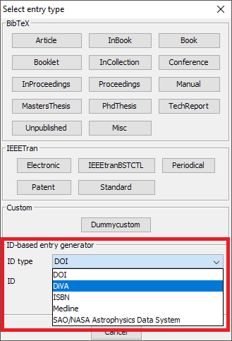

# Creating entries from DiVA

[DiVA \(Digitala Vetenskapliga Arkivet\)](http://www.diva-portal.org/) is a database with publications from about [40](https://github.com/JabRef/help.jabref.org/tree/1f58696d9081b60bf60823090c7594d67d7f5295/en/www.diva-portal.org/smash/aboutdiva.jsf) Swedish universities and research institutions.

To use this feature, choose **BibTeX → New entry...**. In the lower part, there is the box "ID-based entry generator". In the field "ID type", "DiVA" can be selected \(see screenshot below\). Select the field "ID" and enter the DiVA here \(e.g., `diva2:260746`\) and press Enter to generate an entry based on the Id. You can also click on "Generate". The found entry is opened in an entry editor. In case an error occurs, a popup is shown.

