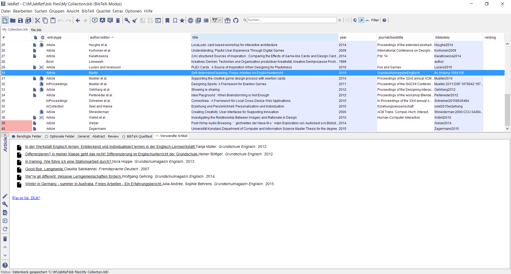

# Der Eintrags-Editor

*Geöffnet wird der Eintrags-Editor im Hauptfenster durch einen Doppelklick auf die Zeile eines Eintrags oder durch Drücken auf ENTER. Der Eintrags-Editor wird geschlossen, indem man auf ESC drückt.*

Im Eintrags-Editor können Sie alle relevanten Informationen eines Eintrags festlegen. Der Editor überprüft den Eintragstyp und zeigt alle benötigten und optionalen Felder für den Gebrauch mit *BibTeX* an. Darüber hinaus gibt es einige Felder, die *Allgemeine Felder* genannt werden und für alle Eintragstypen gelten.

Sie können die Felder, die für die einzelnen Eintragstypen als benötigt und optional angesehen werden, und auch die Allgemeinen Felder anpassen. Schlagen Sie unter [Eintragstypen anpassen](CustomEntriesHelp) nach, wenn Sie mehr Informationen darüber erhalten möchten.

Nähere Informationen darüber, was in die Felder eingetragen werden soll, finden sie in der [Bibtex Hilfe](BibtexHelp).

## Die Panels des Eintrags-Editors

Der Eintrags-Editor besteht in der Standardeinstellung aus fünf Panels: *Benötigte Felder*, *Optionale Felder*, *General*, *Abstract* und *BibTeX Quelltext*, wobei *General* und *Abstract* vom Benutzer angepasst werden können (siehe dazu [Allgemeine Felder festlegen](GeneralFields)). In den ersten drei Panels können Sie mit TAB und SHIFT-TAB zwischen den einzelnen Feldern hin- und herwechseln.

Zu einem anderen Panel gelangen Sie, indem Sie auf die Tabs klicken. Mit den folgenden Tastaturkürzeln können Sie ebenfalls zwischen den Panels navigieren: CTRL-TAB oder CTRL-PLUS wechselt zum Panel rechts vom aktuellen Panel, CTRL-SHIFT-TAB oder CTRL-MINUS wechselt dementsprechend zum Panel links vom aktuellen Panel. Außerdem können Sie zum nächsten oder vorherigen Eintrag wechseln, indem Sie "STRG-SHIFT-Pfeil nach unten" bzw. "STRG-SHIFT-Pfeil nach oben" oder die Pfeiltasten in der linken Toolbar drücken.

Das Panel *BibTeX Quelltext* zeigt, wie der Eintrag aussehen wird, wenn die Datei im *bibtex*-Format gespeichert wird. Wenn Sie wollen, können Sie den *BibTeX* Quelltext direkt bearbeiten. Sobald Sie zu einem anderen Panel wechseln, STRG-S drücken oder den Eintrags-Editor schließen, wird JabRef versuchen, den Inhalt des Quelltext-Panels zu analysieren. Falls dabei Probleme auftreten, werden Sie benachrichtigt und erhalten die Möglichkeit, den Eintrag noch einmal zu überarbeiten oder den vorherigen Inhalt wiederherzustellen. Wenn in den **Einstellungen** (unter **Allgemein**) die Option **Quelltext standardmäßig anzeigen** gewählt wurde, wird das Quelltext-Panel beim Öffnen des Eintrags-Editors als erstes angezeigt. Wenn Sie lieber den Quelltext bearbeiten als die anderen Panels zu benutzen, sollten Sie diese Option wählen.

**Tip:** Wenn Ihre Datei Felder enthält, die JabRef nicht kennt, erscheinen diese im Quelltext-Panel.

**Tip:** Die *pdf* und *url*-Felder unterstützen Drag & Drop. Sie können z.B. ein URL aus Ihrem Browser dort einfügen.

## Überprüfung der Feldkonsistenz

Wenn der Inhalt eines Feldes geändert wird, überprüft JabRef, ob der neue Inhalt akzeptiert werden kann. Bei Feldern, die von *BibTeX* genutzt werden, wird der Inhalt zum einen auf die richtige Klammerung mit geschweiften Klammern, aber auch auf die Benutzung des Zeichens '\#' hin überprüft. Das "hash"-Symbol darf *nur* paarweise benutzt werden, um damit den Namen eines *BibTeX*-Strings einzuschließen. Beachten Sie, dass JabRef nicht überprüft, ob der angeführte String tatsächlich vorhanden ist (der *BibTeX*-Stil, den Sie benutzen, kann eine beliebige Anzahl von Strings definieren, die JabRef nicht kennt).

Falls die Inhalte nicht akzeptabel sind, wird das Feld mit roter Farbe hinterlegt, was auf einen Fehler hindeutet. In diesem Fall werden die Änderungen nicht gespeichert.

## Autovervollständigung von Wörtern und Namen

Der Eintragseditor bietet die Autovervollständigung von Wörtern. Im Dialog *Optionen -&gt; Einstellungen* können Sie auswählen, in welchen Feldern die Autovervollständigung aktiviert werden soll.

Bei aktiver Autovervollständigung zeichnet JabRef alle Worte auf, die in jedem der ausgewählten Felder der Datei vorkommen. Immer wenn Sie den Anfang eines dieser Wörter schreiben, wird das Wort sichtbar vorgeschlagen. Sie können den Vorschlag ignorieren, indem Sie einfach weiterschreiben. Um den Vorschlag anzunehmen, drücken Sie entweder auf *ENTER* oder benutzen die Pfeiltasten oder andere Tasten, um die Auswahlbox um die vorgeschlagenen Buchstaben zu entfernen.

*Anmerkung:* Bei den Wörtern, die für die Vorschläge berücksichtigt werden, handelt es sich nur um solche, die in demselben Feld in Einträgen der Datei vorkommen, die Sie gerade bearbeiten. Es gibt viele Möglichkeiten, um dieses Feature zu realisieren, und wenn Sie der Meinung sind, das es auf eine andere Art implementiert werden sollte, würden wir gerne Ihre Vorschläge hören.

## *BibTeX* Key kopieren

Mit STRG-K oder dem 'Key'-Knopf wird der *BibTeX* Key des ausgewählten Eintrags mit umgebenden `\cite{...}` in die Zwischenablage kopiert.

## Nur *BibTeX* Key kopieren

Mit STRG-SHIFT-K wird der *BibTeX* Key des ausgewählten Eintrags in die Zwischenablage kopiert.

## *BibTeX* Key automatisch generieren

Um einen *BibTeX* Key für einen Eintrag automatisch erstellen zu lassen, drücken Sie STRG-G oder den entsprechenden (Zauberstab-)Knopf in der Toolbar-Leiste.

Für nähere Informationen, wie die *BibTeX* Keys generiert werden, schauen Sie bitte unter [Anpassen der automatischen Generierung von BibTeX-keys](LabelPatterns) nach.

## Ähnliche Dokumente

Wird der Tab "ähnliche Dokumente" im EntryEditor ausgewählt, so wird der Titel des ausgewählten Items an Mr. DLib gesendet.

Mr. DLib ist ein Dienst, der aus diesem Titel ähnliche Dokumente berechnet. Nach einer kurzen Ladezeit werden hier die ähnlichen Dokumente aufgelistet. Für detailierte Informationen hierzu besuchen Sie die Hilfe Seite von [Mr. DLib](http://mr-dlib.org/information-for-users/information-about-mr-dlib-for-jabref-users/#).
Der folgende screenshot zeigt den "Ähnliche Dokumente" Tab im Entry Editor mit Empfehlungen zum ausgewählten Eintrag.

