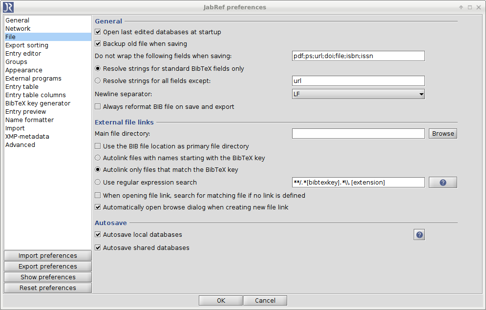

# Autosave

## Purpose

The autosave feature helps to to save an opened database without manual intervention.
Furthermore it synchronizes your local files which are associated with appropriate [shared SQL databases](SQLDatabase).

## Activation

You can activate the autosave feature through **Options -&gt; Preferences**, and then by choosing **File** on the left panel. At the lower part of the window, a section is dedicated to **AutoSave**.

## Autosave for local databases

If you are working on **.bib** files which are located on your file system, the feature will detect your changes automatically and save them without further intervention.

## Autosave for shared databases

Generally you are able to save a shared database after connecting to it. This feature enables a full synchronization of your local bib file with the [shared SQL database](SQLDatabase) which could simoultaneously be used by other collaborators.

## Remarks

By default this feature is disabled for local databases.
