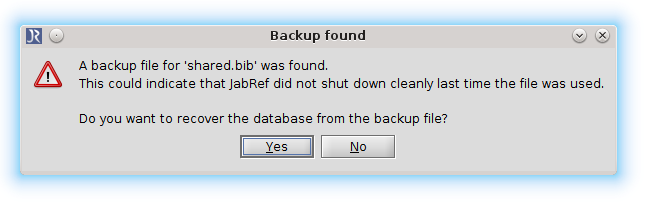

# Backup

## Purpose

This module is always running in the background while you are working on a _bib_ database. It makes a _backup copy_ 
and keeps that up-to-date on every user interaction.

_E.g.: When you change a field the new value would get saved into the backup copy._
 
Assumed that _JabRef_ crashes while you are working on a _bib_ database. When you try again to open the file _JabRef_ crashed with,
you will get the following dialog:

Now you have the possibility to restore your changes which would normally get lost.

## Remarks

By default this feature is enabled and it is running continuously without users influence.

## Offstage

While opening a _.bib_ file _JabRef_ simoultaneously creates a _.swp_ file which is used as a current buffer.
If _JabRef_ gets closed normally the _.swp_ file will be removed. Otherwise this file is going to be used for
database restoration next time.
