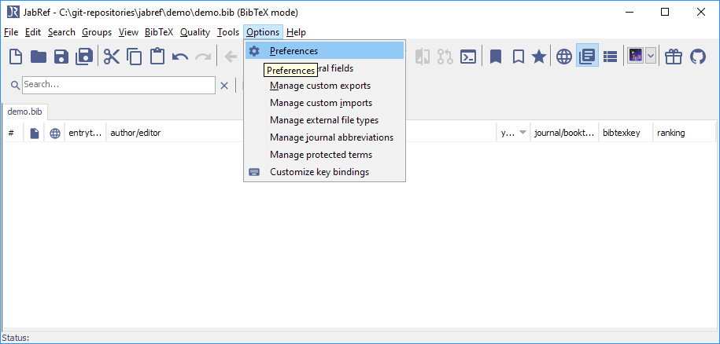
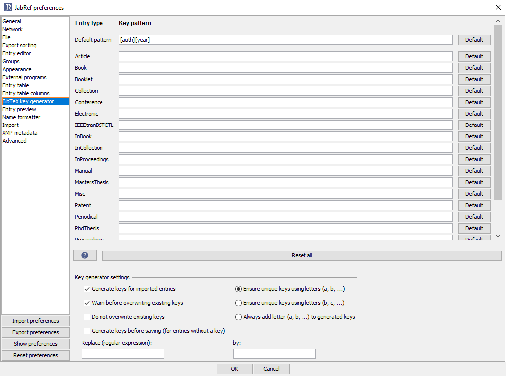
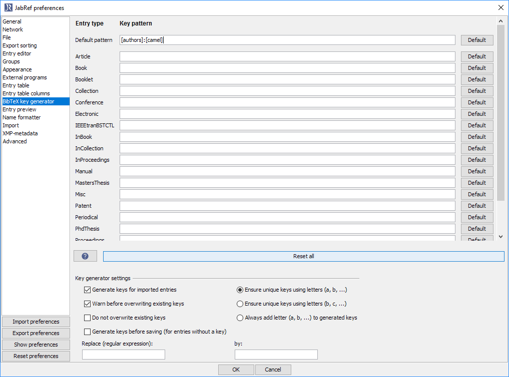

# Customizing the BibTeX key generator

The pattern used in the auto generation of BibTeX labels can be set for each of the standard entry types in **Options  → Preferences**, tab **BibTeX key generator**.
Additionally, if you right click the tab of a database, the menu **BibTeX key patterns** allows to set specific key patterns for this database.

## Key patterns
The key pattern can contain any text you wish, in addition to field markers that indicate that a specific field of the entry should be inserted at that position of the key. A field marker generally consists of the field name enclosed in square braces, e.g. **\[volume\]**. If the field is undefined in an entry at the time of key generation, no text will be inserted by the field marker.

### Default key pattern
If you have not defined a key pattern for a certain entry type, the **Default pattern** will be used. You can change the default pattern - its setting is above the list of entry types in the **BibTeX key generator** section of the **Preferences** dialog.

The default key pattern is \[auth\]\[year\], and this could produce keys like e.g. `Yared1998` If the key is not unique in the current database, it is made unique by adding one of the letters a-z until a unique key is found. Thus, the labels might look like:

`Yared1998`
`Yared1998a`
`Yared1998b`

### Special field markers

Several special field markers are offered, which extract only a specific part of a field. Feel free to suggest new special field markers.

#### Author-related key patterns

-   **\[`auth`\]**: The last name of the first author
-   **\[`authors`\]**: The last name of all authors
-   **\[`authorLast`\]**: The last name of the last author
-   **\[`authorsN`\]**: The last name of up to N authors. If there are more authors, “EtAl” is appended.
-   **\[`authorsAlpha`\]**: Corresponds to the BibTeX style “alpha”. One author: First three letters of the last name. Two to four authors: First letters of last names concatenated. More than four authors: First letters of last names of first three authors concatenated. “+” at the end.
-   **\[`authIniN`\]**: The beginning of each author's last name, using no more than N characters.
-   **\[`authorIni`\]**: The first 5 characters of the first author's last name, and the last name initials of the remaining authors.
-   **\[`authN`\]**: The first N characters of the first author's last name
-   **\[`authN_M`\]**: The first N characters of the Mth author's last name
-   **\[`auth.auth.ea`\]**: The last name of the first two authors, and “.ea” if there are more than two.
-   **\[`auth.etal`\]**: The last name of the first author, and the last name of the second author if there are two authors or “.etal” if there are more than two.
-   **\[`authEtAl`\]**: The last name of the first author, and the last name of the second author if there are two authors or “EtAl” if there are more than two. This is similar to `auth.etal`. The difference is that the authors are not separated by “.” and in case of more than 2 authors “EtAl” instead of “.etal” is appended.
-   **\[`authshort`\]**: The last name if one author is given; the first character of up to three authors' last names if more than one author is given. A plus character is added, if there are more than three authors.
-   **\[`authForeIni`\]**: The forename initial of the first author.
-   **\[`authorLastForeIni`\]**: The forename initial of the last author.

**Note:** If there is no author (as in the case of an edited book), then all of the above **`[auth...]`** markers will use the editor(s) (if any) as a fallback. Thus, the editor(s) of a book with no author will be treated as the author(s) for label-generation purposes. If you do not want this behaviour, i.e. you require a marker which expands to nothing if there is no author, use **`pureauth`** instead of **`auth`** in the above codes. For example, **`[pureauth]`**, or **`[pureauthors3]`**.

#### Editor-related key patterns

-   **\[`edtr`\]**: The last name of the first editor
-   **\[`edtrIniN`\]**: The beginning of each editor's last name, using no more than N characters
-   **\[`editors`\]**: The last name of all editors
-   **\[`editorLast`\]**: The last name of the last editor
-   **\[`editorIni`\]**: The first 5 characters of the first editor's last name, and the last name initials of the remaining editors.
-   **\[`edtrN`\]**: The first N characters of the first editor's last name
-   **\[`edtrN_M`\]**: The first N characters of the Mth editor's last name
-   **\[`edtr.edtr.ea`\]**: The last name of the first two editors, and “.ea” if there are more than two.
-   **\[`edtrshort`\]**: The last name if one editor is given; the first character of up to three editors' last names if more than one editor is given. A plus character is added, if there are more than three editors.
-   **\[`edtrForeIni`\]**: The forename initial of the first editor.
-   **\[`editorLastForeIni`\]**: The forename initial of the last editor.

#### Title-related key patterns

-   **\[`shorttitle`\]**: The first 3 words of the title
-   **\[`veryshorttitle`\]**: The first word of the title, discounting ‘the’, ‘a’, ‘an’.
-   **\[`camel`\]**: Capitalize and concatenate all the words of the title. For example, `An awesome paper on JabRef` will become `AnAwesomePaperOnJabref`
-   **\[`title`\]**:  Capitalize all the significant words of the title, and concatenate them. For example, `An awesome paper on JabRef` will become `AnAwesomePaperonJabref`

#### Other key patterns

-   **\[`firstpage`\]**: The number of the first page of the publication (Caution: this will return the lowest number found in the pages field, since BibTeX allows `7,41,73--97` or `43+`.)
-   **\[`pageprefix`\]**: The non-digit prefix of pages (like "L" for L7) or "" if no non-digit prefix exists (like "" for `7,41,73--97`) .
-   **\[`keywordN`\]**: Keyword number N from the “keywords” field, assuming keywords are separated by commas or semicolons.
-   **\[`lastpage`\]**: The number of the last page of the publication (See the remark on `firstpage`)
-   **\[`shortyear`\]**: The last 2 digits of the publication year

## Modifiers

A field name (or one of the above pseudo-field names) may optionally be followed by one or more modifiers. Modifiers are applied in the order they are specified.

-   **:abbr**: Abbreviates the text produced by the field name or spcial field marker. Only the first character and subsequent characters following white space will be included. For examples:
    -  **\[journal:abbr\]** would from the journal name “Journal of Fish Biology” produce “JoFB”.
    -  **\[title:abbr\]** would from the title “An awesome paper on JabRef” produce “AAPoJ”.
    -  **\[camel:abbr\]** would from the title “An awesome paper on produce “AAPOJ”.
-   **:lower**: Forces the text inserted by the field marker to be in lowercase. For example, **\[auth:lower\]** expands the last name of the first author in lowercase.
-   **:upper**: Forces the text inserted by the field marker to be in uppercase. For example, **\[auth:upper\]** expands the last name of the first author in uppercase.
-   **:(x)**: The string between the parentheses will be inserted if the field marker preceding this modifier resolves to an empty value. The placeholder `x` may be any string. For instance, the marker **\[volume:(unknown)\]** will return the entry's volume if set, and the string **unknown** if the entry's `volume` field is not set.

## Regular expression replace

After the key pattern has been applied to produce a key, you can choose to have the key generator search for occurrences of a specific regular expression, and replace it with a string. The regular expression and replacement string are entered in the text fields below the list of key patterns. If the replacement string is empty, matches of the regular expression will simply be removed from the generated key. For instance, `\p{Punct}` or `[:/%]` can be replaced by nothing to remove unwanted characters from the key. This may be useful when naming PDFs according to BibTeX keys.

## How to configure

To change the pattern to `[authors]:[camel]`, execute the following steps:

1. Open the preferences

1. Navigate to "BibTeX key generator"

1. Change the default pattern to `[authors]:[camel]`.

1. Click "OK"
