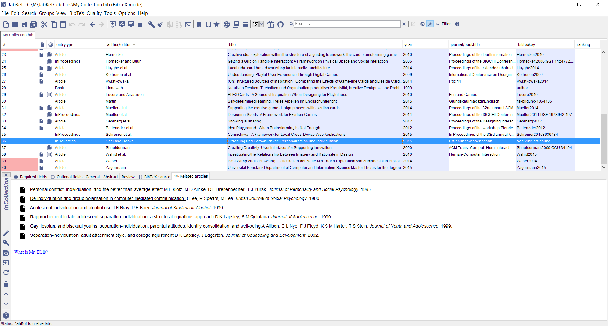

# BibTeX entry editor

*Opened from main window by double-clicking anywhere on the line of the entry, or selecting the entry and pressing <kbd>Enter</kbd> or <kbd>Ctrl</kbd> + <kbd>D</kbd>. The panel is closed by pressing <kbd>Esc</kbd>.*

In this panel you can specify all relevant information on a single entry. The entry editor checks the type of your entry, and lists all the fields that are required, and the ones that are optional, for referring the entry with *BibTeX*. In addition, there are several fields termed *General fields*, that are common to all entry types.

You can fully customize which fields should be regarded as required and optional for each type of entry, and which fields appear in the General fields tabs. See [Customizing entry types](CustomEntries) for more information about this.

For information about how the fields should be filled out, see [BibTeX help](Bibtex).

## The entry editor's panels

The entry editor contains six panels: *Required fields*, *Optional fields*, *General*, *Abstract*, *Comments* and *BibTeX source*, where *General*, *Abstract* and *Comments* can be customized (see [Customizing general fields](GeneralFields) for details). Inside the three first panels,  <kbd>Tab</kbd> and <kbd>Shift</kbd> + <kbd>Tab</kbd> are used to switch focus between the text fields.

Up to JabRef 4.1, the field was called "Review".
The field name was changed to "Comments" as "Review" indicated some external reviews or some fundamental comments.

Switch panels by clicking on the tabs, or navigate to the panel to the left or right using the following key combinations: <kbd>Ctrl</kbd> + <kbd>Tab</kbd> or <kbd>Ctrl</kbd> + <kbd> + </kbd> switch to the tab to the right, and <kbd>Ctrl</kbd> + <kbd>Shift</kbd> + <kbd>Tab</kbd> or <kbd>Ctrl</kbd> + <kbd>-</kbd> switch to the tab to the left. You can also switch to the next or previous entry by pressing <kbd>Ctrl</kbd> + <kbd>Shift</kbd> + <kbd>Down</kbd> or <kbd>Ctrl</kbd> + <kbd>Shift</kbd> + <kbd>Up</kbd>, respectively, or by clicking the appropriate toolbar button.

The *BibTeX source* panel shows how the entry will appear when the database is saved in *BibTeX* format. If you wish, you can edit the *BibTeX* source directly in this panel. When you move to a different panel, press <kbd>Ctrl</kbd> + <kbd>S</kbd> or close the entry editor, JabRef will try to parse the contents of the source panel. If there are problems, you will be notified, and given the option to edit your entry further, or to revert to the former contents. If **Show source by default** is checked in the **General options** tab of the **Preferences** dialog, the source panel will be the one shown each time you open the entry editor. If you prefer editing the source rather than using the other four panels, you should check this option.

**Tip:** If your database contains fields unknown to JabRef, these will be visible in the source panel.

**Tip:** the *pdf* and *url* fields support Drag and Drop operations. You can drop there an url from your browser. either a link to a pdf file (that JabRef can download for you) or you can keep the link.

## Field consistency checking

When the contents of a field is changed, JabRef checks if the new contents are acceptable. For field types that are used by *BibTeX*, the contents are checked with respect to the use of the '\#' character. The hash symbol is *only* to be used in pairs (except in escaped form, '\\\#'), wrapping the name of a *BibTeX* string that is referenced. Note that JabRef does not check if the referenced string actually exists (this is not trivial, since the *BibTeX* style you use can define an arbitrary set of strings unknown to JabRef).

If the contents are not accepted, the field will turn red, indicating an error. In this case the change will not be stored.

## Handling of string constants

BibTeX supports string constants.
One can define in the bibliography.
JabRef offers editing of these strings via the [String Editor](StringEditor.md).

For instance, if you see `#jan#` in the `month` field, the "real" BibTeX entry looks like `month = jan`.
For more details, see [Strings](Strings.md).

## Word/name autocompletion

The entry editor offers autocompletion of words. In the Preferences dialog you can enable or disable autocompletion, and choose for which fields autocompletion is active.

With autocompletion, JabRef records all words that appear in each of the chosen fields throughout your database. Whenever you write the beginning of one of these words, it will be suggested visually. To ignore the suggestion, simply write on. To accept the suggestion, either press <kbd>Enter</kbd> or use your arrow keys or other keys to remove the selection box around the suggested characters.

*Note:* the words considered for suggestion are only the ones appearing in the same field in entries of the same database as the one you are editing. There are many ways to realise this kind of feature, and if you feel it should have been implemented differently, we'd like to hear your suggestions!

## Drag and drop behavior settings

The entry editor allows for file(s) to be dragged and dropped directly into the entry editor window. There are three different types of behaviors that govern how the files are handled, and the user can set which behavior they would like the entry editor to use in the **Entry editor** tab of the **Preferences** dialog. These behaviors are the following: copy, link, move.

If the copy option is selected as the drag and drop behavior, the entry editor will create a copy of the file in the current directory. While this option is selected, the keyboard shortcuts needed to move, copy or link files are the following: 

- Move: <kbd>Ctrl</kbd> + Drag (Windows) or <kbd>Option</kbd> + Drag (MacOS/Linux)
- Copy: <kbd>Shift</kbd> + Drag (Windows) or <kbd>Command</kbd> + Drag (MacOS/Linux) or no key + Drag
- Link: <kbd>Alt</kbd> + Drag (Windows) or <kbd>Command</kbd> + <kbd>Option</kbd> + Drag (MacOS/Linux)

If the link option is selected as the drag and drop behavior, the entry editor will create a link of the file. This creates a shortcut to the file and will not copy the file to the current directory. While this option is selected, the keyboard shortcuts needed to move, copy or link files are the following: 

- Move: <kbd>Alt</kbd> + Drag (Windows) or <kbd>Command</kbd> + <kbd>Option</kbd> + Drag (MacOS/Linux)
- Copy: <kbd>Ctrl</kbd> + Drag (Windows) or <kbd>Option</kbd> + Drag (MacOS/Linux)
- Link: <kbd>Shift</kbd> + Drag (Windows) or <kbd>Command</kbd> + Drag (MacOS/Linux) or no key + Drag

If the move option (shown as **Copy, rename and link file**) is selected as the drag and drop behavior, the entry editor will move the file to the current directory by copying the file to the current location, renaming the copy, and linking it to the original file. While this option is selected, the keyboard shortcuts needed to move, copy or link files are the following: 

- Move: <kbd>Shift</kbd> + Drag (Windows) or <kbd>Command</kbd> + Drag (MacOS/Linux) or no key + Drag
- Copy: <kbd>Ctrl</kbd> + Drag (Windows) or <kbd>Option</kbd> + Drag (MacOS/Linux)
- Link: <kbd>Alt</kbd> + Drag (Windows) or <kbd>Command</kbd> + <kbd>Option</kbd> + Drag (MacOS/Linux)

## Copy *BibTeX* key including citation command.

Pressing <kbd>Ctrl</kbd> + <kbd>K</kbd> or the 'key' button causes the *BibTeX* key for your entry including the surrounding to be copied to the clipboard.

## Copy *BibTeX* key

Pressing <kbd>Ctrl</kbd> + <kbd>Shift</kbd> + <kbd>K</kbd> causes the *BibTeX* key for your entry to be copied to the clipboard.

## Autogenerate *BibTeX* key

Press <kbd>Ctrl</kbd> + <kbd>G</kbd> or the 'gen key' button (the magic wand) to autogenerate a *BibTeX* key for your entry based on the contents of its required fields.

For more information on how JabRef generates *BibTeX* keys, see [Customizing the BibTex key generator](LabelPatterns).

## Related Articles Tab

By selecting this Tab, we are sending the title of the selected paper to Mr. DLib.

Mr. DLib is a service that calculates recommendations for you based on this title. After a short loading time the recommendations are listed in the Related Articles Tab.
For detailed information see [Mr. DLibs help page](http://mr-dlib.org/information-for-users/information-about-mr-dlib-for-jabref-users/#). The following image shows the Related Articles Tab with recommendations to the selected item.

