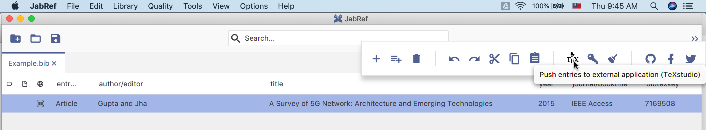
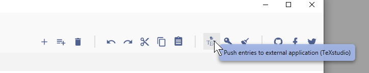
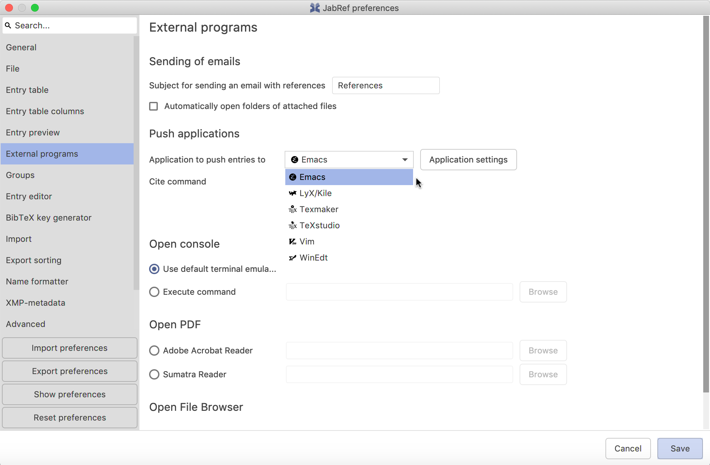
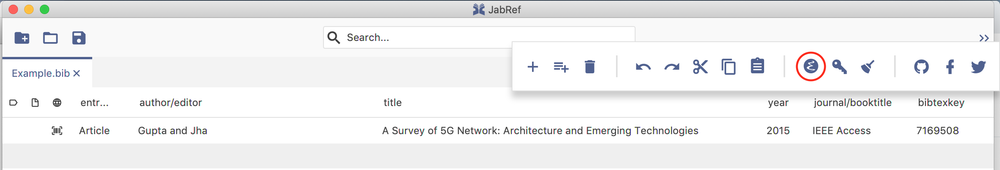
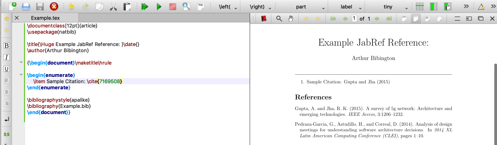
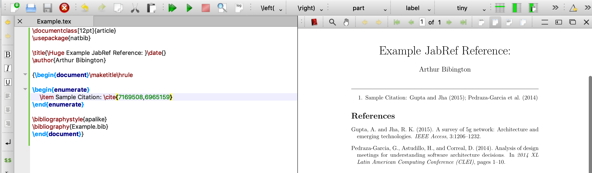

# URL and DOI links in JabRef

For linking attached files, see [File links in JabRef](FileLinks).

JabRef lets you link documents on the web in the form of an URL or a DOI identifier.

## Setting up external viewers

JabRef has to know which external viewers to use for web pages.
These are by default set to values that probably make sense for your operating system, so there's a fair chance you don't have to change these values.

To change the external viewer settings, go to **Options → Preferences → External programs**.

## Pushing to external viewer application

JabRef allows you to push any entries in your main window to an external viewer through the push-to-external application feature. You would need to first select the entries in your entry table that you would like to export before using the feature. Once you have done so, go to the tools submenu and click on the push-to-external application button to the left of the **Generate BibTeX keys** button. By default the external viewer used to push exports is TeXstudio.

On MacOS:

On Windows:

JabRef also allows you to change the external viewer application you would like to push your exports to. To do so, first go to **Options → Preferences → External programs**. Under the **Push applications** section click on the **Application to push entries to** field. This will cause a dropdown menu to appear, from which you are able to select from a list of the external viewers you have configured.

Once you have made your selection and click **Save**, the push-to-external application button icon will change to match that of the selected external viewer application.

When you click on the push-to-external application button, JabRef will export your selected entries to a file generated by the selected external viewer application. As an example, here is what happens when you export one entry to TexStudio.

As long as you continue using the same external viewer application, clicking on the push-to-external application button for subsequent exports will just extend the existing export file with additional entries. Following from the example above, here is what happens when you export to TexStudio a second entry, which ends up in the same initial export file.

## Opening external links

There are several ways to open an external web page.
In the entry editor, click on the icon "open" right of the text field to open the respective DOI or URL.

In the entry table you can select an entry and use the menu choice, keyboard shortcut or the right-click menu to open the file or web page.
Finally, you can click on a URL or DOI icon.

By default the entry table will contain a singly column containing an indicator whether there is a DOI or a URL linked.
You can disable any of these in **Options → Preferences → Entry table columns**.

