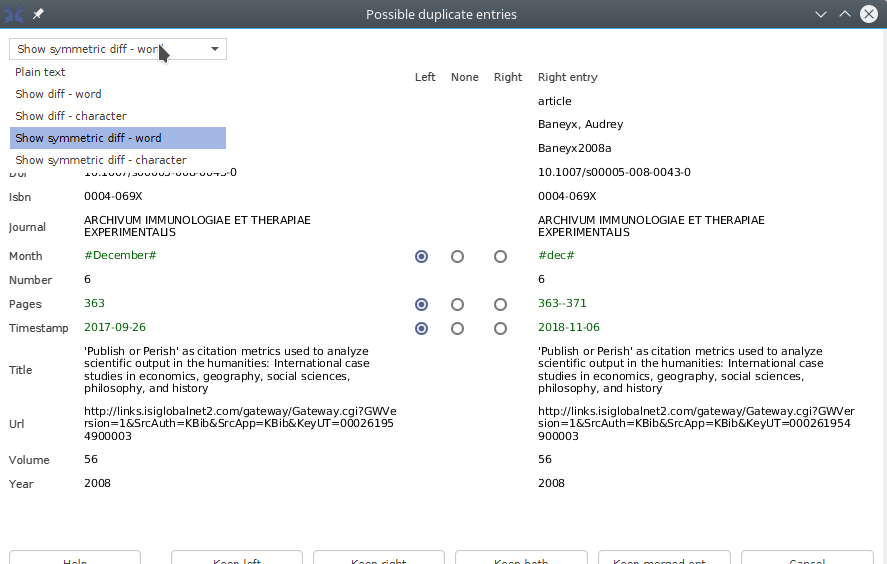
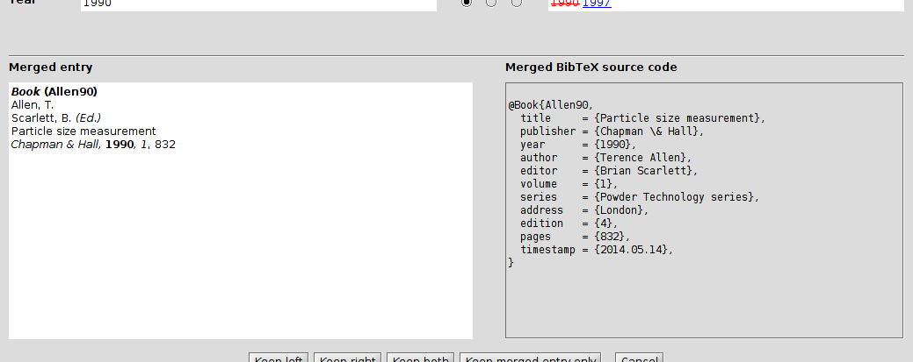

# Find duplicates

JabRef can look for duplicated entries inside a database.

This feature is accessible directly through  **Quality -&gt; Find duplicates**.
It is also used when [importing new entries](ImportInspectionDialog)
from a supported reference format or directly from the Internet.

Detection of potential duplicates is done by a distance algorithm.
Extra weighting is put on the fields *author*, *editor*, *title* and *journal*.

## Parallel display of potential duplicates

When two potential duplicates are found, their fields are displayed side-by-side.

The differences between the two entries can be emphasized through the drop-down menu located
at the upper right-hand corner of the window.
Five ways of displaying the differences are offered:
- **plain text**: as is, no emphasis
- **show diff** - word: differences are shown in the right entry. Full words are struck out in red or underlined in blue.
- **show diff** - character: differences are shown in the right entry. Individual characters are struck out in red or underlined in blue.
- **show symmetric diff** - word: differences are shown on both sides. Words are underlined and displayed in color.
- **show symmetric diff** - character: differences are shown on both sides.  Characters are underlined and displayed in color.

In the central column, a radio button allows you to select which side to keep for each field:
the **left side**, the **right side**, or **none**.
By default, the left entry is kept.

## Merged entry: preview and source code

Based upon your selection, the merged entry is shown, both as a preview (on the left) and as source code (on the right).

If you right-click on the preview, you can **Print entry preview** or **Copy preview**.

## Selecting which entry to keep

You are offered to:
- **Keep left** entry.
- **Keep right** entry.
- **Keep both** entries, meaning that you consider the two entries are not duplicates.
- **Keep merged entry only**, meaning that the merged entry is the fullest.
- **Cancel**, which will end the duplicate finding.
 
