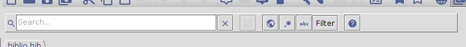

# Searching

The search bar is located between the icon bar and the database tabs.

To make the cursor jump to the search field, you can:
- click in the search field.
- select the menu **Search → Search**.
- press <kbd>Ctrl</kbd> + <kbd>F</kbd>.

Additionally, <kbd>Ctrl</kbd> + <kbd>Shift</kbd> + <kbd>F</kbd> also activates the global search setting.

Searching includes two modes (normal and advanced), along with several settings.

## Search settings

At the right of the search text field, several buttons allow for selecting some settings:

- New window
  - When pressed, the results are displayed in a dedicated window.

- Global search
  - activated:
    - the search query will be taken over when switching tabs
    - the external search result window will show matches in all databases
  - deactivated:
    - each tab will remember its search query
    - the external search result window will only show matches in the current database

- Regular expressions
    - Whether or not the search query uses [regular expressions](Search#regex).

- Case sensitivity
  - Whether or not the search query is case sensitive.

- Display setting
  - _Filter_ - Displays only entries which match the search query, non-matches are hidden
  - _Float_ -  Matching entries are moved to the top, entries which do not match the search query are grayed-out

## Search modes

There are two search modes in JabRef.

### Normal search

In a normal search, the program searches your database for all occurrences of the words in your search string, once you entered it.
Only entries containing all words will be considered matches.
To search for sequences of words, enclose the sequences in double quotes.
For instance, the query **progress "marine aquaculture"** will match entries containing both the word "progress" and the phrase "marine aquaculture".
All entries that don't match are hidden, leaving for display the matching entries only (filter mode), or are grayed-out (float mode).
To stop displaying the search results, just clear the search field again, press <kbd>Esc</kbd> or click on the "Clear" (`X`) button.

### Advanced search

#### Syntax

In order to search specific fields only and/or include logical operators in the search expression, a special syntax is available in which these can be specified. E.g. to search for entries whose an author contains **miller**, enter:

`author = miller`

Both the field specification and the search term support [regular expressions](Search#regex).
If the search term contains spaces, enclose it in quotes.
Do *not* use spaces in the field specification!
E.g. to search for entries about image processing, type:

`title|keywords = "image processing"`

You can use `and`, `or`, `not`, and parentheses as intuitively expected:

`(author = miller or title|keywords = "image processing") and not author = brown`

The `=` sign is actually a shorthand for `contains`.
Searching for an exact match is possible using `matches` or `==`.
Using `!=` tests if the search term is *not* contained in the field (equivalent to `not ... contains ...`).
The selection of field types to search (required, optional, all) is always overruled by the field specification in the search expression.
If a field is not given, all fields are searched. For example, `video and year == 1932` will search for entries with any field containing `video` and the field `year` being exactly `1932`.

#### Pseudo fields

JabRef defines the following pseudo fields:

|            |                |               |
|------------|----------------|---------------|
| **Pseudo field** | **Purpose** | **Example** |
|`anyfield`| Search in any field | `anyfield contains fruit`: search for entries having one of its fields containing the word **fruit**. This is identical to just writing `apple`. It may be more useful as `anyfield matches apple`, where one field must be exactly `apple` for a match. |
|`anykeyword`| Search among the keywords | `anykeyword matches apple`: search for entries which has the word **apple** among its keywords. However, as this also matches `pineapple`, it may be more useful in searches of the type `anykeyword matches apple`, which will not match `apples` or `pineapple` |
|`bibtexkey` | Search for citation keys | `bibtexkey == miller2005`: search for an entry whose BibTeX key is **miller2005**|
|`entrytype`| Search for entries of a certain type |  `entrytype = thesis`: search entries whose type (as displayed in the `entrytype` column) contains the word **thesis** (which would be **phdthesis** and **mastersthesis**)|

####  Regular expressions

##### Background

Regular expressions (regex for short) define a language for specifying the text to be matched, for example when searching. JabRef uses regular expressions as defined in Java. For extensive information, please, look at the [documentation](https://docs.oracle.com/javase/8/docs/api/java/util/regex/Pattern.html)
and at the [tutorial](https://docs.oracle.com/javase/tutorial/essential/regex/).

##### Regular expressions and casing

By default, regular expressions do not account for upper/lower casing.
Hence, while the examples below are all in lower case, they match also upper- and mixed case strings.

If casing is important to your search, activate the case-sensitive button.

##### Searching for entries with an empty or missing field

- `.` means any character
- `+` means one or more times

`author != .+`

##### Searching for a given word

- `\b` means word boundary
- `\B` means not a word boundary

`keywords = \buv\b`
matches *uv* but not *lluvia* (it does match *uv-b* however)

`author = \bblack\b`
matches *black* but neither *blackwell* nor *blacker*

`author == black`
does not match *john black*, but
`author = \bblack\b`
does.

`author = \bblack\B`
matches *blackwell* and *blacker*, but not *black*.

##### Searching with optional spelling

- `?` means none or one copy of the preceeding character.
- `{n,m}` means at least *n*, but not more than *m* copies of the preceding character.
- `[ ]` defines a character class

`title =neighbou?r`
matches *neighbour* and *neighbor*, and also *neighbours* and *neighbors*, and *neighbouring* and *neighboring*, etc.

`title = neighbou?rs?\b`
matches *neighbour* and *neighbor*, and also *neighbours* and *neighbors*, but neither *neighbouring* nor *neighboring*.

`author = s[aá]nchez`
matches *sanchez* and *sánchez*.

`abstract = model{1,2}ing`
matches *modeling* and *modelling*.

`abstract = modell?ing`
also matches *modeling* and *modelling*.

##### Searching for strings with a special character (`()[]{}\^-=$!|?*+.`)

If a special character (i.e. `(` `)` `[` `]` `{` `}` `\` `^` `-` `=` `$` `!` `|` `?` `*` `+` `.` ) is included in your search string, it has to be escaped with a backslash, such as `\}` for `}`.

It means that to search for a string including a backslash, two consecutive backslaskes (`\\`) have to be used:
`abstract = xori{\\c{c}}o` matches *xoriço*.

##### Searching for strings with double quotation marks (`"`)

The character `"` has a special meaning: it is used to group words into phrases for exact matches.
So, if you search for a string that includes a double quotation, the double quotation character has to be replaced with the hexadecimal character 22 in ASCII table `\x22`.

Hence, to search for  *{\"o}quist* as an author, you must input `author = \{\\\x22o\}quist`, with regular expressions enabled (Note: the *{*, *\* and the *}* are escaped with a backslash; see above).

Indeed, `\"` does not work as an escape for `"`.
Hence, neither `author = {\"o}quist` with regular expression disabled,
nor `author = \{\\\"O\}quist` with regular expression enabled, will find anything even if the name *{\"o}quist* exists in the database.
