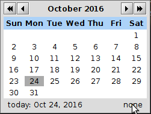

# Entry time stamps

JabRef can optionally set a field to contain the date an entry was added to the database.

## Configuration

You can disable or enable this feature by entering **Options → Preferences → General**, and selecting/deselecting the line *'Mark new entries with addition date'*.

If an entry with a timestamp is pasted or imported, the field is updated with the current date if *'Overwrite'* is checked. The value of the timestamp field will be updated upon changes in the entry if *'Update timestamp on modification'* is checked.

By default, the date is added in a field called *'timestamp'*, which is visible in the **General fields** tab in the [entry editor](EntryEditor). You can alter the name of this field.
The *date format* can also be customized (see below).

## Usage

The timestamp field can be edited in the **General fields** tab of the [entry editor](EntryEditor).
If you do not see these fields, enable them at [General Fields](GeneralFields) or reset your preferences.

You can manually alter the value by typing in the date and time of your choice. Also, by clicking on the calendar icon located at the right end of the field, you can select the date you want in a calendar. Additionally, by clicking on *Today*, the current date is added. By clicking on *None*, the field is emptied. A double-click on the field sets it to today's date.

## Formatting

The formatting of the time stamp is determined by a string containing designator words that indicate the position of the various parts of the date.

These are some of the available designator letters (examples are given in parentheses for Wednesday 14th of September 2005 at 5.45 PM):

-   **yy**: year (05)
-   **yyyy**: year (2005)
-   **MM**: month (09)
-   **dd**: day in month (14)
-   **HH**: hour in day (17)
-   **mm**: minute in hour (45)

These designators can be combined along with punctuation and whitespace. A couple of examples:

-   **yyyy.MM.dd** gives **2005.09.14**
-   **yy.MM.dd** gives **05.09.14**
-   **yyyy.MM.dd HH:mm** gives **2005.09.14 17:45**
