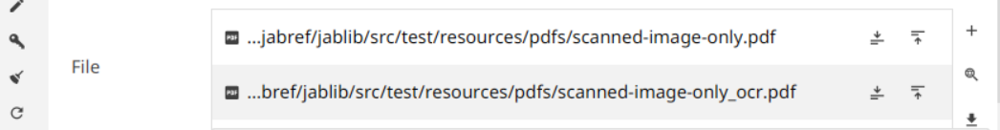
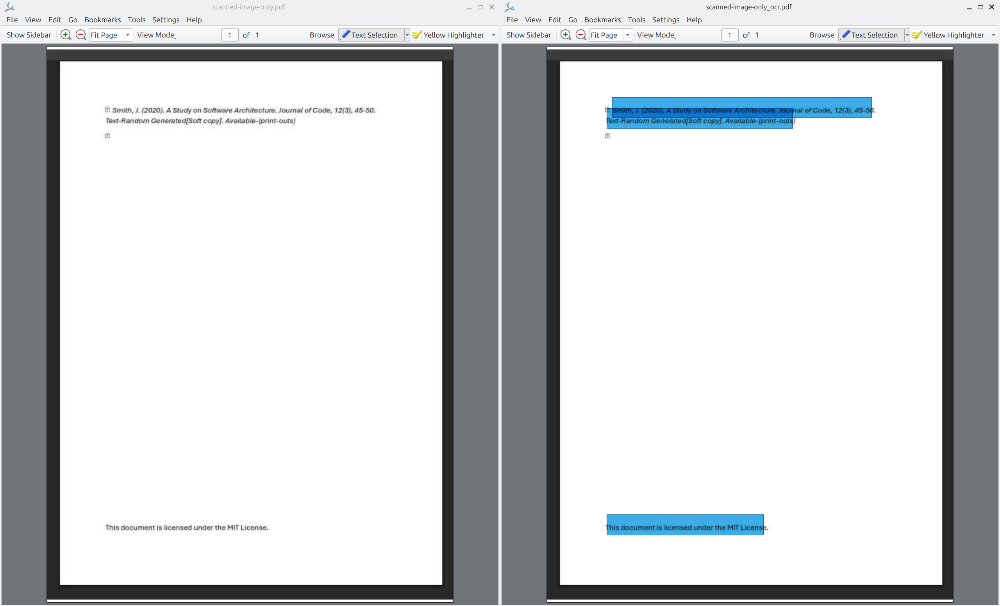
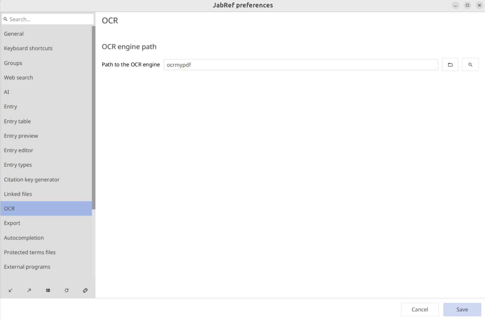
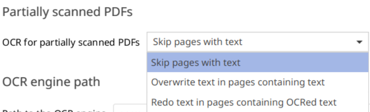
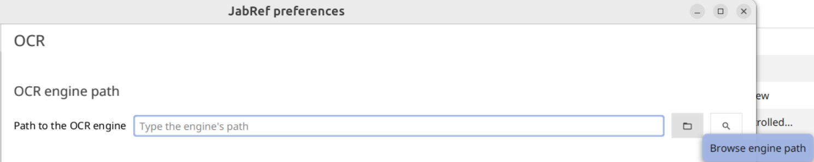
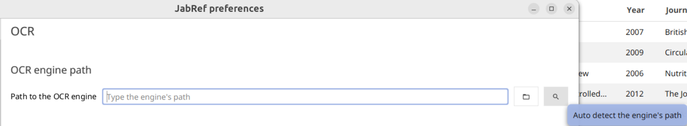

# OCR

[OCR](https://en.wikipedia.org/wiki/Optical_character_recognition) (Optical Character Recognition) is defined as the electronic or mechanic conversion of images of typed, handwritten or printed text into machine-encoded text. Consequently, with this technology it is possible to add editable and searchable data to PDFs and other files in your Jabref library. OCR can be used via multiple tools and engines. Currently, JabRef provides OCR using [OCRmyPDF](https://ocrmypdf.readthedocs.io/en/latest/).

## How to install [OCRmyPDF](https://github.com/ocrmypdf/ocrmypdf)

* Please check the [installation guide](https://ocrmypdf.readthedocs.io/en/latest/installation.html) and follow the instructions for your operating system.

## How to perform OCR on a scanned PDF file in JabRef


OCRmyPDF must be installed on your system to use this feature.


1. Open JabRef and select the entry with the PDFs you want to OCR.
2. Scroll down the Main Tab of the Entry Editor till reach the Files and Links section.
3. Right-click on the File and select "Perform OCR and embed text into new PDF file", or select the file and use the shortcut `Ctrl+Shift+R`. 

* After performing OCR, JabRef creates a new PDF file with the OCR text embedded, and it will be linked to all the entries that have the old file linked to them. The original scanned PDF will remain unchanged.

    

* Now you can select and search text in the new PDF file.

    

## OCR Preferences

* The OCR preferences can be accessed via **File → Preferences → OCR**.

    

### Partially scanned PDFs

* Some PDFs may contain a mix of scanned pages and pages with embedded text.
* In such cases, you will have three options:

1. You can choose to perform OCR only on the scanned pages(Skip pages with text).
2. Force OCR on all pages(Overwrite text in pages containing text).
3. Redo OCR for pages containing OCR text(Redo text in pages containing OCRed text).

* This can be configured in Partially scanned PDFs section in the OCR preferences.

    

### Engine Path


Performing OCR will fail if wrong engine path is provided, make sure that the correct path is provided.


* JabRef needs to know the location of the OCRmyPDF executable to run OCR. By default, JabRef assumes `ocrmypdf` is available on your system PATH, which is the case for most standard installations.
* If OCRmyPDF is installed in a non-standard location, or if it needs to be invoked through Python, you can configure the path manually in this preference tab.
* There are three ways to set the engine path:

1. **Type the path manually**: Enter the path directly into the text field. This can be a bare command name (e.g. `ocrmypdf` or `python -m ocrmypdf`) if it is available on your system PATH, or a full absolute path to the executable (e.g. `/home/user/.local/bin/ocrmypdf`).

    

2. **Browse**: Click the folder icon to open a file chooser and navigate to the OCRmyPDF executable on your system.

    

3. **Auto-detect**: Click the magnifier icon to have JabRef automatically search for a working OCRmyPDF installation. JabRef will try the following commands in order and use the first one that works:

    

    1. `ocrmypdf`
    2. `python -m ocrmypdf`
    3. `py -m ocrmypdf`
    4. `python3 -m ocrmypdf`

If none of these succeed, the path field will remain unchanged and you will need to set the path manually.
