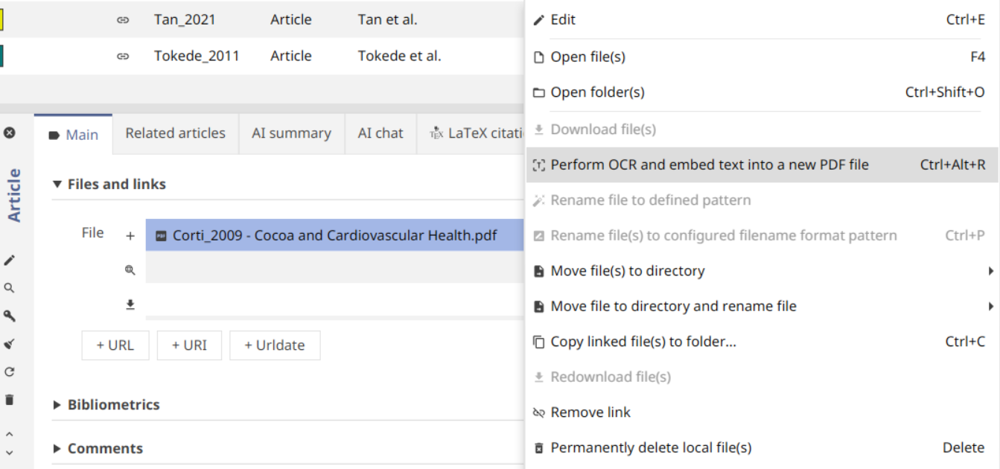

# OCR

[OCR](https://en.wikipedia.org/wiki/Optical_character_recognition) (Optical Character Recognition) is defined as the electronic or mechanic conversion of images of typed, handwritten or printed text into machine-encoded text. In other words, it is a technique that adds editable and searchable data to PDFs and other files in your library. OCR can be used via multiple tools and engines. Currently, JabRef provides OCR using [OCRmyPDF](https://ocrmypdf.readthedocs.io/en/latest/).

## OCRmyPDF


OCRmyPDF must be installed on your system to use this feature. See the installation instructions below.


### How to install [OCRmyPDF](https://github.com/ocrmypdf/ocrmypdf)
   * Please check the [installation guide](https://ocrmypdf.readthedocs.io/en/latest/installation.html) and follow the instructions for your operating system.

### How to perform OCR on a scanned PDF file in JabRef
   1. Open JabRef and go to the entry for the scanned PDF you want to OCR.
   2. Right-click on the File and select "Perform OCR and embed text into new PDF file".
       

* After performing OCR, JabRef creates a new PDF file with the OCR text embedded, and it will be linked in all the entries that have the old file linked to them. The original scanned PDF will remain unchanged.

    

* Now you can select and search text in the new PDF file.

    
