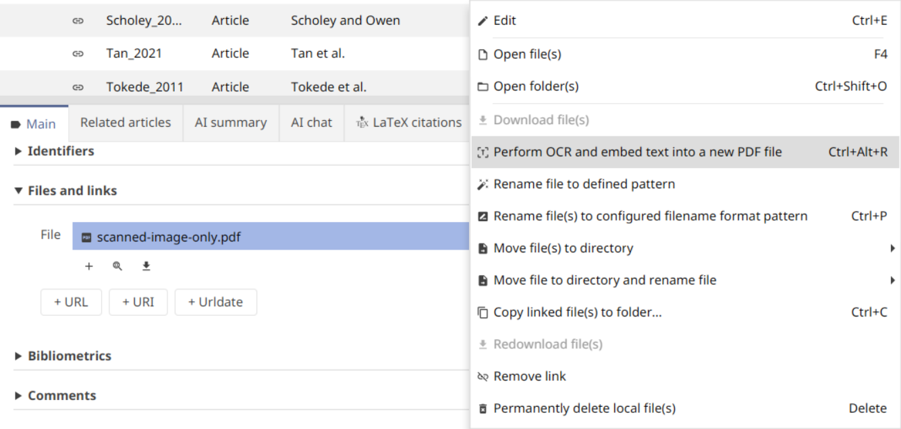
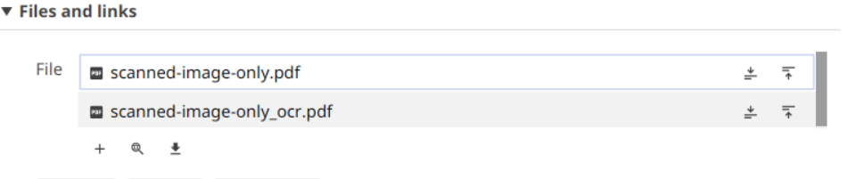
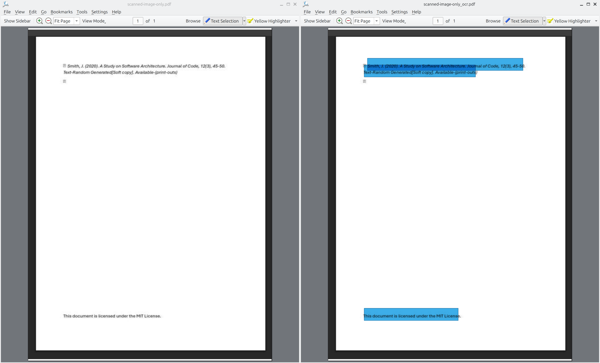
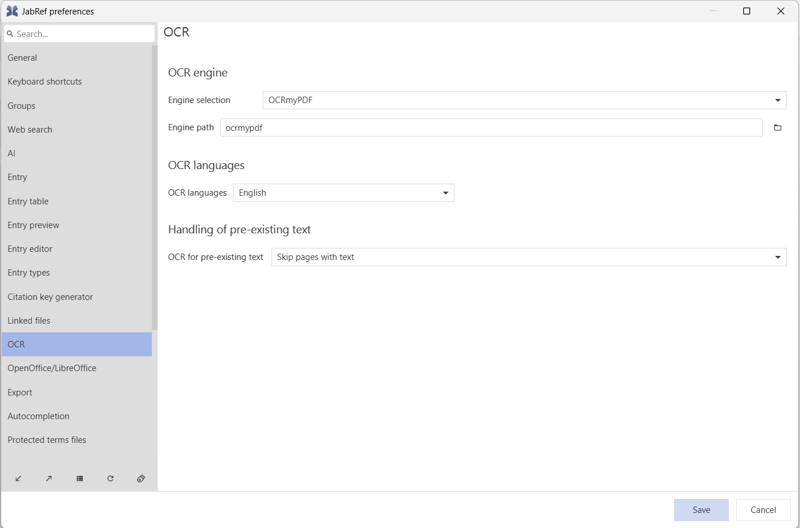
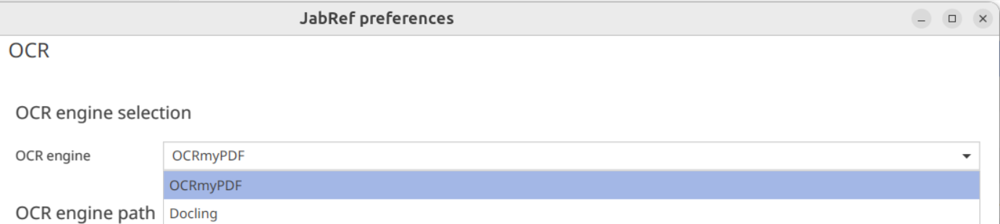
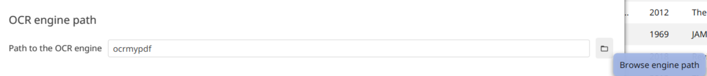
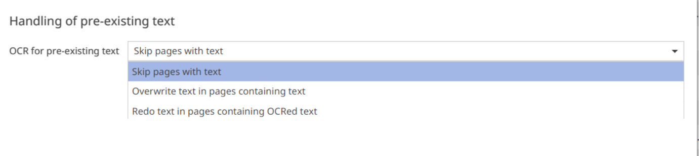

# OCR

[OCR](https://en.wikipedia.org/wiki/Optical_character_recognition) (Optical Character Recognition) is defined as the electronic or mechanic conversion of images of typed, handwritten or printed text into machine-encoded text. Consequently, with this technology it is possible to add editable and searchable data to PDFs and other files in your Jabref library. OCR can be used via multiple tools and engines. Currently, JabRef supports two OCR engines: [OCRmyPDF](https://ocrmypdf.readthedocs.io/en/latest/) and [Docling](https://github.com/docling-project/docling).

## How to install an OCR engine

Install whichever engine you plan to use, no need to install both.

### OCRmyPDF

* Please check the [OCRmyPDF installation guide](https://ocrmypdf.readthedocs.io/en/latest/installation.html) and follow the instructions for your operating system.

### Docling

* Please check the [Docling installation guide](https://docling-project.github.io/docling/getting_started/installation/) and follow the instructions for your operating system.

## How to perform OCR on a scanned PDF file in JabRef


The OCR engine selected in your preferences must be installed on your system to use this feature.


1. Open JabRef and select the entry with the PDFs you want to OCR.
2. Scroll down the Main Tab of the Entry Editor till you reach the Files and Links section.
3. Right-click on the File and select "Perform OCR and embed text into new PDF file", or select the file and use the shortcut `Ctrl+Alt+R`.

    

* After performing OCR, JabRef creates a new PDF file with the OCR text embedded, and it will be linked to all the entries that have the old file linked to them. The original scanned PDF will remain unchanged.

    

* Now you can select and search text in the new PDF file.

    

## OCR Preferences

* The OCR preferences can be accessed via **File → Preferences → OCR**.

    

### OCR Engine Selection

* JabRef lets you choose which OCR engine to use from the **OCR engine** dropdown at the top of the OCR preferences tab.

    

* Available engines:

1. **OCRmyPDF**: the default engine. Well suited for general-purpose OCR on scanned PDFs.
2. **Docling**: an alternative engine with strong handling of complex layouts and documents containing tables or figures (slower than OCRmyPDF).

* Changing the selected engine automatically re-runs **auto-detection** for that engine's path (see below), so if the newly selected engine is installed in a standard location, its path field will populate automatically.

### Engine Path


Performing OCR will fail if wrong engine path is provided, make sure that the correct path is provided.


* JabRef needs to know the location of the selected engine's executable to run OCR. By default, JabRef assumes the engine's standard command (`ocrmypdf` or `docling`) is available on your system PATH, which is the case for most standard installations.
* If your chosen engine is installed in a non-standard location, or if OCRmyPDF needs to be invoked through Python, you can configure the path manually in this preference tab.
* The path field always corresponds to the engine currently selected in the **OCR engine** dropdown above, switching engines switches which path you're viewing and editing.
* There are two ways to set the engine path:

1. **Type the path manually**: Enter the path directly into the text field. This can be a bare command name (e.g. `ocrmypdf`, `docling`, or `python -m ocrmypdf`) if it is available on your system PATH, or a full absolute path to the executable (e.g. `/home/user/.local/bin/ocrmypdf`).

   

2. **Browse**: Click the folder icon to open a file chooser and navigate to the engine's executable on your system.

   

* JabRef also **auto-detects the path automatically** whenever you change the selected engine in the dropdown, you don't need to trigger this manually. When you switch engines, JabRef tries the following commands, in order, and fills in the path field with the first one that works:

  **For OCRmyPDF:**
  1. `ocrmypdf`
  2. `python -m ocrmypdf`
  3. `py -m ocrmypdf`
  4. `python3 -m ocrmypdf`

  **For Docling:**
  1. `docling`

If none of these succeed, the path field will remain unchanged and you will need to set the path manually.

### Handling of pre-existing text

* Some PDFs may contain a mix of pages with and without embedded text.
* In such cases, you will have three options:

1. **Skip pages with text**: Performs OCR only on the pages without already embedded text. This is the default behavior, if not specified.
2. **Redo text in pages containing OCRed text**: Uses OCR on pages containing text created by a prior OCR run.
3. **Overwrite text in pages containing text**: Forces OCR with rasterization on all pages, potentially reducing quality or losing vector content, but this technique works, even when the `Redo text in pages containing text` option doesn't work.

* This can be configured in Handling of pre-existing text section in the OCR preferences.

    


This setting applies to whichever OCR engine is currently selected.

