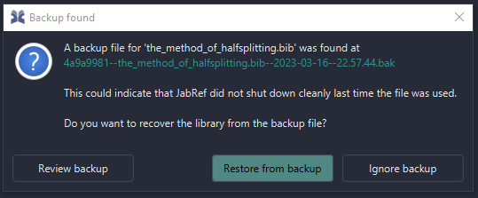

# Automatic Backup and Autosave


Changelog:\

JabRef 6.0\
Backup files use the `.bib` extension (instead of `.bak`), so that they can be opened in JabRef directly.

\
JabRef 5.8\
Major rework and a change in what .bak and .sav denote. Henceforth,\
`.sav` is a temporarily written file.\
`.bak` is a backup file.

\
JabRef 5.1\
To reduce the amount of configuration options, the possibility to disable the  creation of `.bak` files was removed.\
\
JabRef 3.7\
First introduction of the autosave and backup features.\
`.sav` is the automatic backup feature.\
`.bak` preserves the last state of the library after saving


## What are `.sav`, `.tmp` and backup files?

JabRef generates `.sav`, `.tmp` and backup files while working.

* Backup files stand for the automatic backup feature: Each 20 seconds, after a change to the library, the current state of the library is saved to a backup file. JabRef keeps 10 older versions in the [user data dir](https://github.com/harawata/appdirs#supported-directories). Backup files are `.bib` files (`.bak` files in JabRef versions before 6.0) and can be opened in JabRef directly.
* `.sav` preserves the last state of the library after saving. Thus, one can go back one save command in the history. Used when writing the .bib file. Used for copying the .bib away before overwriting on save.
* `.tmp` is a temporary file with changes that are supposed to be written to the `.bib` file.

**Rough outline of what's happening during a write to the `.bib` file:**\
\
A `.tmp` will be written --> `.bib` copies to `.sav` --> `.tmp` copies to `.bib` --> `.sav` gets deleted --> 20 seconds later, a copy of the `.bib` file will be stored as backup file in the user data dir.

#### How to ignore JabRef's .sav and .tmp files in Git

By using the [gitignore.io](https://www.gitignore.io) service, you can generate an appropriate `.gitignore` file by opening [https://www.gitignore.io/api/jabref](https://www.gitignore.io/api/jabref). A `gitignore` file specifies intentionally untracked files that Git should ignore. Files already tracked by Git are not affected; See [https://git-scm.com/docs/gitignore](https://git-scm.com/docs/gitignore) for further details.&#x20;

## Automatic backup of current library edits

This functionality runs in the background while you are working on a _bibliographic database_. It makes a _backup copy_ (a `.bib` file in the user data dir) and keeps that up-to-date on every user interaction. For instance, when you change a field the new value would get saved into the backup copy. Assuming that _JabRef_ crashes while you are working on a _BibTeX database_. When you try again to open the file _JabRef_ crashed with you will get the following dialog:

<figure><figcaption>
Screenshot of the backup found dialog
</figcaption></figure>

Now you have the possibility to restore and review your changes which would normally get lost.

For shared remote libraries and more advanced history, we recommend to use [git as version control system](https://git-scm.com/book).

#### Where can I find the backup files?

* **The backup files can be found in the** [**user data dir**](https://github.com/harawata/appdirs#supported-directories)**.** They are named `<prefix>--<library name>--<date>--<time>.bib` (`.bak` in JabRef versions before 6.0), for example `4a070cf3--library.bib--2024-09-19--09.24.59.bib`.
* **Unix/Linux:**\
  `/home/<username>/.local/share/org.jabref/jabref`
* **Windows:** \
  Windows 7/10:\
  `C:\Users\<Account>\AppData\org.jabref\jabref`\
  Alternatively, open the run dialogue by pressing `Windows+R`, then enter `%APPDATA%\..\Local\org.jabref\jabref` \
  Windows XP: \
  `C:\Documents and Settings\<Account>\Application Data\Local Settings\org.jabref\jabref>`
* **Mac OS X:** \
  `/Users/username/Library/Application Support/org.jabref/jabref`

## Automatic saving of the current library

JabRef offers **automatic saving of the library.** No need to click on File --> Save or pressing Ctrl+S anymore: The opened database are saved automatically without manual intervention.

In case the `.bib` file should automatically be saved on each change, you can direct JabRef to do so. This feature needs to be activated in the preferences:

<figure><figcaption>
Screenshot of the autosave preferences
</figcaption></figure>

