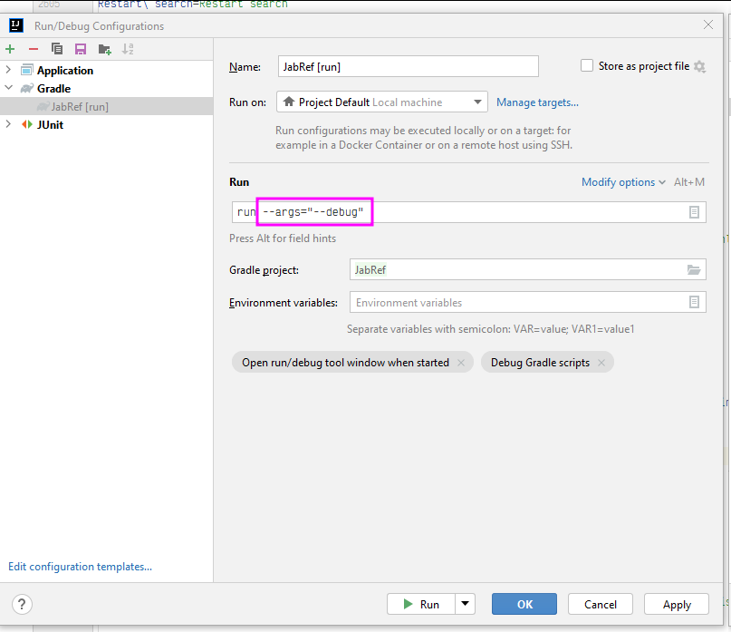

# Command line use and options

Although JabRef is primarily a GUI based application, it offers several command line options that may be useful. JabRef can even perform file conversion operations without opening the graphical interface.

## Basics


This description applies since JabRef 5.0, because JabRef comes with a pre-bundled Java-Runtime Environment


**Windows:**

Locate `JabRef.bat`, for example: `JabRef-5.0-portable_windows\JabRef\runtime\bin\JabRef.bat`

\
**Linux:**

`JabRef-5.0-portable_linux/JabRef/lib/runtime/bin/JabRef`.

\
**macOS:**

`/Applications/JabRef.app/Contents/MacOS/JabRef`\\

**Do not use `JabRef\JabRef.exe` or `bin/JabRef`**

The following documentation is for Windows, but works equally well on Linux and macOS:

```cmd
C:\portable-apps\JabRef-5.0-portable_windows\JabRef\runtime\bin\JabRef.bat [OPTIONS] [BIBTEX_FILE]
```

In some cases, you have to specify `--console` to ensure that output is written to the console.

You can always specify one or more Bib(la)TeX files to load by simply listing their filenames.\
Take care to specify all options before your list of file names.\
Ensure that the first file name is not misunderstood as being an argument for an option; this simply means that if a boolean option like `-n` or `-l` immediately precedes a file name, add the word `true` as an argument.\
For instance, the command line will correctly load the file `original.bib`, export it in [docbook format](https://docbook.org/whatis) to `filetoexport.xml`, and suppress the GUI:

```cmd
C:\portable-apps\JabRef-5.0-portable_windows\JabRef\runtime\bin\JabRef.bat -o filetoexport.xml,docbook5 -n true original.bib
```

The word _true_ prevents the file name from being interpreted as an argument to the `-n` option.

## Options

* [Help: `-h`](commandline.md#help--h)
* [No-GUI mode: `-n`](commandline.md#no-gui-mode--n)
* [Import file: `-i filename[,import format]`](commandline.md#import-file--i-filenameimport-format)
* [Export file: `-o filename[,export format]`](commandline.md#export-file--o-filenameexport-format)
* [Import BibTeX: `-importBibtex`](commandline.md#import-bibtex--importbibtex)
* [Export matching entries: `-m [field]searchTerm,outputFile:file[,exportFormat]`](commandline.md#export-matching-entries--m-fieldsearchtermoutputfilefileexportformat)
* Write BibTexEntry as XMP metadata to PDF: `-w CITEKEY1[,CITEKEY2][,CITEKEYn] | PDF1[,PDF2][,PDFn] | all`
* [Fetch entries from Web: `-f=FetcherName:QueryString`](commandline.md#fetch-entries-from-web--ffetchernamequerystring)
* [Subdatabase from .aux file: `-a infile[.aux],outfile[.bib] base-BibTeX-file`](commandline.md#subdatabase-from-aux-file--a-infileauxoutfilebib-base-bibtex-file)
* [Set file links: `-asfl`](commandline.md#set-file-links--asfl)
* [Regenerate keys: `-g`](commandline.md#regenerate-keys--g)
* [Export preferences: `-x filename`](commandline.md#export-preferences--x-filename)
* [Import preferences: `-p filename`](commandline.md#import-preferences--p-filename)
* [Reset preferences: `-d key`](commandline.md#reset-preferences--d-key)
* [No files at startup: `-b`](commandline.md#no-files-at-startup--b)
* [Version: `-v`](commandline.md#version--v)
* [Debug mode: `--debug`](commandline.md#debug-mode---debug)
* [Display output in the console: `--console`](commandline.md#display-output-in-the-console---console)

### Help: `-h`

(or `--help`)

Displays a summary of the command line options, including the list of available import and export formats.

### No-GUI mode: `-n`

(or `--nogui`)

Suppresses the JabRef window (i.e. no GUI - Graphic User Interface - is displayed).

It causes the program to exit immediately once the command line options have been processed. This option is useful for performing file conversion operations from the command line or a script.

### Import file: `-i filename[,import format]`

(or `--import filename[,import format]` or `--importToOpen filename[,import format]`)

Import or load the file `filename`.

If only the filename is specified (or if the filename is followed by a comma and a `*` character), JabRef will attempt to detect the file format automatically. This works for BibTeX files, and also for all files in a supported import format. If the filename is followed by a comma and the name of an import format, the given import filter will be used.

Use the `-h` option to get the list of available import formats.

If an export option is also specified, the import will always be processed first, and the imported or loaded file will be used by the export filter. If the GUI is not suppressed (using the `-n` option), any imported or loaded file will show up in the main window.

If `--importToOpen` is used, the content of the file will be imported into the opened tab.

_Note:_ The `-i` option can be specified only once, and for one file only.

### Export file: `-o filename[,export format]`

(or `--output filename[,export format]`)

Export or save a file imported or loaded by the same command line.

If a file is imported using the `-i` option, that file will be exported. If no `-i` option is used, the _last_ file specified (and successfully loaded) will be exported.

If only filename is specified, it will be exported in BibTeX format. If the filename is followed by a comma and an export format, the given export filter will be used.

A custom export filter can be used, and will be preferred if the export name matches both a custom and a standard export filter.

If the GUI is not suppressed (using the `-n` option), any export operation will be performed before the JabRef window is opened, and the imported database will show up in the window.

_Note:_ The `-o` option can be specified only once, and for one file only.

#### Xmp export option

[XMP](https://en.wikipedia.org/wiki/Extensible_Metadata_Platform) is an ISO standard for the creation, processing and interchange of standardized and custom metadata for digital documents and data sets.

The first option is to export all entries, which are included in the `entries.bib` file to the specified `export.xmp` file. The second argument, separated by comma, is the type of exporter used by JabRef.

```cmd
JabRef.bat -o path\export.xmp,xmp  path\entries.bib -n
```

The second option is to export every entry in the entries.bib in a single .xmp file. Therefore, the file name is replaced by the keyword `split` without a file ending! JabRef generates individual .xmp files at the `path` location. The file name is a combination of the identifier provided by JabRef and the cite key of the entry.

```cmd
JabRef.bat -o path\split,xmp  path\entries.bib -n
```

### Import BibTeX: `-importBibtex`

Import or load code directly from the BibTeX file. This only works for BibTeX files, and does not support files of other import formats. If it detects this command line option, the JabRef CLI will take in its following argument as a BibTeX string that represents the BibTeX article file being read in for import (usually a filename). JabRef then passes on this information to a helper function that will parse the BibTex string into entries and return the resulting BibTex entries to the JabRef CLI.

If the GUI is not suppressed (using the `-n` option), any imported or loaded BibTeX file will show up in the main window.

_Note:_ The `-importBibtex` option can be specified only once, and for one file only.

### Export matching entries: `-m [field]searchTerm,outputFile:file[,exportFormat]`

(or `--exportMatches [field]searchTerm,outputFile:file[,exportFormat]`)

Save to a new file all the database entries matching the given search term.

If the filename is followed by a comma and an export format, the given export filter will be used. Otherwise, the default format _html-table_ (with _Abstract_ and _BibTeX_, provided by _tablerefsabsbib_) is used.

Information about to the search function is given in ['advanced search' documentation](../finding-sorting-and-cleaning-entries/search.md).

_Note:_ In addition it is also possible to search for entries within a time frame such as `Year=1989-2005` (instead of only searching for entries of a certain year as in `Year=2005`).

_Note:_ Search terms containing blanks need to be bracketed by quotation marks, as in `(author=bock or title|keywords="computer methods")and not(author=sager)`

### Write BibTexEntry as metadata to PDF: `-w CITEKEY1[,CITEKEY2][,CITEKEYn] | PDF1[,PDF2][,PDFn] | all`

(or `-writeMetadatatoPdf -w CITEKEY1[,CITEKEY2][,CITEKEYn] | PDF1[,PDF2][,PDFn] | all`)

Exports information stored in the database as Metadata to linked files. The metadata is stored as XMP metadata and as an embedded bib file. The entries can be selected by citekey. Individual pdfs can be selectec by the path to the pdf (either as given in the database or as an absolute or relative path to the pdf file itself). The keyword `all` may be specified to write metadata on all pdfs in the database.

### Write BibTexEntry as XMP metadata to PDF: `-writeXMPtoPdf CITEKEY1[,CITEKEY2][,CITEKEYn] | PDF1[,PDF2][,PDFn] | all`

As -writeMetadatatoPdf, but only write XMP metadata.

### Write BibTexEntry as XMP metadata to PDF: `-embeddMetadataInPdf CITEKEY1[,CITEKEY2][,CITEKEYn] | PDF1[,PDF2][,PDFn] | all`

As -writeMetadatatoPdf, but only embedd a bib file.

### Fetch entries from Web: `-f=FetcherName:QueryString`

(or `--fetch=FetcherName:QueryString`)

Query a Web fetcher and import the entries.

Pass both the name of a fetcher and your search term or paper id (e.g. `--fetch=Medline:cancer`), and the given fetcher will be run. Some fetchers will still display a GUI window if they need feedback from you.

The fetchers listed in the Web search panel can be run from the command line. To get the list of available fetchers, run `--fetch` without parameters.

### Subdatabase from .aux file: `-a infile[.aux],outfile[.bib] base-BibTeX-file`

(or `--aux infile[.aux],outfile[.bib] base-BibTeX-file`)

Extract a subdatabase from a .aux file:

When you compile a LaTeX document (e.g. `infile.tex`), an .aux file is created (`infile.aux`). Among other things, it contains the list of entries used in your document. JabRef can extract the references used from the `base-BibTeX-file` to a new .bib file (`outfile.bib`). This way, you will have a subdatabase containing only the entries used in the .tex file.

### Set file links: `-asfl`

(or `--automaticallySetFileLinks`)

Automatically set file links.

### Regenerate keys: `-g`

(or `--generateCitationKeys`)

Regenerate all keys for the entries of a Bib(la)TeX file.

### Export preferences: `-x filename`

(or `--prexp filename`)

Export user preferences to an XML file. After exporting, JabRef will start normally.

### Import preferences: `-p filename`

(or `--primp filename`)

Import user preferences from an XML file (exported using the `-x` option, or through the GUI). After importing, JabRef will start normally.

### Reset preferences: `-d key`

(or `--prdef key`)

Reset preferences (key1, key2,..., or `all`).

### No files at startup: `-b`

(or `--blank`)

Do not open any files at startup

### Version: `-v`

(or `--version`)

Display the version number of JabRef.

### Debug mode: `--debug`

Show debug level messages. The log files are stored in an internal file. See FAQs for [Windows](https://docs.jabref.org/faq/windows#q-where-can-i-find-jabrefs-log-files), [Linux](https://docs.jabref.org/faq/linux#where-can-i-find-jabrefs-log-files), [macOS](https://docs.jabref.org/faq/osx#q-where-can-i-find-jabrefs-log-files) depending on your OS where to find it.

### Display output in the console: `--console`

Show info and error messages in the console.

## Development

As developer, you pass arguments to the app using gradle's `--app` switch. Enclose the arguments in quotes. For instance `--args="--debug"` turns on debug mode.

<figure><figcaption></figcaption></figure>

You can then view the event log in JabRef as follows:

<figure><figcaption></figcaption></figure>
