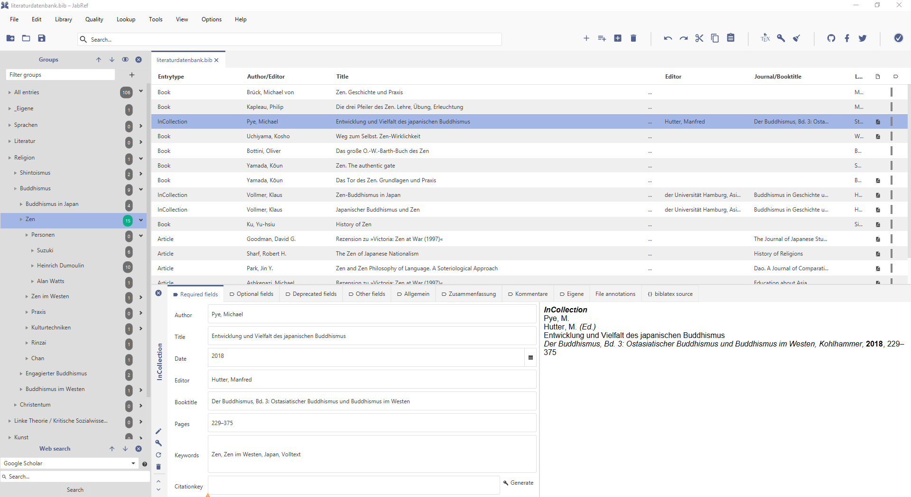
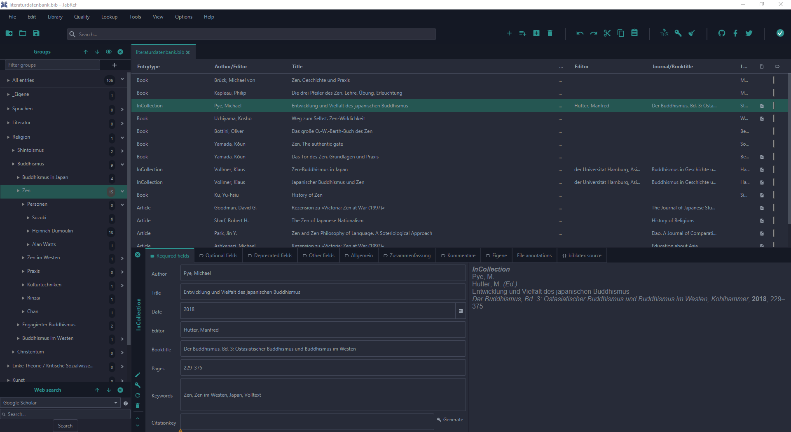
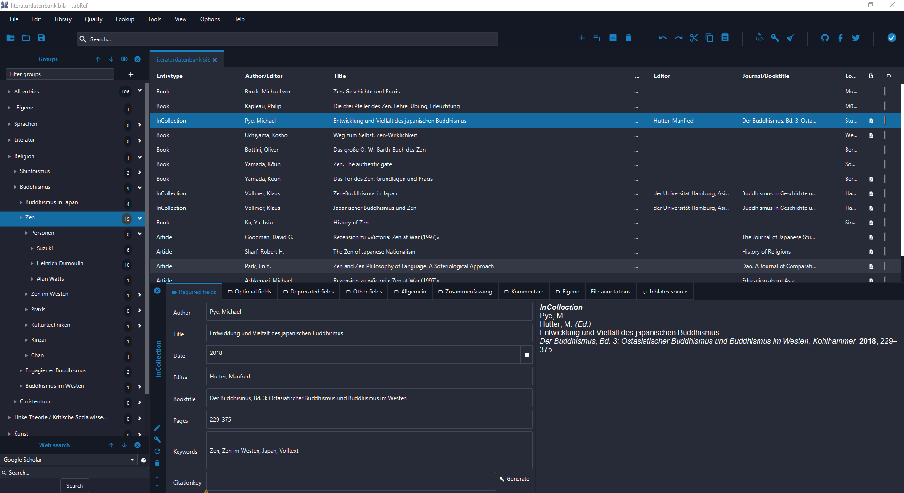

# Custom Themes
## General
Since `JabRef 5.2` it is possible to use custom themes. In `Preferences > Appearance > Visual theme` the themes in general can be changed. Themes are just [CSS](https://developer.mozilla.org/en-US/docs/Learn/Getting_started_with_the_web/CSS_basics) files defining the look of the UI.

* __Light Theme__: The default theme is the light theme ([`Base.css`](https://github.com/JabRef/jabref/blob/master/src/main/java/org/jabref/gui/Base.css)).
* __Dark Theme__: There is an alternative dark theme ([`Dark.css`](https://github.com/JabRef/jabref/blob/master/src/main/java/org/jabref/gui/Dark.css)) which is based on `Base.css` and just overwrites the colors.
* __Custom Theme__: In `Preferences > Appearance > Visual theme > Custom theme` there can be set a custom theme by simply selecting a custom CSS (based on `Base.css` or `Dark.css`), for instance [`dark-custom.css`](../.gitbook/assets/dark-custom.css).

## Selection of Useful CSS selectors
UI element | CSS selector
------ | ------
preview box | `#previewBody`
`{} biblatex source` tab | `.code-area`
text in `{} biblatex source` tab | `.code-area .text`

## Examples
__Light Theme__

__Dark Theme__

__Custom Theme__ (based on the Dark Theme)

