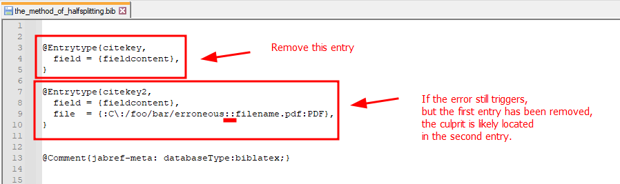

# Debugging your library file

## Enable debug log

Sometimes, it helps to [ask JabRef to write some more debugging messages](https://docs.jabref.org/advanced/commandline#debug-mode-debug).

## Use Backups

If you encounter any errors that are related to wrong, erroneous, corrupt or vanished data in your library file or simply unintended behavior that has unknown causes, the first thing that is advised to do, is to find and make use of your backups.

1. **Navigate to your** [**backup directory**](https://docs.jabref.org/advanced/autosave#where-can-i-find-the-backup-files)**.**
2. **Find and select all** [**backups files**](https://docs.jabref.org/advanced/autosave#what-are-.sav-.bak-and-.tmp-files) (the `.bak` files).
3. **Copy the backup files to a safe, but different location.** (Basically, create a backup of the backups. This step is very important, as each 20 seconds, after a change to the library, the current state of the library is saved to a .bak file, but JabRef at most stores 10 backup files and if you continue to work with your original library file (.bib), eventually JabRef will overwrite your old backup files)
4. **Compare the backup file with the erroneous library.** You can do this by editing your chosen backup file (via JabRef or file editor) in such a way that the modification date is newer than that of your erroneous library. Open the erroneous library and the backup merge dialogue should trigger, which allows you to see what has changed in the file. Alternatively, to achieve the same result, it is possible to use third party file versioning systems like [Git](https://git-scm.com/) or visual difference and merge tools like [Meld](https://meldmerge.org/) or [WinMerge](https://winmerge.org/).

If this method works: Great!\
If this method does not work with the first backup file: Try an older backup file\
If this method does not work with any backup file: Try the method of half splitting.

## The method of half splitting

The method of **half splitting** (also referred to as **halving**) can be used to find certain faults in your library file, which are caused by erroneous syntax, file conversions or incompatible encodings/charsets. These faults may make it impossible for JabRef to correctly parse, read or import the library file.\
\
An easy way to look at the method of halving is to repeatedly ask yourself the following question, after having deleted a part of your library file: "Is the error in the first part or the last part of the entries?"

#### **How it works:**

1. Create a backup of your library file.
2. Open your library with the text-editor of your choice (For example, [Notepad++](https://alternativeto.net/software/notepad-plus-plus/)).
3. Delete half of your [entries](https://docs.jabref.org/advanced/fields#standard-bibtex-format).
4. Open your library with JabRef.
5. If your library now miraculously does not trigger the error, don't stop and leave. Instead, rinse and repeat and use the technique of halving on the junk of entries that you just deleted (hence the need for backups!). Use the technique of halving on THAT part of the library.
6. Repeat deleting entries until you can isolate the specific entry or entries that trigger errors.
7. Remove these entries with the error.\
   Add all the other entries back.\
   Open JabRef.\
   Be happy :-)\\

#### **Example:**

Half splitting a library with two entries:

<figure><figcaption></figcaption></figure>

#### How efficient is this method?

Halving as a process of elimination will quickly lead to results, as the following table illustrates:

| Number of entries | 2 | 3 | 4 | 5 | 6 | 7 | 8 | 9 | 10 | 17 | 33 | 65 | 129 | 257 | ... |
| ----------------- | - | - | - | - | - | - | - | - | -- | -- | -- | -- | --- | --- | --- |
| Steps             | 1 | 2 | 2 | 3 | 3 | 3 | 3 | 4 | 4  | 5  | 6  | 7  | 8   | 9   | ... |

#### Related Literature

If you want to find out more about this method, the following articles explain the method of halving in various contexts:

* [https://ljackso.medium.com/half-splitting-applying-a-troubleshooting-technique-to-debugging-code-6a0578d1833c](https://ljackso.medium.com/half-splitting-applying-a-troubleshooting-technique-to-debugging-code-6a0578d1833c)
* [https://www.ecmweb.com/maintenance-repair-operations/article/20889049/the-beauty-of-halfsplitting](https://www.ecmweb.com/maintenance-repair-operations/article/20889049/the-beauty-of-halfsplitting)
* [https://www.techrepublic.com/article/secrets-of-a-super-geek-use-half-splitting-to-solve-difficult-problems/](https://www.techrepublic.com/article/secrets-of-a-super-geek-use-half-splitting-to-solve-difficult-problems/)
