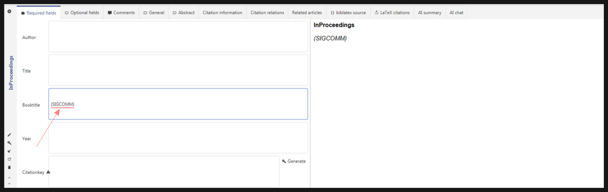

# The 'Icore' Field

The [ICORE (International CORE Conference Rankings)](https://www.core.edu.au/home) is a ranking of Computer Science conferences (A*, A, B, C). JabRef allows you to lookup a conference's ICORE rank so you can find out how highly ranked a paper's venue is.

By default, the `Icore` field shows up under the `General` tab below the `DOI` field:


If you can't find it, you can [update your preferences](../../setup/generalfields.md) and add the `icore` field to the `General` tab.


Let's do a quick example. Add a new Entry of type `InProceedings` and enter a conference acronym in parentheses under the `Booktitle` field (we'll use SIGCOMM here).

Now, navigate to the General Tab and click the "Lookup conference rank" button to see the ICORE rank for the conference (which would be A*).

Additionally, if you click the button next to the lookup button, JabRef will open the found conference's ICORE page in your default browser.

In case an acronym isn't present in the title, JabRef will then use the full `Booktitle` to match with a conference title. We'll use this long one for our next example:

> Proceedings of the 3rd International Conference on Cloud Computing and Service Science, 8-10 May 2013, Aachen, Germany

Copy-paste it into the `Booktitle` field, go to the `General` Tab, and click on the Lookup button again to see the conference's rank (which would be C).

The feature allows lookups for `InProceedings`, `InCollection`, and `Article` entry types and looks for conference titles in the `Booktitle` or `JournalTitle` fields.

In case an acronym is present but it doesn't match anything, JabRef will still fallback to searching for the entire title string. If a match is not found for the full title either, a notification with "not found" will be displayed and the Open Conference Page button will be disabled.

