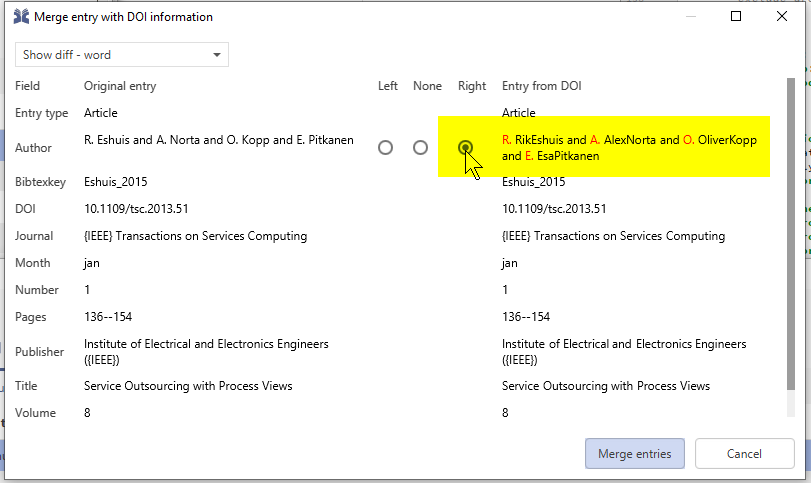

# How to expand first names of a Bib\(la\)TeX entry

Sometimes, one has a Bib\(la\)TeX entry with abbreviated short names:

```text
@Article{Eshuis_2015,
  author    = {R. Eshuis and A. Norta and O. Kopp and E. Pitkanen},
  journal   = {{IEEE} Transactions on Services Computing},
  title     = {Service Outsourcing with Process Views},
  year      = {2015},
  month     = {jan},
  number    = {1},
  pages     = {136--154},
  volume    = {8},
  publisher = {Institute of Electrical and Electronics Engineers ({IEEE})},
}
```

Now, one wants to have the full first names. In case, there is a DOI available, this is as simple as the following steps:

1. Determine the DOI: Switch to the "General" tab and click on "Look up DOI"

   

2. Fetch BibTeX data from the DOI: Click on "Get BibTeX data from DOI"

   

3. A popup appears. Select which data you want to merge into the eixting entry

   

4. Now the first names are expanded:

   

