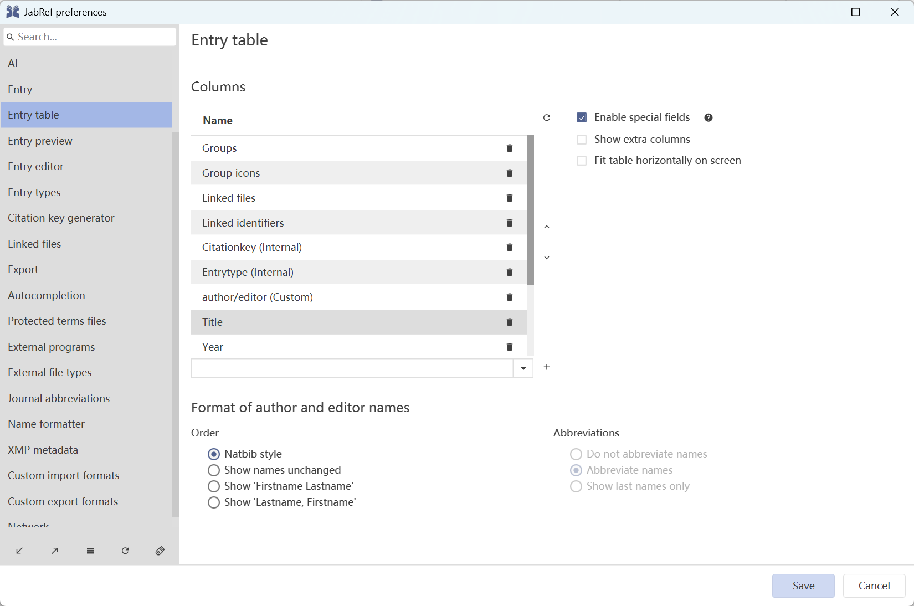
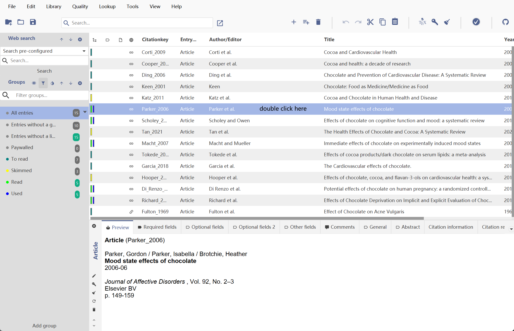
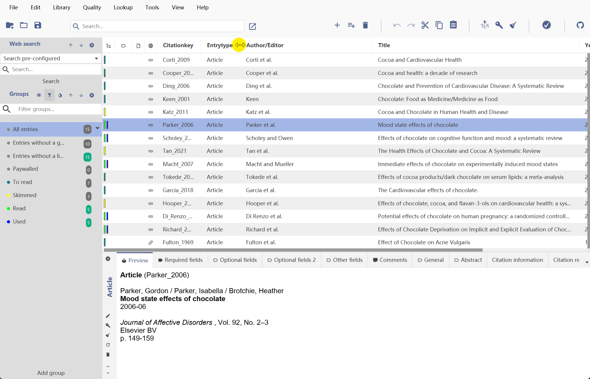

# Main Window

This is the main window from where you work with your databases. Below the menubar and the toolbar is a tabbed pane containing a panel for each of your currently open databases. When you select one of these panels, a table appears, listing all the database's entries, as well as a configurable selection of their fields. This table is also referred to as **Entry Table**

### Entry Table Preferences

* You decide which fields are shown in the entry table by checking the fields you want to see in the **File → Preferences → Entry table** dialog.

  

### Entry Table

* Double-click a line of the entry table to edit the entry content. You can navigate the table with the arrow keys.

  

* To quickly change the sort order within the entry table, click the header of a column to set it as the primary sort criterion, or reverse the sorting if it is already set. Another click will deselect the column as sorting criterion. Hold down Ctrl and click a column to add, reverse or remove it as a sub-criterion after the primary column. You can add an arbitrary number of sub-criteria, but only three levels will be stored for the next time you start JabRef.

* Adjust the width of each column by dragging the borders between their headers.

  
