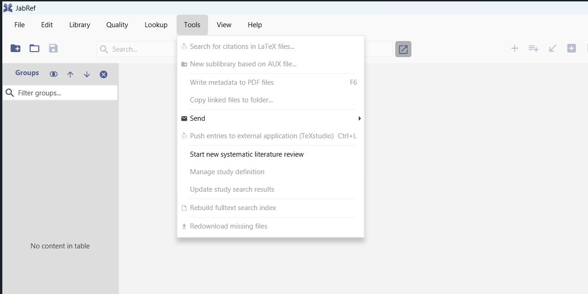
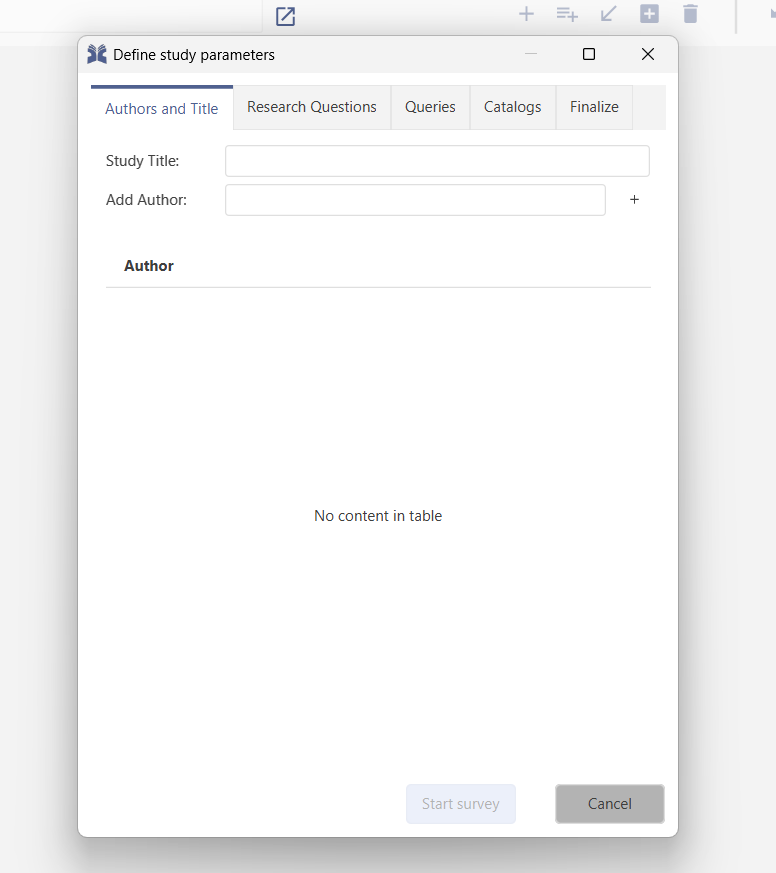
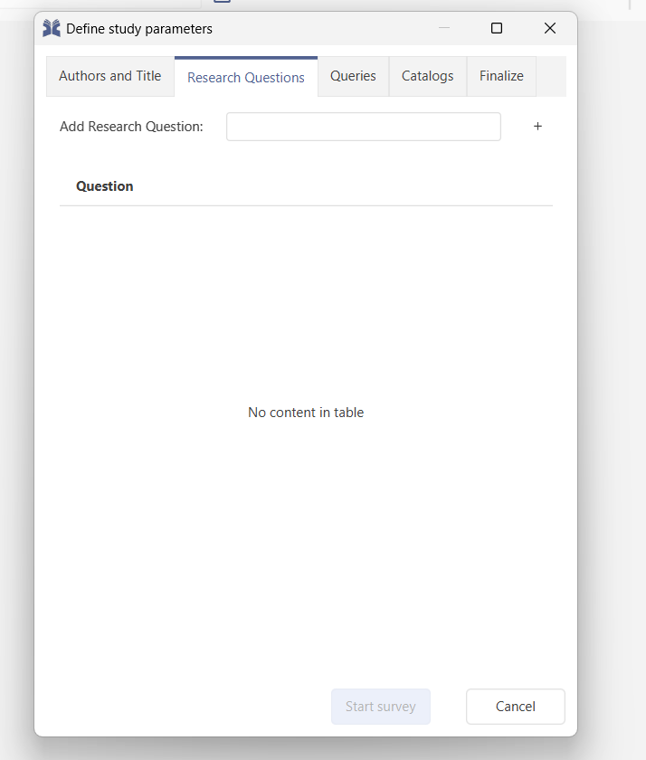
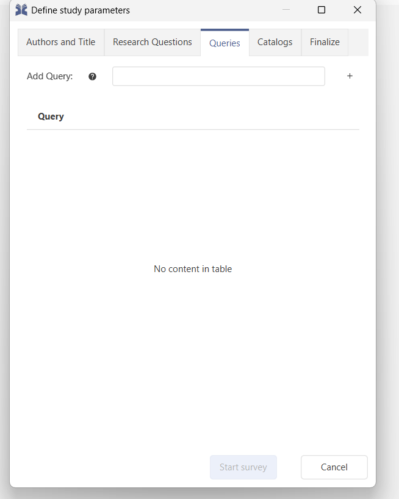
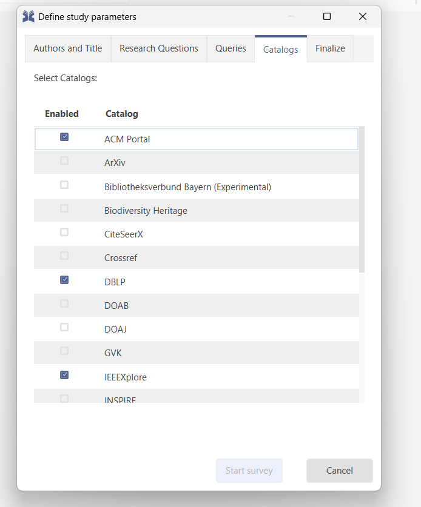
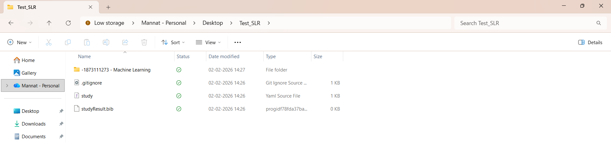

# Systematic literature review

JabRef supports managing systematic literature reviews by structuring research questions, search queries, catalogs, and results within a dedicated study directory created by JabRef.
This feature helps organize search configuration and collected references, but it does not replace methodological decisions made by the researcher.

---

## Starting a systematic literature review

A new study definition can be created via:

`Tools → Start new systematic literature review`

<figure>

<figcaption>Starting a new systematic literature review</figcaption>
</figure>

This opens the **Define study parameters** dialog, where JabRef stores the configuration used for search and data collection.

---

## Study parameters

The study definition dialog contains several sections that determine how JabRef performs searches and stores results.

<figure>

<figcaption>Study definition dialog</figcaption>
</figure>

### Authors and title

This section defines the study metadata:

* Study title
* At least one author

These elements identify the study and are required before the survey can begin.

---

### Research questions

Research questions define the scope of the study within JabRef.
They help relate queries and later screening decisions to the study purpose.

Each question should be:

* Clear
* Focused
* Defined by the research goal rather than tool settings

<figure>

<figcaption>Defining research questions</figcaption>
</figure>

---

### Queries

Queries define how JabRef retrieves literature from the selected catalogs.

<figure>

<figcaption>Defining search queries</figcaption>
</figure>

Queries typically combine keywords using Boolean operators:

* `AND`
* `OR`
* `NOT`

Queries can be adjusted later if search results need refinement.

---

### Catalogs

Catalogs define the external services that JabRef queries for literature.

<figure>

<figcaption>Selecting catalogs</figcaption>
</figure>

Examples include:

* ACM Portal
* arXiv
* DBLP
* Crossref
* IEEE Xplore

Using multiple catalogs increases coverage and reduces the risk of selection bias.

---

### Finalize

In this step, a directory for storing the study is selected.

⚠ **The selected study directory must be empty before starting the survey.**
When the survey begins, JabRef initializes the directory by creating the internal study structure, configuration files, and result database.

The **Start survey** button becomes available only after the study definition is complete. The definition must include:

* At least one author
* Study title
* At least one research question
* At least one query

These requirements ensure that JabRef can execute searches and store results using the defined study structure.

---

## After starting the survey

Starting the survey triggers the search and data collection process using the defined study parameters.

During this process:

* Queries are executed on the selected catalogs
* Retrieved records are written into the study database
* The study directory structure is populated with configuration and result data

References can then be:

* Screened
* Filtered
* Tagged
* Exported

<figure>

<figcaption>Generated study directory structure after starting the survey</figcaption>
</figure>

---

## Example Study
The example demonstrates how Jabref supports systematic-literature reviews.

### Study Title
Machine Learning Techniques for Phishing Detection: A Systematic Study

---

### Research Questions
* RQ1: What ML techniques are used in research for phishing detection?
* RQ2: How is the performance of ML models measured for phishing detection?
* RQ3: What are the open challenges in implementing ML techniques for detecting phishing?

These research questions mainly focus on the technical side of phishing detection research. RQ1 aims to identify the approaches proposed for detecting phishing attacks. We can then categorize what methods actually exist and hence understand trends in those applied techniques. RQ2 focuses on how researchers analyse and evaluate their models, including the performance metrics. Finally, RQ3 highlights the challenges and the research gaps. This helps identify directions for future research.

<figure>

<figcaption>Research Questions on Jabref</figcaption>
</figure>

---
### Search Strategy
The goal of the search is to gather relevant research studies on machine learning techniques applied to phishing detection.

#### Queries:
("phishing" OR "phishing website" OR "phishing email") AND ("machine learning" OR "ML" OR "artificial intelligence" OR "deep learning")

<figure>

<figcaption>Queries on Jabref</figcaption>
</figure>

#### Catalogs:
The search was conducted using major academic bibliographic databases to ensure wide coverage of research in computer science and security. The databases include IEEE Xplore, CiteSeerX and Crossref.

#### Inclusion-Exclusion criteria
To ensure that only relevant and high-quality studies are selected, inclusion and exclusion criteria are defined.

* Inclusion: Studies must focus on phishing detection as the primary problem and apply machine learning techniques. Studies must report experimental evaluation or performance analysis of the proposed methods.

* Exclusion: Studies are excluded if they do not use machine learning techniques or are not related to phishing detection. Studies are also excluded if they are duplicates, opinion papers, tutorials, or if the full text is not accessible.

---

### Study Selection Process

Initial search results: 120 studies  
After title screening: 77  
After abstract screening: 66
After relevance filtering: 59
Further quality filtering: 34  
Finally selected primary studies: 24

In JabRef, these stages can be represented using groups for screening levels, keywords to mark inclusion or exclusion decisions, and notes to record screening justifications.

<figure>

<figcaption>Initial Search Results</figcaption>
</figure>

<figure>

<figcaption>After Title Screening</figcaption>
</figure>

<figure>

<figcaption>After Abstract Screening</figcaption>
</figure>

<figure>

<figcaption>After Relevance filtering</figcaption>
</figure>

<figure>

<figcaption>After Quality filtering</figcaption>
</figure>

<figure>

<figcaption>Selected Primary Studies</figcaption>
</figure>

---

### Data Extraction

For the 24 selected papers, some basic info was written in the Notes section of each entry in JabRef. Things noted included:
* Which ML method the paper used
* What it tries to detect (email, URL, website, etc.)
* What type of input or features were used
* Which performance metrics were reported
* Any strengths or limitations mentioned in the paper

This shows how JabRef can be used to store small notes about each study while doing the review.

**Notes related to RQ1- Techniques observed**
* Many papers use traditional ML like Random Forest, SVM, XGBoost
* These depend on manual features like URL, email headers, text patterns
* Deep learning is also common — CNN, LSTM for text/email/web content
* Transformer models are used for text classification in some studies
* Recent work includes Large Language Models
* Some papers fine-tune transformers
* Some use in-context learning or multi-agent setups
* A few try self-supervised or contrastive learning

**Notes related to RQ2- Performance evaluation**
* Most studies report accuracy, precision, recall, F1-score
* Traditional ML often performs well and is lighter
* Deep learning and transformers show higher results with more data
* LLM-based systems tested for understanding realistic phishing content
* Some papers test against adversarial or modified inputs

**Notes related to RQ3- Challenges observed**
* Phishing emails and websites look more real now
* Normal URL/text features are not always enough
* In some studies, datasets are old
* New types of phishing are not much covered

---

### Outcome of the example
This example shows how Jabref supports structuring an SLR workflow, organising screening stages, and storing extracted notes for selected studies.

---

## Best practices

* Define research questions before constructing queries
* Start with broader queries and refine if needed
* Use multiple catalogs to retrieve records from different sources
* Document queries used in the study definition
* Use tags and groups to organize screening decisions

This supports consistent and reproducible handling of search results in JabRef.
