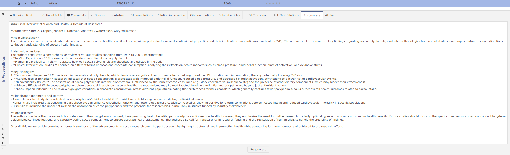
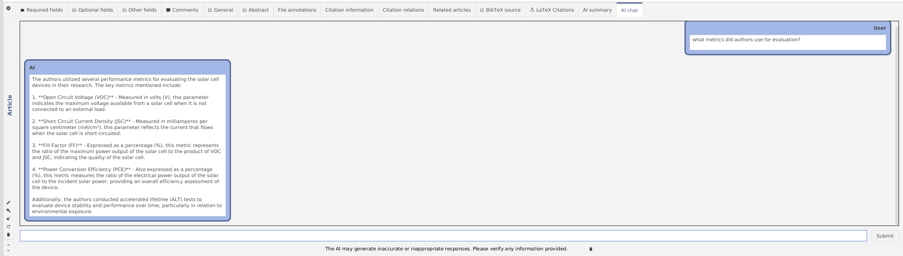

# AI functionality in JabRef

Since version 6, JabRef has AI-functionality build in.

- AI can generate a summary of a research paper
- One can also chat with papers using a "smart" AI assistant

## AI summary tab

On activation of this tab, AI will generate for you a quick overview of the paper.

The AI will mention main objectives of the research, methods used, key findings, and conclusions.

## AI chat tab

Here, one can ask questions, which are answered by the LLM.

In this window you can see the following elements:

- Chat history with your messages
- Prompt for sending messages
- A button for clearing the chat history (just in case)

## How does the AI functionality work?

In the background, JabRef analyzes the linked PDF files of library entries. The information used after the indexing is then supplied to the AI, which, to be precise, in our case is a Large Language Model (LLM). The LLM is currently not stored on your computer.
Instead, we have many integrations with AI providers (OpenAI, Mistral AI, Hugging Face), so you can choose the one you like the most.
These AI providers are availableonly remotely via the internet.
In short: we send chunks of text to AI service and then receive processed responses.
In order to use it you need to configure JabRef to use your API key.

JabRef processes linked files this way: the file is split into parts of fixed-length (also called *chunks*), and then an *embedding* is generated.
Embedding is a representation of a part of text.
It is a vector that represents the meaning of the text.
This vector has a crucial property: texts with similar meaning have vectors that are close to (this is called *vector similarity*).
So, whenever you ask AI a question, JabRef tries to find relevant pieces of text from the indexed files using vector similarity.

## More information








