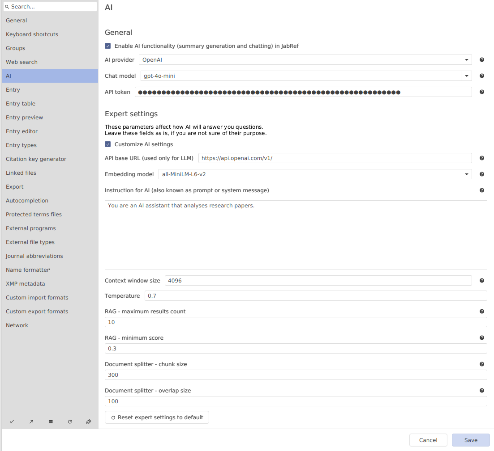

# AI providers and API keys

## What is an AI provider?

An AI provider is a company or a service that gives you the ability to send requests to and receive responses from an LLM. In order to get the response, you also need to send an API key to authenticate and manage billing.

Here is the list of AI providers we currently support: OpenAI, Mistral AI, Hugging Face. Others include Google Vertex AI, Microsoft Azure OpenAI, Anthropic, etc. You can find more information on this topic on the [`langchain4j` documentation website](https://docs.langchain4j.dev/category/language-models). This is the framework that we use in JabRef. This page lists available integrations.

## What is an API key?

An API key or API token is like a password that lets an app or program access information or services from another
app or website, such as an LLM service. It ensures that only authorized users or applications can use
the service. For example, when an app uses an LLM service to generate text or answer questions, it includes its
unique API key in the request. The LLM service checks this key to make sure the request is legitimate before
providing the response. This process keeps the data secure and helps track how the service is being used.

## Which AI provider should I use?

For now, we recommend you choosing [OpenAI](https://platform.openai.com/docs/models).

For Mistral AI, you might need to make a subscription, whereas for OpenAI, a one-time payment option is available

Hugging Face gives you access to numerous count of models for free.
However, it may take a long time for Hugging Face to allocate free computing resources, resulting in longer response times

In order to use any service, you always need an API key.
Please head to the [AI user documentation](https://docs.jabref.org/ai/ai-providers-and-api-keys) to learn about how to receive a key and where to enter it in the preferences.

## How to get an API key?

### How to get an OpenAI API key?

To get an OpenAI API key, follow these steps:

1. Log in or create an account on the [OpenAI website](https://platform.openai.com/login?launch)
2. Go to the "API" section
3. Go to the "Dashboard" (upper-right corner)
4. Go to the "API keys" (left menu)
5. Click "Create new secret key"
6. Click "Create secret key"
7. OpenAI will display the key

### How to get a Mistral AI API key?

1. Login or create an account on the [Mistral AI website](https://auth.mistral.ai/ui/login)
2. Go to the [dashboard -> API keys](https://console.mistral.ai/api-keys/)
3. There you will find a button "Create new key". Click on it
4. You can optionally set up a name for the API key and its expiration date
5. After the creation, you will see "Your key is:" with a string of random characters after that

### How to get a Hugging Face API key?

Hugging Face refers to an "API key" as an "Access Token". It does not make much difference, you can interchangeably use either "API key", or "API token", or "access token".

1. [Login](https://huggingface.co/login) or [create account](https://huggingface.co/join) on Hugging Face
2. Go to [create access token](https://huggingface.co/settings/tokens/new?)
3. Set "Token Type" to "Read"
4. Name a token
5. After you click "Create token", a popup will be shown with the API key

## What should I do with the API key and how can I enter it in JabRef?

Do not share the key with anyone, it is a secret that was created only for your account. Do not enter this key into unknown or unverified services.

Now you need to copy and paste it into JabRef preferences. To do this:

1. Launch JabRef
2. Go "File" -> "Preferences" -> "AI" (a new tab!)
3. Check "Enable chatting with PDFs"
4. Paste the key into "OpenAI token"
5. Click "Save"

If you have some money on your credit balance, you can chat with your library!



## How to increase money balance for API key?

### OpenAI

To increase your credit balance on OpenAI, follow these steps:

1. Add payment method [here](https://platform.openai.com/settings/organization/billing/payment-methods).
2. Add credit balance on [this](https://platform.openai.com/settings/organization/billing/overview) page.

### Mistral AI

Make the subscription on [their website](https://console.mistral.ai/billing/subscribe/).

### Hugging Face

You do not have to pay anything for Hugging Face in order to send requests to LLMs. Though, the speed is very slow by default. You can switch to faster inference by [upgrading your user account](https://huggingface.co/pricing#pro) or by [running a space on GPU](https://huggingface.co/docs/hub/spaces-gpus).
