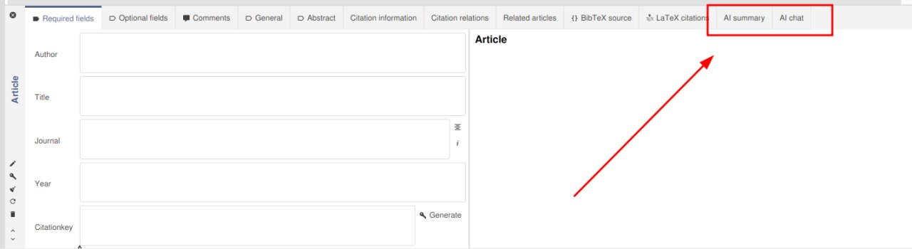
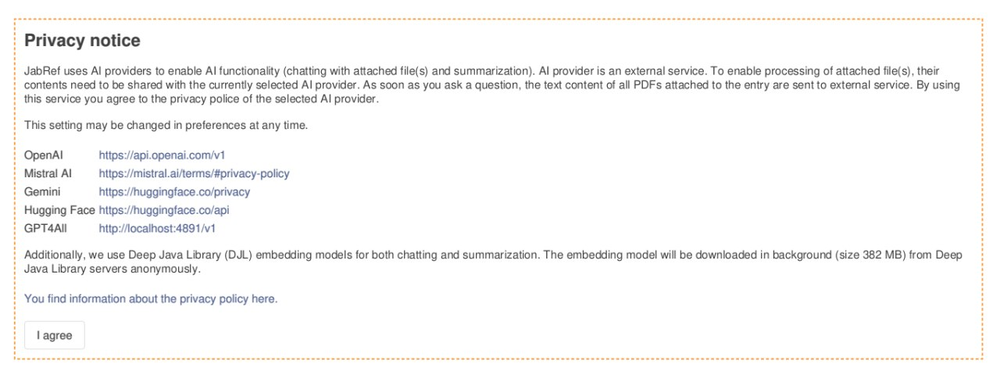
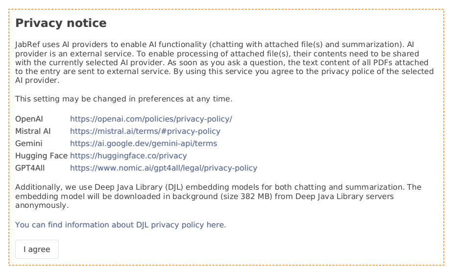

# How to enable and use AI features?

Thank you for checking out JabRef AI features! We believe you can find them useful in your research or brainstorming process.

## 1. Locate new entry editor tabs and accept AI Privacy Policy

As you run the latest JabRef version, you will find 2 new entry editor tabs ("AI Chat" and "AI Summary"):

However, the first time you open these tabs, JabRef will ask your permission for using AI features and accepting AI Privacy Policy:

In AI Privacy Policy you can find links to Privacy Policies of external services like OpenAI, Mistral AI, etc.

In order to enable all AI features, you need to accept this Privacy Policy. If you do not accept it, none of your information will be transmitted to external services.

## 2. Obtain API key

After clicking "I agree" button, there is only one crucial step left for using AI features. You need to setup connection to AI provider. Please refer to [AI providers and API keys](ai-providers-and-api-keys.md) page to understand what is an AI provider and how to get an API key.

## 3. Enter API key in JabRef

After you got your API key, you need to enter it in JabRef preferences. Open Preferences using menu `File -> Preferences`. Locate tab `AI`:

Choose the AI provider you have the API key from and enter the API key (in this order, because JabRef stores several API keys tied to specific AI provider). Additionally you can choose chat model of the AI provider.[AI providers and API keys](ai-providers-and-api-keys.md) page to understand what is an AI provider and how to get an API key.

Choose the AI provider you have the API key from and enter the API key (in this order, because JabRef stores several API keys tied to specific AI provider). Additionally, you can choose chat model of the AI provider that you want to use in JabRef.

Save the preferences and after that you are able to use JabRef's AI features on full power!
