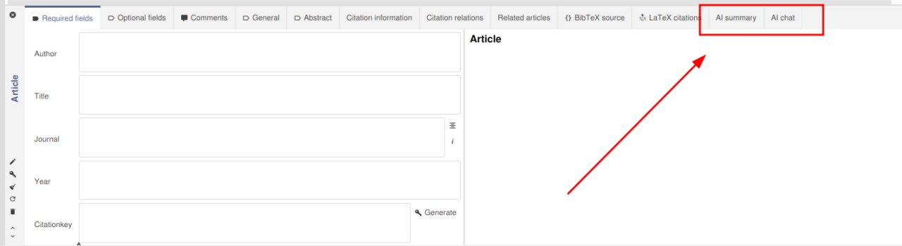
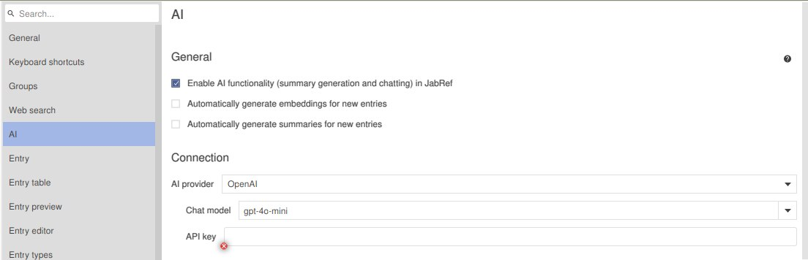

# How to enable and use AI features?

Thank you for checking out JabRef AI features! We believe you can find them useful in your research or brainstorming process.

## 1. Locate and accept the AI Privacy Policy

1. Run JabRef, open a library, select an entry and open the [entry editor](../advanced/entryeditor/). There you will see tabs that have AI in their name.

2. Open the **AI Chat** or the **AI Summary** tab. The first time you open any of these tabs, JabRef will ask for your permission to accept the Privacy notice. In order to enable all AI features, you need to accept it, by pressing the **I agree** button. If you do not accept it, none of your information will be transmitted to external services.

In the AI Privacy notice you can find links to Privacy Policies of supported external services and an explanation what data is sent to external services.

## 2. Attach a file to your entry

In order to use the following AI features in the entry editor, you need to [add PDFs to an entry](../collect/add-pdfs-to-an-entry.md):

* AI Chat
* AI Summary tabs

This in turn requires you to [set a main file directory](../finding-sorting-and-cleaning-entries/filelinks.md#directories-for-files). JabRef supports other AI features that do not require you to attach a file to your entry, such as [using a language model to turn plain reference text into an entry](../collect/newentryfromplaintext.md#llm) and if that's all you need, you can skip this step.

## 3. Connect to an external AI provider

There is only one crucial step left for using AI features. You need to set up a connection to an external AI provider. With _external_, we mean a provider outside of JabRef, regardless, if that entails connecting to an [AI app on your local device](local-llm.md) or connecting to a remote online service.

While the former may or may not require an API key, online services most definitely will require you to enter one, therefore here is some guidance:

#### 1. Obtain an API key

Please look at the [AI providers and API keys](ai-providers-and-api-keys.md) documentation page to understand what is an AI provider and how to get an API key.

#### 2. Enter an API key

After you got your API key, you need to enter it in JabRef's [Preferences](preferences.md).

1. Open the preferences menu via `File > Preferences`.
2. Locate the `AI` tab.
3. Choose the AI provider you have the API key from and enter the API key (in this order, because JabRef can store several API keys, tied to specific AI providers).

Finally, you can choose the chat model of the AI provider.

Save the preferences and henceforth you are able to use JabRef's AI features as you see fit!