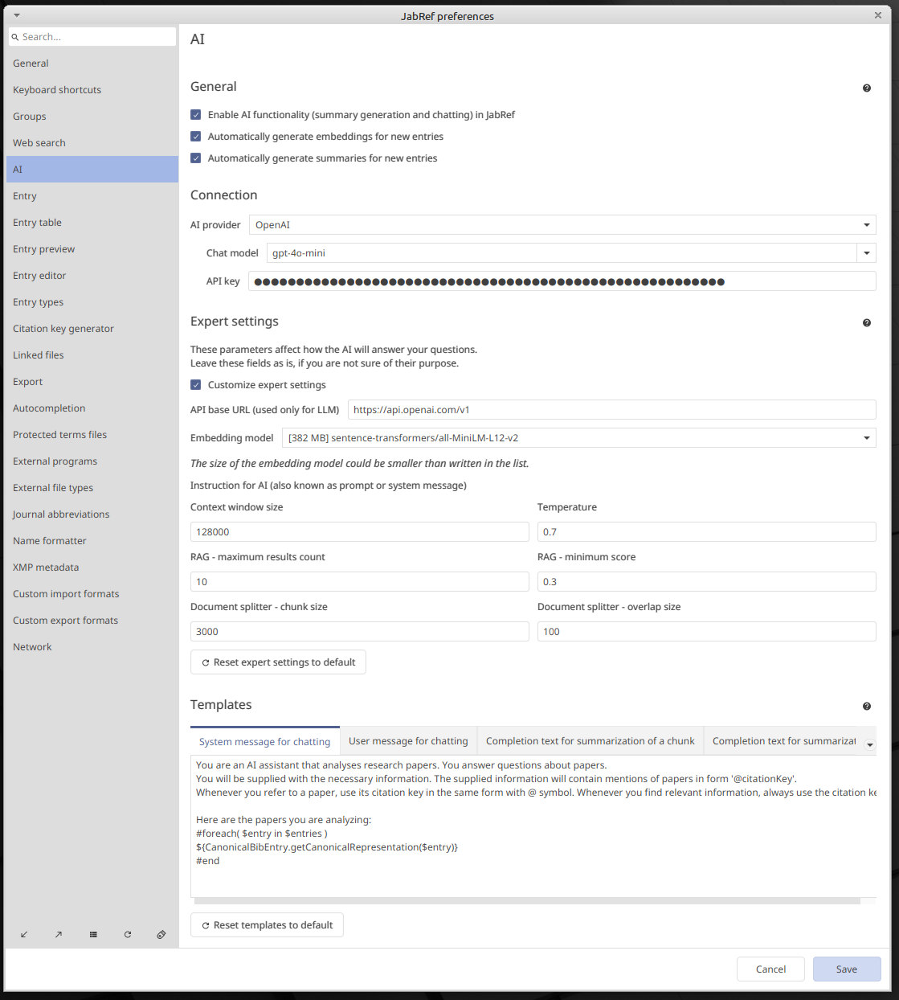

# AI preferences

## General settings

- "Enable AI functionality in JabRef": by default it is turned off, so you need to check this option if you want to use the new AI features
- "Automatically generate embeddings for new entries": when this check box is switched on, for every new entry in the library, JabRef will automatically start an embeddings generation task. (If you do not know what are the embeddings, take a look at ["How does the AI functionality work?"](https://docs.jabref.org/ai#how-does-the-ai-functionality-work)).
- "Automatically generate summaries for new entries": when this check box is switched on, for every new entry in the library, JabRef will automatically generate a summary.

If you import a lot of entries at a time, we recommend you to switch off options "Automatically generate embeddings for new entries" and "Automatically generate summaries for new entries", because this may slow down your computer, and you may reach the usage limit of the AI provider.

## Connection settings

- "AI provider": you can choose either OpenAI, Mistral AI, or Hugging Face
- "Chat model": choose the model you like (for OpenAI we recommend `gpt-4o-mini`, as to date, it is the cheapest and fastest, though we also recommend to look up the prices periodically, as they are subject to change)
- "API token": enter your API token here

## Expert settings

### API base URL

**Type**: string

**Requirements**: valid URL address

The "API Base URL" setting tells your application where to find the language model's online service. Think of it as the main address or starting point for all communications with the language model. By specifying this URL, your application knows exactly where to send requests to get responses from the language model.

You do not have to set this parameter manually or remember all the addresses. JabRef will automatically substitute the address for you when you select the AI provider.

### Embedding model

**Requirements**: choose one available from combo box

The embedding model transforms a document (or a piece of text) into a vector (an ordered collection of numbers). This transformation provides the AI with relevant information for your questions.

Different embedding models have varying performance, including accuracy and the speed of computing embeddings. The `_q` at the end of the model name usually denotes *quantized* (meaning reduced or simplified). These models are faster and smaller than their original counterparts but provide slightly less accuracy.

Currently, only local embedding models are supported. This means you do not need to provide a new API key, as all the processing will be done on your machine.

### Instruction

**Type**: string

**Requirements**: not empty

An instruction (also known as a "system message") in Large Language Models (LLMs) sets the tone and rules for the conversation. Think of it as instructions given to the AI before it starts interacting with a user. It guides the AI on how to respond, ensuring it stays on topic and behaves appropriately. For example, a system message might tell the AI to be formal, concise, or provide detailed explanations. This helps the AI provide more relevant and useful answers tailored to the user's specific needs.

**Important**: in JabRef, the system message for the LLM is constructed from the supplied text plus information about the current library entry. Therefore, at the end of your text, you should add a note such as "Here is the information about the library entry you are chatting about:"

### Context window size

**Type**: integer

**Requirements**: > 0

The "context window size" in our application helps the AI remember and respond to conversations more effectively by keeping the most recent messages within a sliding window. As new messages are added, older messages are removed to make room, ensuring the AI always has the latest context. This feature enhances the AI's ability to provide accurate and relevant responses by focusing on the most current parts of the conversation, similar to how we remember the latest parts of a discussion. This process is managed automatically, so you can enjoy a smoother and more natural conversation experience without any additional effort. For the advanced user, we recommend to check the context window of the Large Language Model is trained on to find the largest possible parameter.

### Temperature

**Type**: float

**Requirements**: 0 >= && <= 2

This setting controls how creative or focused the AI’s responses will be. A lower temperature (closer to 0) makes the AI more predictable, providing safer and more straightforward answers. A higher temperature (closer to 2) allows the AI to be more creative and varied in its responses, but it may also become less consistent. Adjust the temperature based on whether you prefer more accurate or more imaginative answers.

### Document splitter chunk size

**Type**: integer

**Requirements**: > 0

The "chunk size" parameter in document splitting refers to the size of segments into which linked files are divided for processing by AI models. When dealing with linked files, such as PDFs, they are segmented into smaller chunks based on this parameter. Each segment typically contains a specified number of words or characters, ensuring manageable units for analysis and generating answers.

These segments are then passed to the AI model for processing. This approach helps optimize performance by breaking down large documents into smaller, more digestible parts, allowing for more efficient handling and analysis by the AI.

### Document splitter chunk overlap

**Type**: integer

**Requirements**: > 0 && < chunk size

The "chunk overlap" parameter determines how much text from adjacent chunks is shared when dividing linked files into segments. This overlap is measured in characters and ensures continuity and context across segmented chunks. By sharing a specified amount of text between adjacent segments, typically at the beginning and/or end of each chunk, the AI model can maintain coherence and understanding of the content across segments. This approach helps enhance the accuracy and relevance of responses generated by the AI from the segmented content.

### Retrieval augmented generation maximum results count

**Type**: integer

**Requirements**: > 0

The parameter "Retrieval augmented generation: maximum results count" specifies the maximum number of chunks or segments of text to retrieve for processing and generating responses. When using retrieval-augmented generation (RAG), which combines traditional language model generation with the retrieval of relevant text segments, this parameter determines how many segments are considered for each query or input.

Setting this parameter controls the scope of information the AI model uses to generate responses, balancing depth of context and computational efficiency. It ensures that the AI focuses on the most relevant segments to provide accurate and contextually rich answers based on the user's input or query.

### Retrieval augmented generation minimum score

**Type**: float

**Requirements**: > 0 && < 1

The "Retrieval augmented generation: minimum score" parameter sets the relevance threshold when retrieving chunks of text for generation. It specifies the minimum score that segments must achieve to be included in the results. Any text segments scoring below this threshold are excluded from the AI's response generation process.

This parameter is crucial for ensuring that the AI model focuses on retrieving and utilizing only the most relevant information from the retrieved chunks. By filtering out segments that do not meet the specified relevance score, the AI enhances the quality and accuracy of its responses, aligning more closely with the user's needs and query context.

## Templates

### General Description

The **Templates** section in the AI settings allows you to customize the behavior of every task in JabRef that includes LLMs.

To use the templates, we employ the [Apache Velocity](https://velocity.apache.org/) template engine. You can refer to the [User Guide](https://velocity.apache.org/engine/devel/user-guide.html) to learn the syntax of Apache Velocity.

There are four templates that JabRef uses:

- **System Message for Chatting**: This template constructs the system message (also known as the instruction) for every AI chat in JabRef (whether chatting with an entry or with a group).
- **User Message for Chatting**: This template is also used in chats and is responsible for forming a request to AI with document embeddings. The user message created by this template is sent to AI; however, only the plain user question will be saved in the chat history.
- **Summarization Chunk**: In cases where the chat model does not have enough context window to fit the entire document in one message, our algorithm will split the document into chunks. This template is used to summarize a single chunk of a document.
- **Summarization Combine**: This template is used only when the document size exceeds the context window of a chat model. It combines the summarized chunks into one piece of text.

You can create any template you want, but we advise starting from the default template, as it has been carefully designed and includes special syntax from Apache Velocity.

### Contexts for Templates

For each template, there is a context that holds all necessary variables used in the template. In this section, we will show you the available variables for each template and their structure.

- **System Message for Chatting**: There is a single variable, `entries`, which is a list of BIB entries. You can use `CanonicalBibEntry.getCanonicalRepresentation(BibEntry entry)` to format the entries.
- **User Message for Chatting**: There are two variables: `message` (the user question) and `excerpts` (pieces of information found in documents through the embeddings search). Each object in `excerpts` is of type `PaperExcerpt`, which has two fields: `citationKey` and `text`.
- **Summarization Chunk**: There is only the `text` variable, which contains the chunk.
- **Summarization Combine**: There is only the `chunks` variable, which contains a list of summarized chunks.

## Further literature

- [Visual representation of samplers (Temperature, Top-P, Min-P, ...) by Artefact2](https://artefact2.github.io/llm-sampling/index.xhtml)
- [What is a Context Window?](https://www.techtarget.com/whatis/definition/context-window)
- [Is temperature the creativity of Large Language Models?](https://arxiv.org/abs/2405.00492)
- [The Effect of Sampling Temperature on Problem Solving in Large Language Models](https://arxiv.org/abs/2402.05201)
- [Min P Sampling: Balancing Creativity and Coherence at High Temperature](https://arxiv.org/abs/2407.01082)
- [Challenges in Deploying Long-Context Transformers: A Theoretical Peak Performance Analysis](https://arxiv.org/abs/2405.08944)
