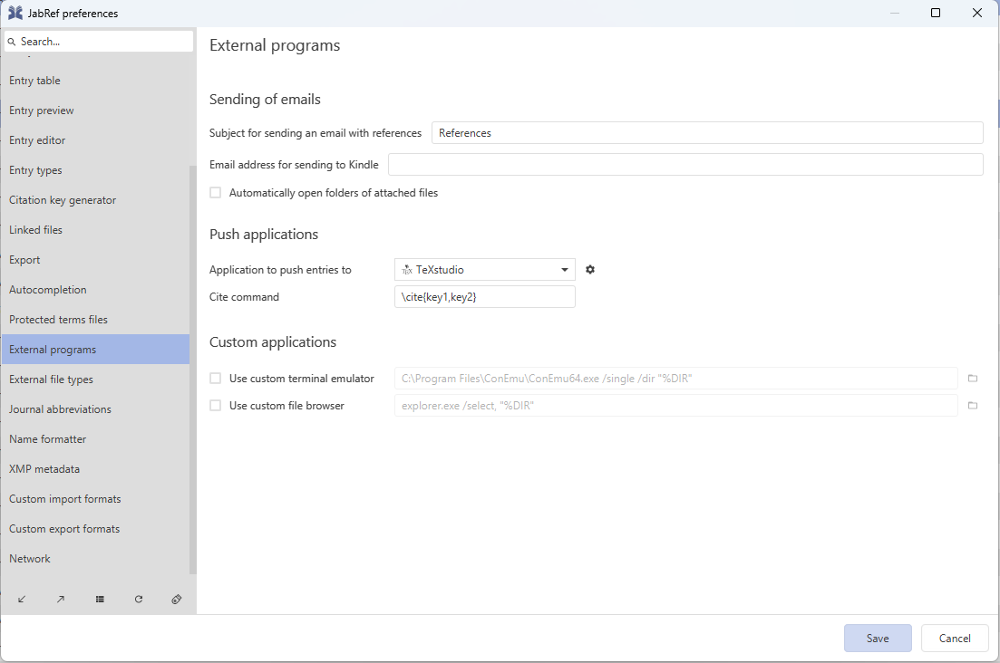

---
helpCategories:
  - Import/Export
description: Inserting a citation directly in your editor.
---

# Pushing to external editor application

JabRef allows you to push any entries in your main window to an external editor through the push-to-external application feature. It works with [Emacs](https://www.gnu.org/software/emacs/), [LyX](https://www.lyx.org/), [Kile](https://apps.kde.org/kile/), [Sublime Text](https://www.sublimetext.com/), [Texmaker](https://www.xm1math.net/texmaker/), [TeXShop](https://pages.uoregon.edu/koch/texshop/), [TeXstudio](https://www.texstudio.org/), [TeXworks](https://www.tug.org/texworks/), [vim](https://www.vim.org/), [Visual Studio Code](https://code.visualstudio.com/), and [WinEdt](https://www.winedt.com/).

To push as citation, first select the entries in your entry table that you would like to push. Then, either:

* go to **Tools → Push entry to external application​**
* Press `CTRL + L`
* Click on the dedicated button in the taskbar (left of the _Generate citation key_ button)

.png>)

By default the external editor used to push citations is TeXstudio. You can select another application in **Options → Preferences → External programs**. Under the **Push applications** section, click on the **Application to push entries to** field. This will cause a dropdown menu to appear, from which you are then able to select from a list of all the external editors you have configured.



You can configure the citation command at "Cite command". JabRef intelligently parses the value you gave here. In the example, the congiration `\cite{key1,key2}` means, that the cite command is `\cite`, the keys are enclosed by `{...}` and that multiple keys are separted by a comma (`,`). With that, you can even support Pandoc's Markdown citation syntax. Configure it with `[@key1,@key2]`.

Once you have made your selection and click **Save**, the push-to-external application button icon will change to match that of the selected external editor application.

.png>)

When you click on the push-to-external application button, JabRef will export your selected entries to an open LaTeX file in the selected external editor application. As an example, here is what happens when you export one entry to TexStudio.

.png>)

As long as you continue using the same external editor application, clicking on the push-to-external application button for subsequent exports will just add new citations or extend an existing citation with additional entries. Following the example above, here is what happens when you export a second entry to TeXStudio on an existing citation, which is extended to include the new entry in your LaTeX document.

.png>)

## Hints on Emacs

There are the tools [`emacsclient`](https://www.emacswiki.org/emacs/EmacsClient) and `gnuclient`. Both support [GNU Emacs](https://www.emacswiki.org/emacs/GnuEmacs). Additionally, `gnuclient` supports [XEmacs](https://www.emacswiki.org/emacs/XEmacs). As default configuration, JabRef uses `emacsclient`. JabRef passes `-e` as parameter, because JabRef adds the emacs command after the given parameters. For a discussion on the use of `emacsclient`, see [a stackoferflow answer](https://stackoverflow.com/a/10911288/873282). The parameter `-n` (for `--no-wait`) is also passed, but that is not necessary.

On Windows, you can install emacs using `choco install emacs`. Then, start emacs. Afterwards, start the emacs daemon with following command:

```cmd
C:\tools\emacs\bin\emacs.exe --daemon
```

If that does not work, hints are provided at [https://emacs.stackexchange.com/q/35545/12933](https://emacs.stackexchange.com/q/35545/12933).
