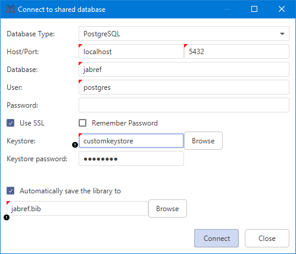
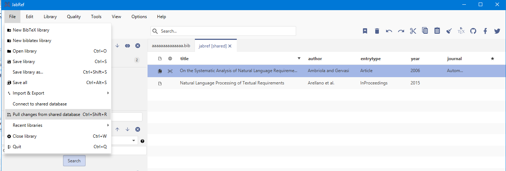

# Shared SQL Database

## Usage

To use this feature you have to connect to a remote database. To do so you have to open **File** in the menu bar and then click the **Connect to shared database** item. The **Connect to shared database** dialog will open and you will have to fill in the shared's database connection settings. Under the field **Database type** you can choose between PostgreSQL (at least version 9.1), MySQL (at least 5.5, not recommended, because there is no live synchronization), and Oracle depending on your shared database. Then, you have to fill out the remaining fields with the according information. If you like you can save your password by clicking the **Remember password?** checkbox.

### SSL configuration

Since version 5.0 JabRef supports secure SSL connection to the database. For PostgreSQL make sure the server supports SSL and you have correctly setup the [certificates](https://www.postgresql.org/docs/current/static/ssl-tcp.html). Then [convert the client certificates](https://jdbc.postgresql.org/documentation/ssl/#configuring-the-client) into a java readable format and import them into a (custom) keystore. For MySQL the procedure is similar. [Setting up MySQL with SSL](https://dev.mysql.com/doc/refman/8.0/en/using-encrypted-connections.html) and [converting the certificates](https://dev.mysql.com/doc/connector-j/8.0/en/connector-j-reference-using-ssl.html) for the java keystore. However, it has only been tested with PostgreSQL. Once the certificates are imported into the keystore, specify the path to the keystore file in the connection dialog and the password for accessing the keystore.

After connecting to your shared database, your main window should look like this:

JabRef will automatically detect your changes and push them to the shared side. JabRef will also constantly check if there is a newer version available. If you experience connection issues, you can pull changes from your shared database via the icon in the icon bar. If a newer version is available, JabRef will try to automatically merge the new version and your local copy. If this fails, the **Update refused** dialog will show up. You will then have to manually merge using the **Update refused** dialog. The dialog helps you by pointing out the differences, you then will have to choose if you want to keep your local version or update to the shared version. Confirm your merge by clicking on **Merge entries**.

.png>)

The **Update refused** dialog can also take a different form, if the BibEntry you currently work on has been deleted on the shared side. You can choose to keep the BibEntry in the database by clicking **Keep** or update to the shared side and click **Close**.

If you experience a problem with your connection to your shared database, the **Connection lost** dialog will show up. You can choose to **Reconnect**, **Work offline** or **Close database**. Most of the time simply reconnecting will fix this problem, if that's not the case you will have to choose between **Work offline** or **Close database**. Pick **Work offline** if you want to make sure your changes are saved. If you think there is nothing to save just pick **Close database**. If you choose to work offline, JabRef will convert the shared database to a local .bib database. Since you are no longer working online, but instead on a local database, you will have to import your work via copy and paste into the shared database. However before you import it into the shared database, make sure to check if changes happened during your offline time. Otherwise you might override someone else's work.

## Try it out

You can test the shared SQL database support by using [https://www.freemysqlhosting.net](https://www.freemysqlhosting.net) for MySQL (not recommended) and [https://www.elephantsql.com/](https://www.elephantsql.com) for PostgreSQL (recommended).
