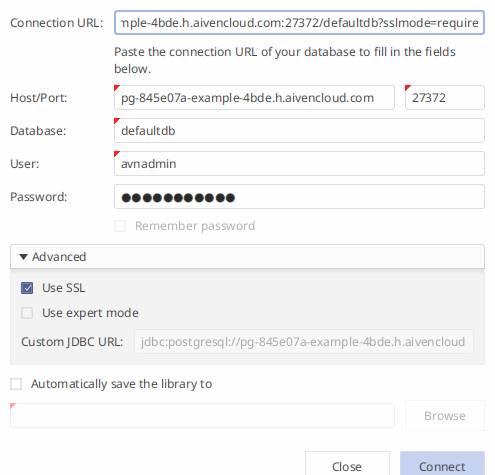
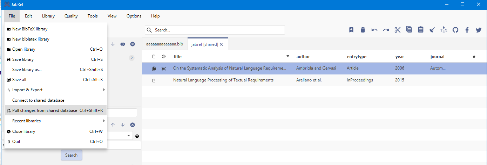
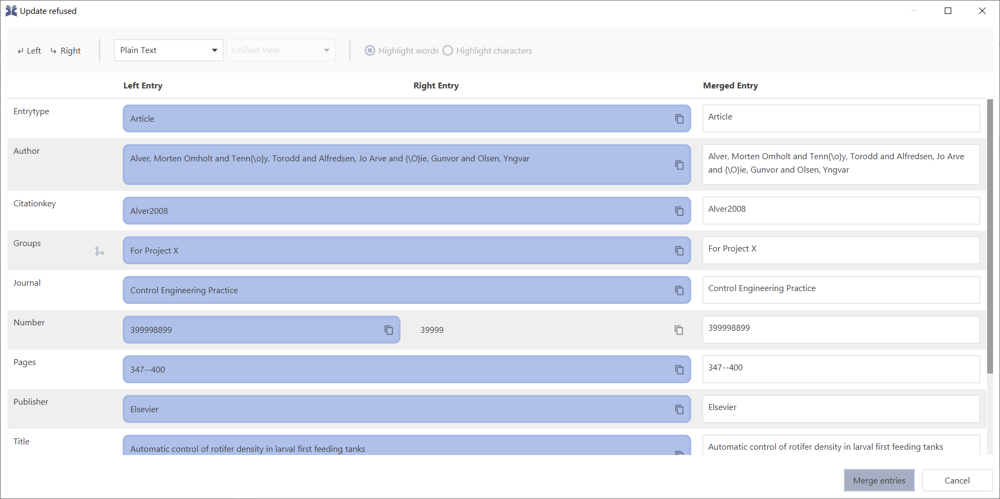
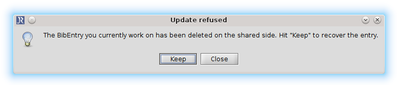
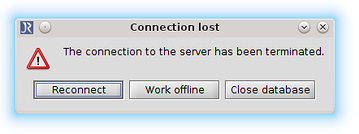

# Shared SQL Database

JabRef uses [PostgreSQL](https://www.postgresql.org/) as the database system for shared databases. Support for MySQL/MariaDB and Oracle was removed due to high maintenance effort.

## Usage

To use this feature you have to connect to a remote database. To do so you have to open **File** in the menu bar and then click **Shared database** and **Connect to shared database**. The **Connect to shared database** dialog will open and you will have to fill in the shared's database connection settings. Then, you have to fill out the remaining fields with the according information. If you like you can save your password by clicking the **Remember password?** checkbox.

If the database was already used by an older version of JabRef, its content is migrated to the new table structure automatically when the first client connects. The old tables are kept untouched, so older JabRef versions can still be used with them.

### SSL configuration

Checking **Use SSL** encrypts the connection without authenticating the server — the same behavior as `psql` — so managed PostgreSQL providers work without any certificate setup. A separate keystore is no longer needed. If you additionally want the server certificate verified, use expert mode with a custom JDBC URL containing `sslmode=verify-full` (see the [PostgreSQL JDBC documentation](https://jdbc.postgresql.org/documentation/ssl/)).

After connecting to your shared database, your main window should look like this:

JabRef will automatically detect your changes and push them to the shared side. Changes made by other users arrive automatically as well: JabRef listens for change notifications from the database, so edits, new groups, and changed library settings show up in all connected JabRef instances without any manual action. If a newer version is available, JabRef will try to automatically merge the new version and your local copy. If this fails, the **Update refused** dialog will show up. You will then have to manually merge using the **Update refused** dialog. The dialog helps you by pointing out the differences, you then will have to choose if you want to keep your local version or update to the shared version. Confirm your merge by clicking on **Merge entries**.

The **Update refused** dialog can also take a different form, if the BibEntry you currently work on has been deleted on the shared side. You can choose to keep the BibEntry in the database by clicking **Keep** or update to the shared side and click **Close**.

If you experience a problem with your connection to your shared database, the **Connection lost** dialog will show up. You can choose to **Reconnect**, **Work offline** or **Close database**. Most of the time simply reconnecting will fix this problem, if that's not the case you will have to choose between **Work offline** or **Close database**. Pick **Work offline** if you want to make sure your changes are saved. If you think there is nothing to save just pick **Close database**. If you choose to work offline, JabRef will convert the shared database to a local .bib database. Since you are no longer working online, but instead on a local database, you will have to import your work via copy and paste into the shared database. However before you import it into the shared database, make sure to check if changes happened during your offline time. Otherwise you might override someone else's work.

## Try it out

Choose one online provider and start a PostgreSQL database there.\
One list of providers is available at [https://www.postgresql.org/support/professional\_hosting/](https://www.postgresql.org/support/professional_hosting/).
