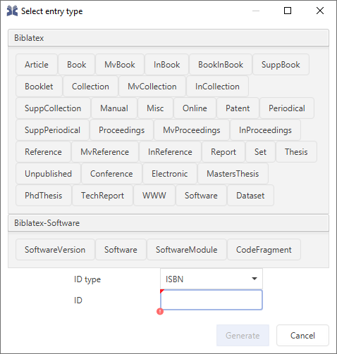

# Add entry manually

The New entry menu action shows a dialog where you can choose the type of the entry from a list.

When a new entry is added, by default an [entry editor](../advanced/entryeditor/) for the entry will be opened.

_Note:_ To bypass this dialog, there are also separate menu actions for each entry type, and keyboard shortcuts for the most common types. We strongly recommend learning the shortcuts for the entry types you use most often, e.g. Ctrl + Shift + A for adding an _article_ entry.


You have looked everywhere in this documentation and could not find a solution ?
[Ask the JabRef help forum](https://discourse.jabref.org/c/help/7).

