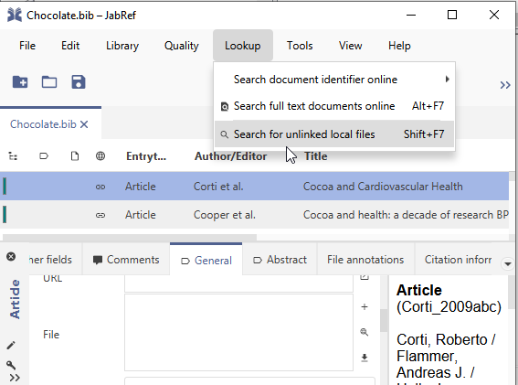
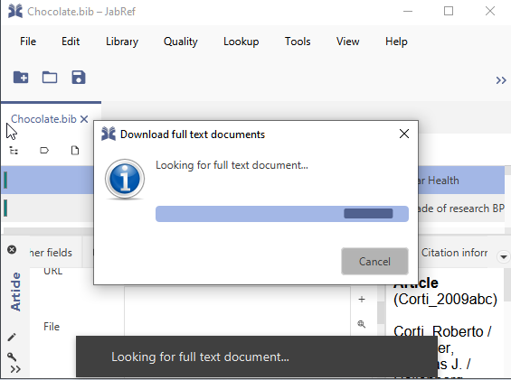
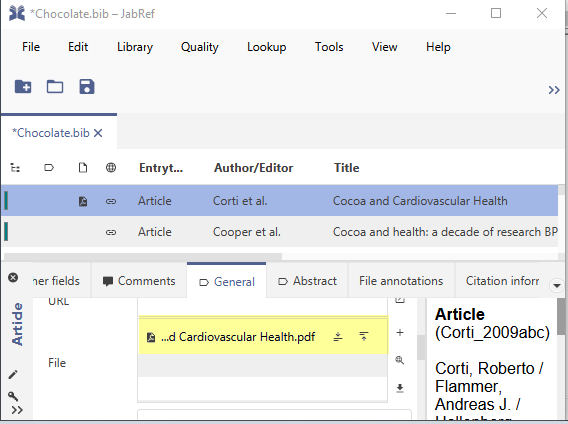

# Add PDFs to an entry

JabRef offers finding full text documents online. Mostly, these are PDFs file. To use this feature, go to "Lookup" and then select "Find full text documents online".

<figure><figcaption>
Lookup > Search for unlinked local files
</figcaption></figure>

Then, JabRef uses online services to find a PDF. (Implementation details are provided at the [developer's documentation](https://devdocs.jabref.org/code-howtos/fetchers.html).)

<figure><figcaption>
JabRef looking up full text documents
</figcaption></figure>

Result of the look up:

<figure><figcaption>
Look up result
</figcaption></figure>
