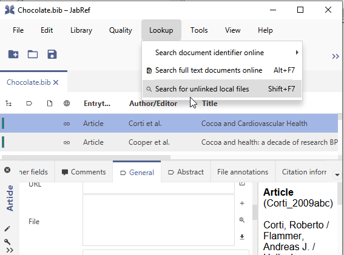
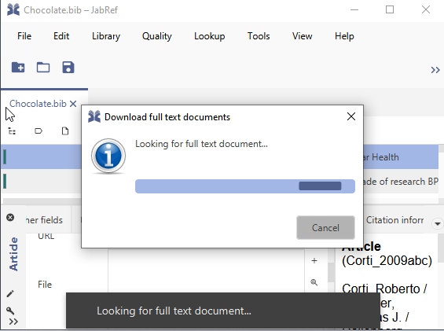
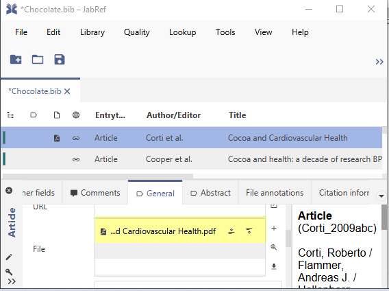
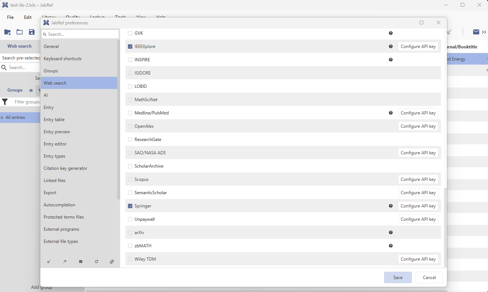
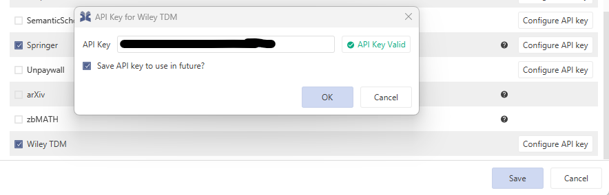

# Add PDFs to an entry

JabRef offers finding full text documents online. Mostly, these are PDFs file. To use this feature, go to "Lookup" and then select "Find full text documents online".

<figure><figcaption>
Lookup > Search for unlinked local files
</figcaption></figure>

Then, JabRef uses online services to find a PDF. (Implementation details are provided at the [developer's documentation](https://devdocs.jabref.org/code-howtos/fetchers.html).)

<figure><figcaption>
JabRef looking up full text documents
</figcaption></figure>

Result of the look up:

<figure><figcaption>
Look up result
</figcaption></figure>

## Supported sources

JabRef uses different publishers and services to find full text documents. When multiple sources find a PDF for the same entry, JabRef prefers results from higher-trust sources (e.g., a publisher's own site is preferred over a meta-search aggregator).

## Configuring API keys

Some publishers/services require an API key to work. You can configure API keys in **File > Preferences > Web search**.

<figure><figcaption>
Configuring API keys in Preferences > Web search
</figcaption></figure>

For each publisher that supports an API key, click the **"Configure API key"** button next to it to enter your key.

The following publishers require API keys:

| Publisher | API key |
| --- | --- |
| Wiley TDM | **Required.** Without a token, Wiley PDF downloads will fail (Wiley blocks direct downloads). See [Wiley setup](#wiley-tdm-setup) below. |

### Wiley TDM setup

Wiley journals cannot be downloaded directly because Wiley blocks automated access with Cloudflare protection. Instead, JabRef uses Wiley's official [Text and Data Mining (TDM) API](https://onlinelibrary.wiley.com/library-info/resources/text-and-datamining) to retrieve PDFs.

To set it up:

1. Go to the [Wiley TDM page](https://onlinelibrary.wiley.com/library-info/resources/text-and-datamining) and sign in with your Wiley account.
2. Accept the click-through license agreement to receive your personal TDM API token.
3. In JabRef, go to **File > Preferences > Web search**.
4. Find **"Wiley TDM"** in the list, click **"Configure API key"**, paste your token, and check **"Save API key to use in future?"**.

<figure><figcaption>
Configuring the Wiley TDM token
</figcaption></figure>

After configuring the token, **Lookup > Find full text documents online** will be able to download PDFs for Wiley DOIs.


The Wiley TDM token is personal and non-transferable. Each user needs to obtain their own token. You can only access articles that your institution subscribes to.

