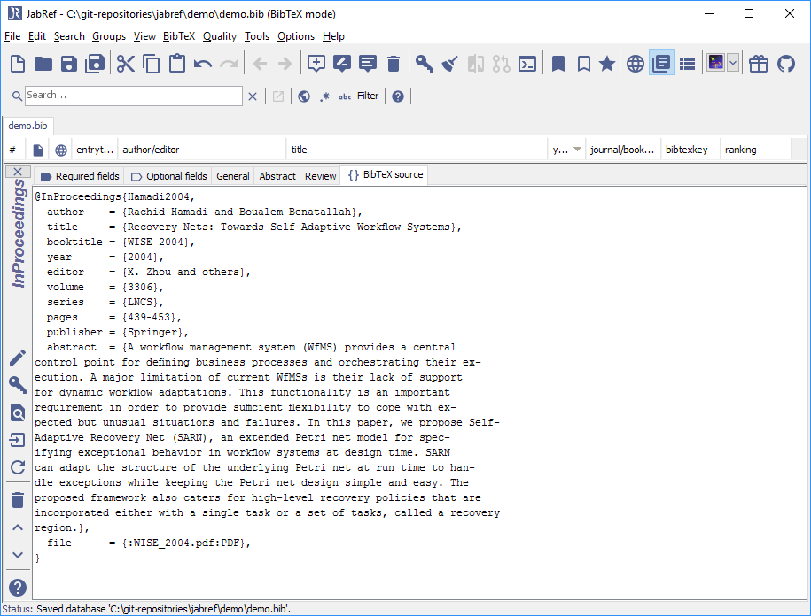
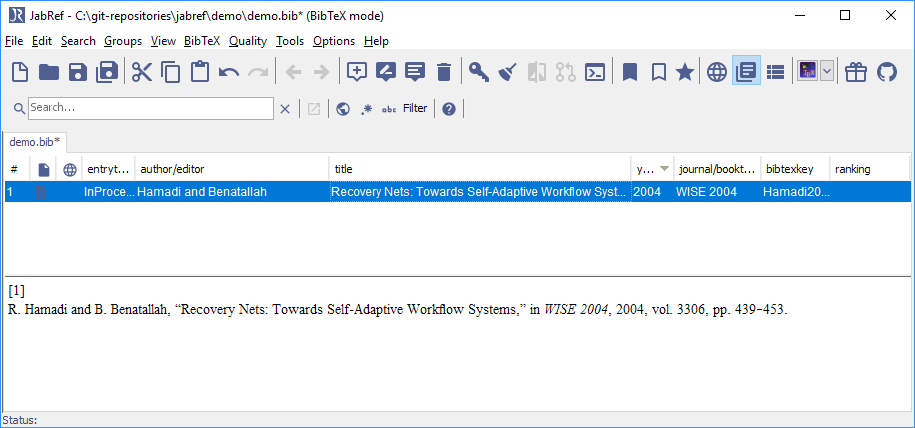

# Add entry using PDFs


The simplest way to create a new entry based on a single PDF file is to drag & drop the file onto the table of entries (between two existing entries). JabRef will then analyze the PDF and create a new entry.


This feature is available through **Lookup -> Search for unlinked local files**.


This information is partially outdated. Please help to improve it ([how to edit a help page](../../contributing/how-to-improve-the-help-page.md#editing-help-pages-directly-in-the-browser)).


The following description appeared first on [tex.stackexchange.com](http://tex.stackexchange.com/a/344310/9075).

## Preparation: Adjust the JabRef key generation pattern to fit your needs

JabRef offers a BibTeX key generation and offers different patterns described at [BibtexKeyPatterns](../setup/citationkeypatterns.md).

## Link the PDFs to your bib library

In case you have numerous PDF files and want to convert them into new entries, JabRef can search automatically for the PDF files, let you select the relevant ones, and convert them into new entries.

1. Create or open a `.bib` library.
2. Go to **Lookup -> Search for unlinked local files**. (or press `SHIFT + F7`)

    .png>) .png>)
3. The "Search for unlinked local files" dialog opens.

    
4. Choose a start directory using the "Browse" button.
5. Click on "Search" / "Scan directory".
6. In "Select files", the files not yet contained in the library are shown.

    
7. Select the entries you are interested in. Note: the button `Export selected files` allows you to export the list of the selected files (a text file containing on each line one filename with its path)
8. Click on `Import`.

    The windows close and the entry table now contains the newly-imported entries.
9. The entry editor with the last imported entry is shown .png>)
10. You can now save the file and are finished.
11. Optional: Click on "General" to see the linked file .png>)
12. Optional: Click on "BibTeX source" to see the BibTeX source 
13. Optional: You have to shrink it to see the entry in the entry table, enlarge the JabRef window and use the mouse at the upper border of the entry editor 
14. Optional: Press Esc to show the entry preview 


The imported entries may need some editing because all the information gathered from the PDF files may not be accurate (see below "PDFs for which it works").


## Further information

### PDFs for which it works

The importer based on the content has been written for IEEE and [LNCS](https://github.com/latextemplates/LNCS) formatted papers. Other formats are not (yet) supported. In case a DOI is found on the first page, the DOI is used to generate the BibTeX information.

The next development step is to extract the title of the PDF, use the "Lookup DOI" and then the [Get BibTeX data from DOI](../finding-sorting-and-cleaning-entries/getbibtexdatafromdoi.md) functionality from JabRef to fetch the BibTeX data.

We are also [thinking about](https://github.com/koppor/jabref/issues/169) replacing the code completely by using another library. This is much effort and there is no timeline for that.

### Better filenames

JabRef also offers to change the filenames. You can adapt the pattern at Preferences -> Import 

Select "Choose pattern" and choose "bibtexkey - title" .png>) This results in the setting `\bibtexkey\begin{title} - \format[RemoveBrackets]{\title}\end{title}`.

This makes the filenames start with the bibtey key followed by the full title. In the concrete case, `\bibtexkey` only may be the better option as the described bibtey key already contains the title.

### Mr.DLib

JabRef used to have support for [Mr.DLib](http://mr-dlib.org), which returned back a full BibTeX entry or a PDF. Due to unclear copyright situation of a used library, this service was removed. Further, Mr.DLib changes its focus and will provide literature recommendations. See [the realted articles tab](../advanced/entryeditor/#related-articles-tab).

### Related questions on stack overflow

* [Extract titles from each page of a PDF?](http://stackoverflow.com/q/18071127/873282)
* [Zotero: Extract references from PDF and create new library items from them](https://forums.zotero.org/discussion/16277/extract-references-from-pdf-and-create-new-library-items-from-them)
* [Is there an open source tool for producing bibtex entries from paper PDFs?](http://academia.stackexchange.com/questions/15504/is-there-an-open-source-tool-for-producing-bibtex-entries-from-paper-pdfs)
* [Extracting information from PDFs of research papers](http://stackoverflow.com/questions/1813427/extracting-information-from-pdfs-of-research-papers/3523416)
