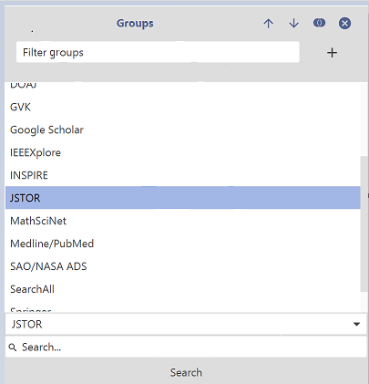

# Searching externally using Online Services

JabRef is not intended to be a tool for mass download of citations. The purpose of the Web search is to easily gather a few entries directly from within JabRef. If you use the search functionality to extensively you might get blocked \(for some time\). To fetch entries from an online database, choose **View → Web search**, and the search interface will appear in the side pane. Select the database you want to search \(e.g. arXiv\) in the dropdown menu. Note that it might be necessary to scroll downwards to find certain fetchers. An example for this is provided in the image below. Then enter the words of your query, and press Enter, or the **Search** button. The results are displayed in the [import inspection dialog](import/importinspectiondialog.md).

Some databases support advanced search queries. These are described on the detail page of the database.

Apart from fetching entries by using a full search, it is also possible to directly [create an entry using a unique identifier](add-entry-using-an-id.md).

## Mass downloading of articles

However, it is still possible to import hundreds or even thousands of entries from these databases. The process depends a bit on the specifics of each database, but in general works as follows: Search the database in your browser, export the result in one of the supported file formats and then [import the file into JabRef](import/).

## Using a Proxy Server

If you need to use an HTTP proxy server, you can configure JabRef to use a proxy using the "Network" preferences \(**Options → Preferences → Network**\).

## Supported databases

### arXiv

[ArXiv](https://arxiv.org/) is a repository of scientific preprints in the fields of mathematics, physics, astronomy, computer science, quantitative biology, statistics, and quantitative finance \([Wikipedia](https://en.wikipedia.org/wiki/ArXiv)\).

### CiteSeerX

[CiteSeerX](http://csxstatic.ist.psu.edu/home) is a public search engine for scientific and academic papers primarily with a focus on computer and information science. However, CiteSeerX has been expanding into other scholarly domains such as economics, physics, and others \([Wikipedia](https://en.wikipedia.org/wiki/CiteSeer)\).

### Collection of Computer Science Bibliographies

The [Collection of Computer Science Bibliographies](https://liinwww.ira.uka.de/bibliography/) is a public search engine for bibliographies of scientific literature in computer science.

> You may use Lucene syntax, available fields are: ti \(title\), au \(author\), yr \(publications year\). In short: the default operator is 'OR', use '+' and '–' operators to specify \('+'\) required and \('–'\) forbidden words. Wildcards: '?' – single letter, and '\*' – part of the word \(at the end of a word\), '~' – specified at the end of a word makes approximate match \(allows typos, but takes many seconds to process\)

### Crossref


To be detailed.


### DBLP

[DBLP](http://dblp.uni-trier.de/db/) is a computer science bibliography website listing more than 3.1 million journal articles, conference papers, and other publications on computer science \([Wikipedia](https://en.wikipedia.org/wiki/DBLP)\).

### DOAJ

[DOAJ \(Directory of Open Access Journals\)](http://doaj.org/) is a database covering more than 10000 open access journals covering all areas of science, technology, medicine, social science, and humanities \([Wikipedia](https://en.wikipedia.org/wiki/Directory_of_Open_Access_Journals)\).

It is possible to limit the search by adding a field name to the search, as **field:text**. The supported fields are:

* title: The title of the article
* doi: The DOI of the article
* issn: The ISSN of the journal
* publisher: The publisher of the journal
* abstract: The abstract of the article

### GVK

[GVK](https://gso.gbv.de), the GBV Union Catalogue, is a multimaterial bibliographic database of seven German federal states. It covers 41.5 million records of books, conference proceedings, periodicals, dissertations, microfilms, and electronic resources.

#### Advanced search

You can simply enter words/names/years you want to search for, or you can specify search keys. Supported keys are:

* all - all words. Not specifying a search key results in an "all" search
* tit - title words
* per - authors, editors, etc.
* thm - topics
* slw - keywords
* txt - tables of content
* num - numbers, e.g. ISBN
* kon - names of conferences
* ppn - Pica Production Numbers of the GVK
* bkl - Basisklassifikation-numbers
* erj - year of publication

#### Notes

* queries can be combined with "and". The use of "and" is optional, though.
* in many cases, you can use the truncation sign "?"
* spaces in person names are not supported yet. Please use the truncation sign ? after the first name for several given names. E.g. "per Maas,jan?"

#### Sample queries

* "marx kapital"
* "per grodke and tit db2"
* "per Maas,jan?"

### Google Scholar

[Google Scholar](https://scholar.google.com/) is a freely accessible database that indexes the full text or metadata of scholarly literature across an array of publishing formats and disciplines. Google Scholar index includes most peer-reviewed online academic journals and books, conference papers, theses and dissertations, preprints, abstracts, technical reports, and other scholarly literature, including court opinions and patents \([Wikipedia](https://en.wikipedia.org/wiki/Google_Scholar)\).

#### Traffic limitations

Google Scholar can block "automated" crawls that generate too much traffic in a short time. To unblock your IP, doing a Google scholar search in your browser might help. You will be asked to show that you are not a robot \(a CAPTCHA challenge\). If no CAPTCHA appears, or JabRef is still blocked after performing a search in the browser, you can also change your IP address manually or wait for some hours to get unblocked again.

Thus, the Google Scholar fetcher is not the best way to obtain lots of entries at the same time. The [JabRef browser extension](jabref-browser-extension.md) might be an alternative to download the bibliographic data directly from the browser.

### IEEEXplore

[IEEEXplore](https://ieeexplore.ieee.org/) is a scholarly research database that indexes, abstracts, and provides full-text for articles and papers on computer science, electrical engineering and electronics. IEEEXplore comprises over 180 journals, over 1,400 conference proceedings, more than 3,800 technical standards, over 1,800 eBooks and over 400 educational courses \([Wikipedia](https://en.wikipedia.org/wiki/IEEE_Xplore)\)

### INSPIRE

[INSPIRE-HEP](https://inspirehep.net/?ln=en) is an open-access digital library for the field of high energy physics \([Wikipedia](https://en.wikipedia.org/wiki/INSPIRE-HEP)\).

#### Query syntax

The INSPIRE-HEP search function merely passes your search queries onto the INSPIRE-HEP web search, so you should build your queries in the same way, except omitting the _find_ or _fin_ command. This help page will only give a brief introduction to the search queries. More extensive help on searching INSPIRE-HEP can be found on the page [http://inspirehep.net/info/hep/search-tips](http://inspirehep.net/info/hep/search-tips) .

Your query can be composed of several parts, combined using `and` and `or` as logical operators. Each part is composed of a letter or word indicating the type of field to search, followed by a space and the text to search for.

The following list shows some of the field indicators that can be used:

* _a_ or _author_: search author names
* _t_ or _title_: search in title
* _j_: journal. Here either the common abbreviation or the 5 letter CODEN abbreviation for a journal can be used. Volume and page can also be included, separated by commas. For instance, _j Phys. Rev.,D54,1_ looks in the journal Phys. Rev., volume D54, page 1.
* _k_: search in keywords

#### Example queries

* _a smith and a jones_: search for references with authors "smith" and "jones"
* _a smith or a jones_: search for references with either author "smith" or author "jones"
* _a smith and not t processor_: search for author "smith" and omit references with "processor" in the title

### Jstor

[Jstor](https://jstor.org) is an online database with access to more than 12 million journal articles, books, and sources in 75 disciplines. [About](https://about.jstor.org/)

It is possible to limit the search by adding a field name to the search, such as `field:"text"`. The supported fields are:

* `ti`: The title of the article
* `au`: an author of the article
* `pt`: publication title

### MathSciNet

[MathSciNet](http://www.ams.org/mathscinet/) is a searchable online bibliographic database. It contains all of the contents of the journal Mathematical Reviews \(MR\) since 1940 along with an extensive author database, links to other MR entries, citations, full journal entries, and links to original articles. It contains almost 3 million items and over 1.7 million links to original articles \([Wikipedia](https://en.wikipedia.org/wiki/MathSciNet)\).

### Medline/PubMed

[MEDLINE](https://www.nlm.nih.gov/bsd/pmresources.html) is a bibliographic database of life sciences and biomedical information. It includes bibliographic information for articles from academic journals covering medicine, nursing, pharmacy, dentistry, veterinary medicine, and health care. MEDLINE also covers much of the literature in biology and biochemistry, as well as fields such as molecular evolution \([Wikipedia](https://en.wikipedia.org/wiki/MEDLINE)\).

There are two ways of specifying which entries to download:

1. Enter one or more MEDLINE IDs \(separated by comma/semicolon\) in the text field.
2. Enter a set of names and/or words to search for. You can use the operators `and` and `or` and parentheses to refine your search expression. See [OVID operators](https://resourcecenter.ovid.com/site/help/documentation/ospa/en/Content/syntax.htm) for full description.

#### Examples

* `May \[au\] AND Anderson \[au\]`
* `Anderson RM \[au\] HIV \[ti\]`
* `Valleron \[au\] 1988:2000\[dp\] HIV \[ti\]`
* `Valleron \[au\] AND 1987:2000\[dp\] AND (AIDS \[ti\] OR HIV\[ti\])`
* `Anderson \[au\] AND Nature \[ta\]`
* `Population \[ta\]`

### SAO/NASA Astrophysics Data System

[SAO/NASA Astrophysics Data System](http://www.adsabs.harvard.edu/) is an online database of over eight million astronomy and physics papers from both peer-reviewed and non-peer-reviewed sources. Abstracts are available free online for almost all articles, and full scanned articles are available in Graphics Interchange Format \(GIF\) and Portable Document Format \(PDF\) for older articles \([Wikipedia](https://en.wikipedia.org/wiki/Astrophysics_Data_System)\).

### SearchAll


To be detailed.


### Springer

[Springer](https://www.springer.com/) \(aka Springer Science+Business Media\) is a global publishing company that publishes books, e-books, and peer-reviewed journals in science, technical and medical publishing. Springer also hosts a number of scientific databases, including SpringerLink, Springer Protocols, and SpringerImages \([Wikipedia](https://en.wikipedia.org/wiki/Springer_Science%2BBusiness_Media)\).

### zbMATH Open

[zbMATH Open](https://zbmath.org/) is an abstracting and reviewing service in pure and applied mathematics. Its database contains about 4 million bibliographic entries with reviews or abstracts currently drawn from about 3,000 journals and book series, and 180,000 books. The coverage starts in the 18th century and is complete from 1868 to the present by the integration of the "Jahrbuch über die Fortschritte der Mathematik" database \([about](https://zbmath.org/about/)\).

#### Structured Search

You can use the same query syntax as in the one-line search at zbmath.org. This means that your query can be composed of several terms, combined by the logical operators `&` (and) and `|` (or). Queries are case-insensitive. Further operators that can be used are `!` for logical negation, `*` for a right wildcard, `“ “` for exact phrase matches, and parentheses `( )` to group terms. Optionally, it is possible to add a field name in the form field:text to limit the search results. The supported fields are:

* **any**: anywhere (default)
* **au**: author, editor
* **ti**: title
* **so**: source
* **py**: publication year
* **cc**: MSC code
* **dt**: document type (possible values are **j** for journal articles, **b** for books, **a** for book articles)
* **an**: the zbl id of the document
* **ai**: internal author identifier
* **la**: language either as a string or as [ISO 639-1](https://en.wikipedia.org/wiki/ISO_639-1) language code
* **ab**: search for term in reviews or abstracts
* **rv**: reviewer
* **sw**: software
* **en**: external identifier
* **br**: biographical reference

#### Examples

* [algebra*](https://zbmath.org/?q=algebra*): Searches for publications containing a term starting with algebra (e.g. algebra, algebras, algebraic, etc.) in **any** field.
* [ti: “Graph Theory”](https://zbmath.org/?q=ti%3A+%E2%80%9CGraph+Theory%E2%80%9D): Searches for publications with the exact phrase *Graph Theory* in their **title** field.
* [an: 0492.90056](https://zbmath.org/?q=an%3A0492.90056): Searches for the document with zbl number *0492.90056*.
* [au: Berge & ti: “Graph Theory”](https://zbmath.org/?q=au%3A+Berge+%26+ti%3A+%E2%80%9CGraph+Theory%E2%80%9D): Searches for entries written by *Berge* with *Graph Theory* in their **title** field. The **and-operator &** is default and can be omitted.
* [dt: b au: Berge](https://zbmath.org/?q=dt%3A+b+au%3A+Berge): Searches for all books written by Berge.
* [ti: “Graph Theory” py: 2010-2020](https://zbmath.org/?q=ti%3A+%E2%80%9CGraph+Theory%E2%80%9D+py%3A+2010-2020): Searches for documents containing the exact phrase *Graph Theory* in their **title** that are published between *2010* and *2020*.
* [so: Combinatorica](https://zbmath.org/?q=so%3A+Combinatorica): Searches for documents published in the journal *Combinatorica*.
* [cc: (05C|90C)](https://zbmath.org/?q=cc%3A+%2805C%7C90C%29): Searches for documents with **MSC code** in *05C* or *90C*.
* [la: es | pt](https://zbmath.org/?q=la%3A+es+%7C+pt): Searches for documents written in *Spanish* or *Portuguese*.
* [sw: python](https://zbmath.org/?q=sw%3Apython): Searches for publications using the **software** *python*.
* [en: arXiv*](https://zbmath.org/?q=en%3AarXiv): Searches for entries with a link to an *arXiv* preprint.
* [br: Claude Berge](https://zbmath.org/?q=br%3AClaude+Berge): Searches for publications with biographical information on *Claude Berge*.
