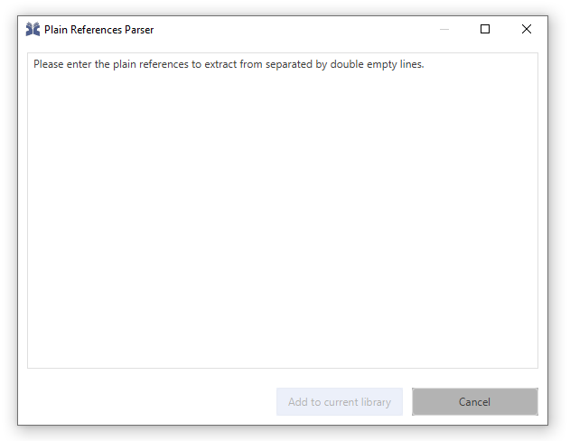

# Add entry using reference text

> Entries can be created from a reference text.

In case you have a reference string, JabRef offers the functionality to convert the text to BibTeX. For this, JabRef uses the technology offered by [Grobid](https://github.com/kermitt2/grobid).

Example:

```text
O. Kopp, A. Armbruster, und O. Zimmermann, "Markdown Architectural Decision Records: Format and Tool Support", in 10th ZEUS Workshop, 2018.
```

1. Click Library and select "New entry from plain text..." Alternatively, you can press Ctrl+Shift+N.

   

2. The "Plain Reference Parser" window opens

   

3. Paste the reference text:

   

4. Click "Add to current library"
5. The result is selected in the entry table:

   

