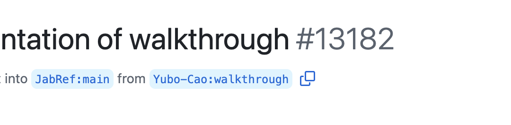

# Contribute to JabRef 

We are really happy that you are interested in contributing to JabRef. Please take your time to look around here. We especially invite you to look into our [community members page](https://discourse.jabref.org/t/community-members/1868?u=koppor) where members introduce themselves.

## I would like to try out a feature introduced at pull request

In JabRef, there are dozens of bug fixes and new features introduced using GitHub's pull request mechansim.
You can browse all at <https://github.com/JabRef/jabref/pulls>.
The JabRef team really welcomes users to try out these changes and to comment on them.
Improving on changes in active pull requests is much easier than fixing them later on after their acceptance.

If you are familiar with the command line on your OS, then it is very easy to try out pull requests and give feedback.
In the following, we try to give a minimal set of installation instructions to be able to run a contribution from a fork.

Required tooling:

- [`gg.cmd`](https://github.com/eirikb/gg) - A cross-platform and cross-architecture version manager. Download [`gg.cmd`](https://github.com/eirikb/gg/releases/latest/download/gg.cmd) and store it in your home (or `Downloads`) directory.

Initial setup:

- Windows:
  - Open PowerShell
  - Switch to a directory containing git repositories. We recommend `c:\git-repositories`
    - `mkdir c:\git-repositories`
    - `cd c:\git-repositories`
  - Get `gg.cmd`
    - `wget ggcmd.io -OutFile gg.cmd`
  - Clone JabRef
    - `.\gg.cmd jbang https://github.com/JabRef/jabref/blob/main/.jbang/CloneJabRef.java jabref`
    - When JBang asks you for trust, you can choose "Trust once" by pressing <kbd>1</kbd> and then <kbd>Enter</kbd>
  - Make `gg.cmd` available in `jabref` source directory
    - `cd jabref`
    - `move ..\gg.cmd .`
- Linux:
  - Open a shell
  - Switch to a directory containing git repositories. We recommend `~/git-repositories`
    - `mkdir ~/git-repositories`
    - `cd ~/git-repositories`
  - Get `gg.cmd` (using either `wget` or `curl`)
    - `wget ggcmd.io/gg.cmd`
    - Alternative: `curl -L ggcmd.io > gg.cmd`
  - Clone JabRef
    - `sh ./gg.cmd jbang https://github.com/JabRef/jabref/blob/main/.jbang/CloneJabRef.java jabref`
    - NOTE: You can also use the native git client: `git clone --recurse-submodules https://github.com/JabRef/jabref.git jabref` for achieving the same result.
  - Make `gg.cmd` available in `jabref` source directory
    - `cd jabref`
    - `mv ../gg.cmd .`

Now you are all set: You have a directory `jabref` containing the recent updates and also `gg.cmd` which you will need later for executing a JabRef build.

Try a branch:

1. `cd` into the `jabref` source directory: `cd c:\git-repositories\jabref`
2. Checkout out the pull request: `sh ./gg.cmd gh pr checkout 13182` - where `13182` is the PR number, in this case [pr#13182](https://github.com/JabRef/jabref/pull/13182).
3. Compile and run JabRef: `sh ./gg.cmd gradle run :jabgui:run` (on Linux and macOS, you need to prefix it with `sh`: `gg.cmd gradle run :jabgui:run`). This will also download the necessary JDK and gradle distribution. On the first run, please give the system enough time to accommodate and wait until the JabRef window launches. Depending on your hardware, this may take minutes.

On Windows, instead of `sh ./gg.cmd` use `.\gg.cmd`.

Instead of the number, you can also copy and paste the branch identifier output by GitHub.

In this case, you can run `sh ./gg.cmd gh pr checkout Yubo-Cao:walkthrough`

Alternatives:

1. In case you don't want to use `gg.cmd`:

  - You have the project clone ready and have some Java JDK available: In the `JabRef` directory, execute `./gradlew run`.
  - Install [GitHubCLI](https://cli.github.com/), a command-line client for GitHub by using the installer linked on their [homepage](https://cli.github.com/) or the commands given at the [installation hints](https://github.com/cli/cli#installation).

2. In case you don't want to use GitHub's `gh` tool: You can use the "usual" `git clone ...`, `git remote add ...`, `git fetch ...`, and `git checkout ...` commands to checkout a pull request from a fork.

**I would like to improve the help page.**

Please see [How to Improve the Help Page](how-to-improve-the-help-page.md)

**I would like to help to translate JabRef to another language.**

We encourage you to read about [translating the JabRef user interface](how-to-translate-the-ui.md).

**I would like to keep Wikipedia pages up-to-date.**

JabRef improves -- and Wikipedia pages should keep up!

For changes affecting all languages, update the [wikidata entry of JabRef](https://www.wikidata.org/wiki/Q1676802).

For changes in a specific language, go to the related page, and simply click on "Edit" (top right-hand tab). Currently, existing pages are:

* Deutsch: [https://de.wikipedia.org/wiki/JabRef](https://de.wikipedia.org/wiki/JabRef)
* English: [https://en.wikipedia.org/wiki/JabRef](https://en.wikipedia.org/wiki/JabRef)
* Español: [https://es.wikipedia.org/wiki/JabRef](https://es.wikipedia.org/wiki/JabRef)
* Français: [https://fr.wikipedia.org/wiki/JabRef](https://fr.wikipedia.org/wiki/JabRef)
* Italiano: [https://it.wikipedia.org/wiki/JabRef](https://it.wikipedia.org/wiki/JabRef)
* Русский: [https://ru.wikipedia.org/wiki/JabRef](https://ru.wikipedia.org/wiki/JabRef)
* Portuguese: [https://pt.wikipedia.org/wiki/JabRef](https://pt.wikipedia.org/wiki/JabRef)
* Svenska: [https://sv.wikipedia.org/wiki/JabRef](https://sv.wikipedia.org/wiki/JabRef)
* Українська: [https://uk.wikipedia.org/wiki/JabRef](https://uk.wikipedia.org/wiki/JabRef)
* 中文: [https://zh.wikipedia.org/wiki/JabRef](https://zh.wikipedia.org/wiki/JabRef)

If there is no page for your own language, you can easily create one.

**I have some cool feature requests.**

[Come discuss it!](http://discourse.jabref.org)

**Can I make a donation? How?**

Donations keep us going! You can use PayPal or bank transfers. Your institution/company can contribute too, through bank transfer for example. All details are provided at [https://donations.jabref.org](https://donations.jabref.org).

Our team consists of volunteers. To provide better support, we are currently trying to get a funded developer on board. Please consider donating money!

**I would like to contribute code. How to?**

Please head to our [Contributing Guide](https://github.com/JabRef/jabref/blob/main/CONTRIBUTING.md#contributing).
