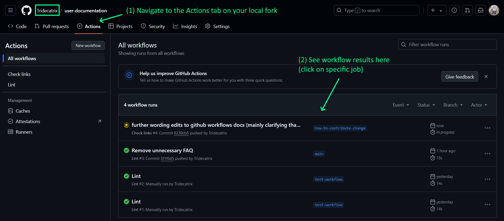

# How to Improve the Help Page

Here is a quick start guide on how to improve help pages in the [JabRef User Documentation](https://docs.jabref.org).

## Prerequisite

The JabRef help pages are hosted at [GitBook](https://www.gitbook.com) with integration to GitHub, which provides version control based on [git](https://git-scm.com). In order to edit or create a JabRef help page, you need a GitHub account. You can sign up [here](https://github.com/join) for free. If you already have an account, please make sure that you are signed in.

## Editing Help Pages directly in the browser

The easiest way to fix small errors, or to add additional information, is to edit a help page directly in your browser, using the following steps.

### 1. Start editing

At the top of each help page, you can find the GitHub icon with "Edit on GitHub" link. Just click the link to show the source of the page.

This leads you to the GitHub page associated with the help page:

To actually edit the page, click on the pencil icon, as highlighted above.

### 2. Make your changes

The window to edit the page at GitHub looks like this:

Most text can be simply added/edited in this field as plain text. However, you can style your contribution by using [markdown](https://daringfireball.net/projects/markdown/). Markdown is a rather easy way to format text without the need for complex markup, such as with HTML. You can find an introduction to markdown [here](https://daringfireball.net/projects/markdown/) or [here](https://docs.github.com/en/get-started/writing-on-github/getting-started-with-writing-and-formatting-on-github/basic-writing-and-formatting-syntax).

In order to review your changes, click on the "Preview changes" tab:

### 3. Saving the changes

To save the changes, create a so-called "Commit" by scrolling down and pressing the "Propose File Change" button:

_Please note: The message you provide here will be visible in the history of the help page, so please consider your change and provide a meaningful description of your changes._

As the last step, submit the changes you have made back to the JabRef team:

Just press the "Create Pull Request" button, and confirm the creation of the request on the next page.

That's it! The JabRef team will review your changes and publish them on [docs.jabref.org](https://docs.jabref.org).

## Advanced Contribution Hints

### Advanced editing

To edit more than one file at a time, add screenshots, and for other more advanced changes, we recommend that you checkout this repository locally and create a Pull Request of your changes using the standard git and GitHub workflow.

### CI

Two CI jobs (called "workflows" in GitHub terminology) are triggered each time you push or pull request.

- Lint workflow checks for minor Markdown formatting style issues.

- Check links workflow checks for broken links, e.g. to images or external resources.

On PRs, you are able to view the results directly on the PR (though you have to wait for a maintainer to approve running the workflow). You can also view the results on the local fork of the repo that you pushed to (which you are recommended to check first so you can fix mistakes before the maintainer has to look at it).

On your local fork, you can check the results of the workflows in the Actions tab > All actions panel on Github as shown below. Click on a specific workflow and its run to check the results.

### Notes on links workflow

Links to external resources that aren't essential should be added to `.lycheeignore`. Resources can change URL or be taken down, and it isn't the best use of contributor resources to constantly keep fixing them, so try to spare us the headache!

Note that check links may fail on links which you did not modify in your changes, in which case you can ignore them. Just do make sure that you don't introduce any additional broken links. (Note: until [issue #533](https://github.com/JabRef/user-documentation/issues/533) is fixed, you will actually find a *lot* of broken links.)

### Tables

The best way to enter tables is to use this [Table Generator](http://www.tablesgenerator.com/markdown\_tables) for Markdown. It has the nice feature to generate markdown tables from different sources, e.g. you can directly copy the table from a spreadsheet or upload a csv file. Just copy and paste the generated markdown into the documentation.

### How to regenerate `SUMMARY.md` from scratch

Use <https://github.com/koppor/gitbook-summary-generator>.

### How to rename files

The gitbook integration changes some of the file names and appends "(1) (2) (1)" or something like this.
If one fixes that in the GitHub repository, then the next sync rewrites the names again.
The only solution we've found so far is manually replacing the images using the GitBook UI:
Left to the image you have a hamburger with a "replace" option.

In case GitBook was fixed, with some command line magic, this could be solved:

1. Create a script renaming all images: `fd -e png -x bash -c "echo '{}' | sed 's/\([^(]*\)\(.*\).png/mv \"\\1\\2.png\" \"\\1.png\"/' | sed 's/ \.png/.png/'" | sort > fix-filenames.sh`. Execute in `en/.gitbook`. Otherwise, `fd` does not find any file.
2. Repeat for `gif` instead of `png`.
3. Create a script doing the renaming in all `.md` files: `fd -e md -x bash -c "echo sed -i '\"s/assets\/\([^%]*\)\(.*\).png/assets\/\\1.png/\"' {}" > fix-mds.sh`. Execute in the root repository.
   You can also do manually in VSCode using `( \(\d\))+.png` as RegEx.
4. Repeat for `gif` instead of `png`.
