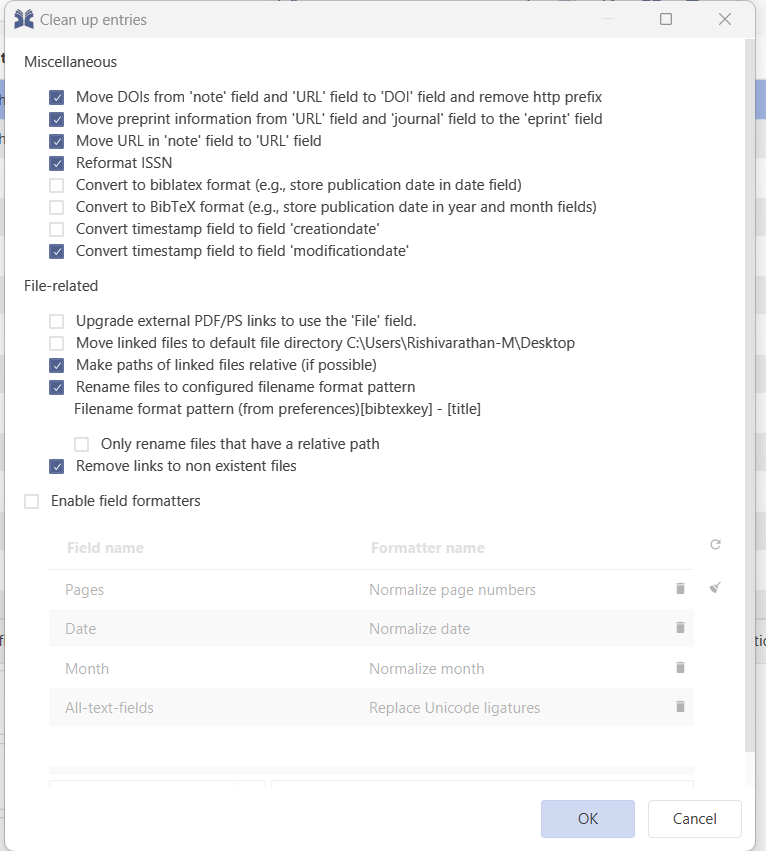

# Cleanup entries

JabRef can cleanup the entries of a database. To do a cleanup of the entries, go to **Quality → Cleanup entries**.

In the lower part, you can choose "Enable field formatter", where you can choose different [Save Actions](../advanced/saveactions.md). Dependent on the database mode, "Recommended for BibTeX" or "Recommended for BibLaTeX". When pressing this button, the recommended cleanups for the respective mode is called.



