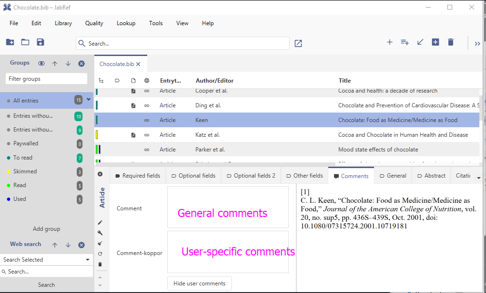
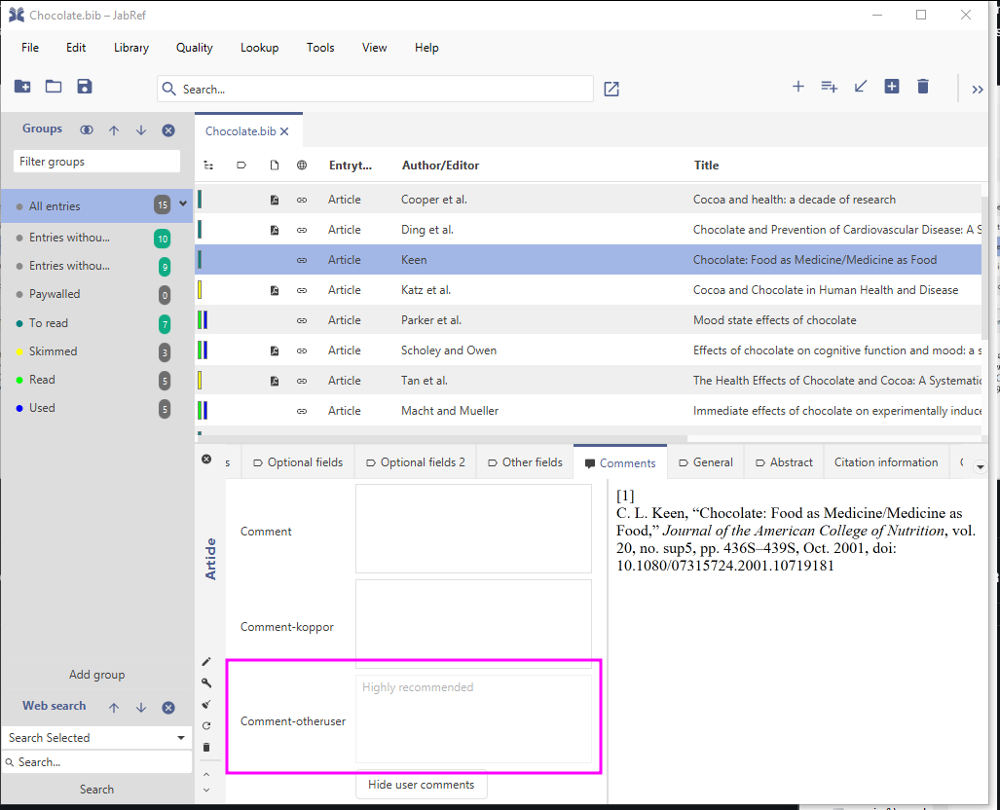
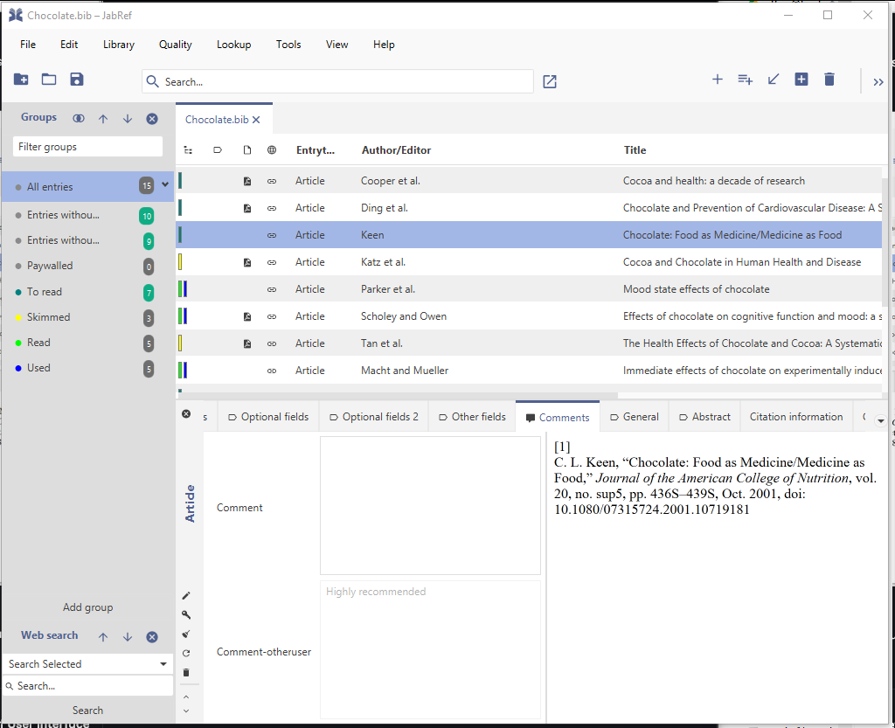
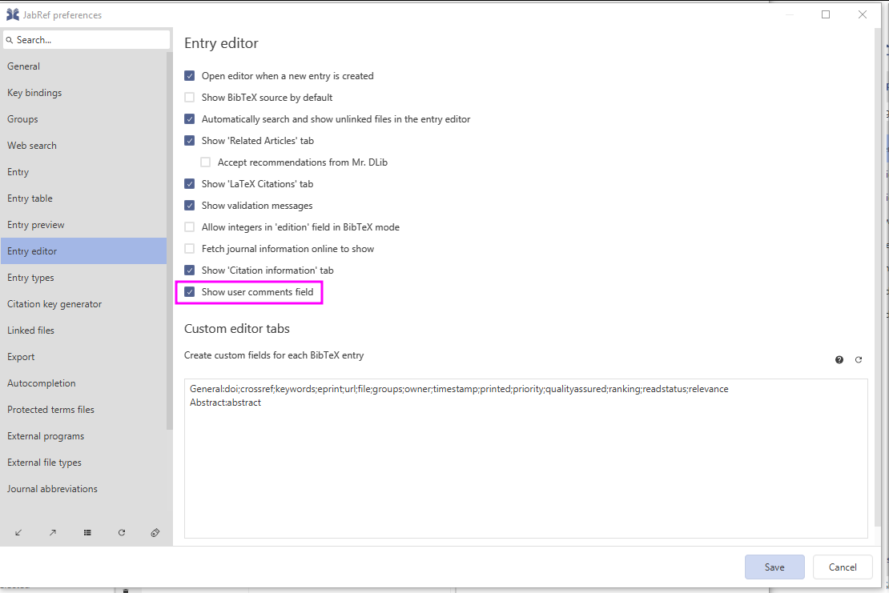

# Comment on an entry

One can add free text to an entry. This is possible in the "Comments" tab of JabRef.&#x20;

There is the general "comments" field.

JabRef offers to separate comments from  as well as user-specific comments field.&#x20;

The following screenshots show the comments for the user `koppor`. As default, general comments are managed through the field `comment`. In addition, the field `comment-koppor` stores the comments of the user koppor.

<figure><figcaption>
JabRef's entry editor showing two comment fields
</figcaption></figure>

Now, lets assume, the library (.bib File) is shared among different users. `koppor` closed the library and opened it later again. He sees that a user `otheruser` has written a comment:

<figure><figcaption>
JabRef showing the comment of the user "otheruser".
</figcaption></figure>

Now, koppor desides, that he does not want to add any comments in JabRef, so he pushes the "Hide user comments" button. Then, JabRef does not display the comment field for koppor's user any more:

<figure><figcaption>
JabRef's entry editor showing the general comment field and a comment of another user.
</figcaption></figure>

A bit later, koppor thinks, he wants to put comments again. To achieve that, he needs to navigate to File -> Preferences -> Entry editor. Then, he needs to add a checkmark to "Show user comment fields". then, he needs to press "Save" to save the preferences.

<figure><figcaption>
Preference to enable user-specific comments
</figcaption></figure>

Then, JabRef's entry editor shows the field "Comment-koppor" again.
