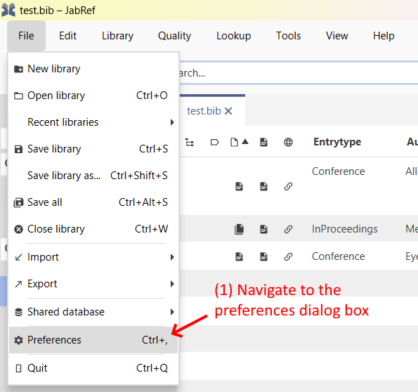
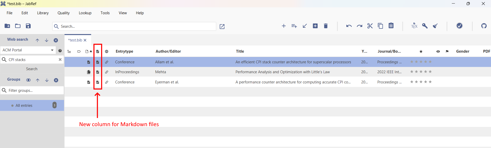

# Manage associated files

JabRef lets you link up your entries with files of any type stored on your system. Thereby, it uses the field `file`, which contains a list of linked files. Each entry can have an arbitrary number of file links, and each linked file can be opened quickly from JabRef. The fields `url` and `doi` are used as links to documents on the web in the form of a URL or a DOI identifier, respectively (see [URL and DOI in JabRef](../advanced/externalfiles.md)).

In BibTeX/biblatex terms, the file links are stored as text in the field `file`. From within JabRef, however, they appear as an editable list of links accessed from the entry editor along with other fields.

## Adding external links to an entry

If the "file" field is included in [General fields](../setup/generalfields.md), you can edit the list of external links for an entry in the [Entry editor](../advanced/entryeditor/). The editor includes buttons for inserting, editing and removing links, as well as buttons for reordering the list of links.

## Directories for files

JabRef offers the following directory settings:

1. **File → Preferences → Linked files**, item _Main file directory._

    
2. **Library → Library properties**, items _General file directory,_ and _User-specific file directory_.

One of these settings is required. Mostly the "Main file directory" is enough.

JabRef uses these 3 directories to search for the files: JabRef starts in the user-specific file directory, then the general file directory, and, finally, the main file directory​

JabRef enables setting a directory per database. When sharing a library across multiple persons, each user might have a different directory. Either, each user can set his directory in the "Main file directory". In case the group also shares papers and thus there are two directories (the private one and a group-shared one), one can set a directory within the library (the "General file directory"). In case a user has a different location of the shared folder (e.g., different paths on Linux and Windows), he can use the "User-specific file directory". This setting is persisted in the `bib` file in a way that it does not overwrite the setting of another user. For this, JabRef uses the username of the currently logged-in user (`-<loginname>` is used as a suffix in the `jabref-meta` field). So, both `mary` and `aileen` can set a different user-specific file directory.

If JabRef saves an attached file and my login name matches the name stored in the `bib` file, it chooses that directory. If no match is found, it uses the "General file directory" of the bib file. If that is not found, it uses the one configured at File → Preferences → Linked files.

In some settings, the bib file is stored in **the same directory** as the PDF files. Then, one ignores all the above directories and enable "Search and store files relative to library file location". In this case, JabRef starts searching for PDF files in the directory of the `bib` file. It is also possible to achieve this result by setting `.` as "General file directory" in the library properties.

.

Relative file directories obviously only work in the library properties for a bib file, e.g. `a.bib` Library → Library properties → General file directory → `papers`. Assume to have two bib files: `a.bib` and `b.bib` located in different directories: `a.bib` located at `C:\a.bib` and `b.bib` located at `X:\b.bib`. When I click on the `+` icon in the general Tab of file `a.bib`, the popup is opened in the directory `C:\papers` (assuming `C:\papers` exists).

## Auto-linking files

If you have a file within or below one of your file directories with an extension matching one of the defined external file types, and a name starting with (or matching) an entry's citation key, the file can be auto-linked. JabRef will detect the file and display a "link-add" icon in the entry editor, at the left of the filename. Click on the "link-add" icon to link this file to the entry.

The rules for which file names can be auto-linked to a citation key can be set up in **File → Preferences → Linked files**, section _Autolink files_.

## Filename format and file directory pattern

Files can be automatically renamed and organized in folders according to custom patterns. The pattern syntax follows the same as for the [citationkeypatterns.md](../setup/citationkeypatterns.md "mention"). JabRef can rename files according to this pattern, either automatically or as part of a cleanup operation.

With file directory pattern, JabRef can automatically create subfolders and move the files into the directory based on the defined pattern. As an example, you have a single folder, e.g. _papers_ for all your PDFs linked to their corresponding entry in JabRef. Now you want to arrange them according to defined groups. Let's say you have two groups, **Automation** and **Biology,** with a couple of entries.\
Now set the file directory pattern to: `[groups:(unknown)]`

If you now execute the cleanup action "Move files", JabRef will automatically move the files of the corresponding in the file directory to the subfolders _papers/Automation_ and _papers/Biology_ respectively.

_Explanation_: The expression in the brackets says: Create a subdirectory based on the field “groups” of the entry. If the field `groups` is not set or empty, use “unknown” as a fallback name for the directory. If you have one entry assigned to multiple groups, the directory will have the name “groupA, groupB”.

For an entry, if you want to download a file and link it to the entry, you can do this by clicking the **Download** button in the entry editor.

A dialog box will appear, prompting you to enter the URL. The file will be downloaded to your main file directory, named based on the entry's citation key, and finally linked from the entry.

## Using Regular Expression Search for Auto-Linking

It is possible to have greater flexibility in the naming scheme by using regular expressions for the search. In most cases, it should not be necessary though to adapt the given default.

If you open the preferences (**File → Preferences → Linked Files**), you will find in the section _Autolink files_ an option called "Use regular expression search". Checking this option will allow you to enter your own regular expression for search in the PDF directories.

The following syntax is understood:

* `*` - Search in all immediate subdirectories, excluding the current and any deeper subdirectories.
* `**` - Search in all subdirectories recursively AND the current directory.
* `.` and `..` - The current directory and the parent directory.
* `[title]` - All expressions in square brackets are replaced by their corresponding [citation key pattern](../setup/citationkeypatterns.md#citation-key-patterns).
* `[extension]` - Is replaced by the file-extension of the field you are using.
* All other text is interpreted as a regular expression. But caution: You need to escape backslashes by putting two backslashes after each other to not confuse them with the path-separator.

The default for searches is `**/.*[citationkey].*\\.[extension]`. As you can see, this will search in all subdirectories of the extension-based directory (for instance in the PDF directory) for any file that has the correct extension and contains the citation key somewhere.

## Opening external files

There are several ways to open an external file or web page. In the entry table, you can click on the PDF icon to open the PDF. In case there are multiple PDFs linked, always the first one is opened. You can also right-click on the line of the entry in the entry table and select "Open file". There is also a keyboard shortcut for this: In the default setting, this is `F4`, but [it can also be customized](../setup/customkeybindings.md).

To access any of an entry's links, click on the icon with the right mouse button (or `Ctrl + Click` on Mac OS X) to bring up a menu showing all links.

## Setting up external file types

In general, there is no need to change the settings of external file types. So, this setting is for advanced users. See [Manage external file types](../setup/externalfiletypes.md).

## Adding additional columns to entry table for file types

You can add extra columns to the entry table for storing linked files of a specific type. For instance, one might store longer comments in an external Markdown file. One wants to show the presence of this Markdown file using an extra column. This can be done with many other file types too such as Excel/XLSX, PNG, PowerPoint, etc.

To add a specific column, follow these steps:

1. Navigate to **File > Preferences > Entry Table**. This will show the dialog box shown below.

2. Tick the option for **Show Extra Columns**.

3. Replacing "X" in the following with the name of the file type you want, either directly type in `extrafile:X` into the text box, or enter the dropdown menu and find the option `X (Custom)`. So for instance if you wanted a Markdown file column, type in `extrafile:Markdown` or click the `Markdown (Custom)` option in the dropdown.

4. Click the "plus" button next to the text box or hit the Enter key. Your new entry will appear as a choice at the end of the combo box, and you can scroll down to find it.

5. Click Save and exit the dialog box.

Then you may find the column on your entry table like so! You may have to scroll right to find the column where you have added it, and drag it across to the position you desire.

