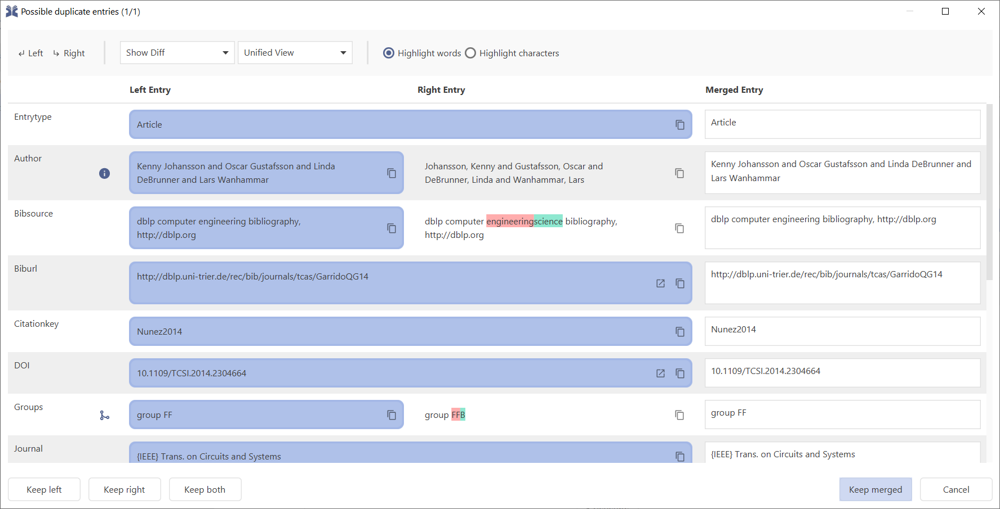
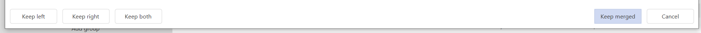

# Find duplicates

JabRef can look for duplicated entries inside a library.

This feature is accessible directly through **Quality → Find duplicates**. It is also used when [importing new entries](../collect/import/importinspectiondialog.md) from a supported reference format or directly from the Internet.

Detection of potential duplicates is done by an edit distance algorithm. Extra weighting is put on the fields _author_, _editor_, _title._ and _journal_.

<figure><figcaption>
Screenshot of the duplicate resolver dialog in light mode
</figcaption></figure>

The differences between the two entries can be configured through the toolbox located at the top of the window. From the toolbox, you can choose to show or hide differences, choose how to display differences _(Unified or Split)_ and you can also choose how to compare entries _(by words or characters)_.

## Show or Hide Differences

* **Plain Text —** This option hides the differences.
* **Show Differences —** This option shows the differences.

## Choose Differences Display Mode

* **Unified View —** In this mode, differences are shown on the right side.
* **Split View —** In this mode, differences are shown on both sides, with <mark style="color:red;">deletions</mark> on the left side and <mark style="color:green;">additions</mark> and <mark style="color:blue;">updates</mark> on the right side.

## Choose Entries Comparison Method

* **Highlight words —** This option compares entries values in terms of words.
* **Highlight characters —** This option compares entries values in terms of characters. It divides both entry values into characters before comparing each character individually. This is perfect for comparing values with small differences _(1 or 2 different characters)_.

From the toolbox's top-left corner, you also can choose to select all the left entry values by clicking `Left` or selecting all the right entry values by clicking `Right`. Be aware that selecting all entry values will select a value even when it is empty.

## Selecting which entry to keep

You are offered to:

* **Automatically remove exact duplicates**. This button shows up if there are exact duplicates. Click it to stop showing other exact duplicates and have them removed automatically.
* **Keep left —**  Keeps the left entry and removes the right entry.
* **Keep right —** Keeps the right entry and removes the left entry.
* **Keep both** **—** Keeps both entries. This usually means that you don't consider the entries to be duplicates.
* **Keep merged —** Keeps the merged entry only and removes the previous entries.
* **Cancel —** Closes the dialog and stops showing other duplicates.
