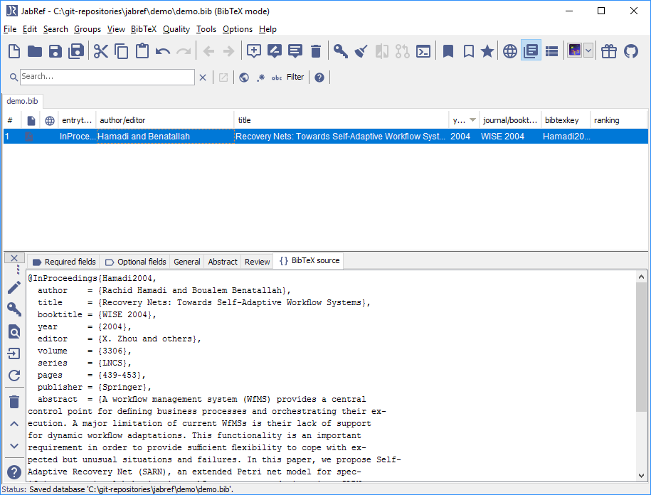
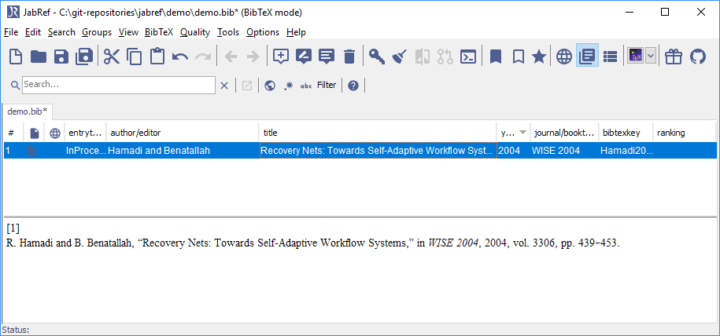

# Add unlinked PDFs including BibTeX data into the database

This feature is available through **Quality → Find unlinked files...**.

The following description appeared first on [tex.stackexchange.com](http://tex.stackexchange.com/a/344310/9075).

## Preparation: Adjust the JabRef key generation pattern to fit your needs

JabRef offers a BibTeX key generation and offers different patterns described at [BibtexKeyPatterns](../setup/bibtexkeypatterns.md).

## Link the PDFs to your bib file

1. Create or open a .bib file.
2. Go to "Quality" -&gt; "Find unlinked files". 
3. The "Find unlinked files" dialog opens. 
4. Choose a directory using the "Browse" button.
5. Click on "Scan directory".
6. In "Select files", the files not yet contained in the database are shown. 
7. To create entries for all files, click on "Apply".
8. For each file, an import dialog is shown    The dialog shows the XMP metadata stored in the PDF in the area "XMP-metadata". If this data fits your needs, select "Create entry based on XMP data". Typically, the XMP-metadata is not good enough. Choose "Create entry based on content".
9. Click on "OK" to start the import
10. A dialog asking for the link is opened    You can choose "Leave file in its current directory" to keep the file where it is. Typically, this is that what one wants. In case you choose "Move file to file directory", you can also choose to rename the file to the generated BibTeX key.
11. Press OK to link the file to the BibTeX entry
12. This happens for each file. After that, the "Find unlinked files" dialog is shown. Just click on "Close" to close it.
13. The entry editor with the last imported entry is shown 
14. You can now save the file and are finished.
15. Optional: Click on "General" to see the linked file 
16. Optional: Click on "BibTeX source" to see the BibTeX source 
17. Optional: You have to shrink it to see the entry in the entry table Enlarge the JabRef window and use the mouse at the upper border of the entry editor 
18. Optional: Press Esc to show the entry preview 

## Further information

### PDFs for which it works

The importer based on the content has been written for IEEE and [LNCS](https://github.com/latextemplates/LNCS) formatted papers. Other formats are not \(yet\) supported. In case a DOI is found on the first page, the DOI is used to generate the BibTeX information.

The next development step is to extract the title of the PDF, use the "Lookup DOI" and then the [Get BibTeX data from DOI](GetBibTeXDataFromDOI.md) functionality from JabRef to fetch the BibTeX data.

We are also [thinking about](https://github.com/koppor/jabref/issues/169) replacing the code completely by using another library. This is much effort and there is no timeline for that.

### Better filenames

JabRef also offers to change the filenames. You can adapt the pattern at Preferences -&gt; Import 

Select "Choose pattern" and choose "bibtexkey - title"  This results in the setting `\bibtexkey\begin{title} - \format[RemoveBrackets]{\title}\end{title}`.

This makes the filenames start with the bibtey key followed by the full title. In the concrete case, `\bibtexkey` only may be the better option as the described bibtey key already contains the title.

### Mr.DLib

JabRef used to have support for [Mr.DLib](http://mr-dlib.org/), which returned back a full BibTeX entry or a PDF. Due to unclear copyright situation of a used library, this service was removed. Further, Mr.DLib changes its focus and will provide literature recommendations. See [https://help.jabref.org/en/EntryEditor\#related-articles-tab](https://help.jabref.org/en/EntryEditor#related-articles-tab).

### Related questions on stack overflow

* [Extract titles from each page of a PDF?](http://stackoverflow.com/q/18071127/873282)
* [Zotero: Extract references from PDF and create new library items from them](https://forums.zotero.org/discussion/16277/extract-references-from-pdf-and-create-new-library-items-from-them)
* [Is there an open source tool for producing bibtex entries from paper PDFs?](http://academia.stackexchange.com/questions/15504/is-there-an-open-source-tool-for-producing-bibtex-entries-from-paper-pdfs)
* [Extracting information from PDFs of research papers](http://stackoverflow.com/questions/1813427/extracting-information-from-pdfs-of-research-papers/3523416)

