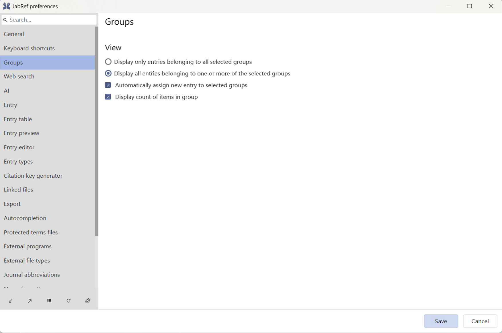

# Groups

Groups allow structuring of bibliographic libraries in a tree-like way that is similar to organizing files on disk in directories and sub-directories. The two main differences are:

* While a file is always located in exactly one directory, an entry may be contained in more than one group.
* Groups may use certain criteria to dynamically define their content. New entries that match these criteria are automatically added to these groups. This feature is not available in common file systems, but in several Email clients (e.g. Thunderbird and Opera).

Selecting a group shows the entries contained in that group. Selecting multiple groups shows the entries contained in any group (union) or those entries common in all selected groups (intersection), depending on the current settings. All this is explained in detail below.


Group definitions are database-specific.​


## Groups interface and first steps

The group interface is shown in the side pane on the left of the screen. It can be toggled on or off by pressing `Alt + 3` or by the menu **View → Groups**. The interface has several buttons, but most functions are accessed via a context menu (i.e. a right-click). Drag-and-drop is also supported.

### Creating a group and adding entries to it

To create a group and manually assign entries to it, press the **Add group** button located at the bottom of the pane, enter a name for the group, then press (leaving all values at their defaults). Now select the entries to be assigned to the group, and drag-and-drop them to the group (or use **Add selected entries to this group** in the context menu of the group interface). Finally, select the group to see its content. Only the entries you just assigned to the group should be displayed in the entry table.

You can also automatically fill a group based on keywords. For this, you need to use a different [type of groups](groups.md#types-of-groups).

When you have numerous groups, the one of interest can be displayed by typing its name in the ''Filter groups'' field located near the top of the group pane.

### Display union or intersection of groups

Selecting one group shows the entries contained in that group (accounting for [hierarchical settings](groups.md#hierarchical-context)).

When selecting several groups, you can intersect or unionize them: _Union_ displays all the entries of the selected groups while _Intersection_ displays all the entries shared among the selected groups.

For example, if you have a group for the author 'Smith' and another one for the author 'Doe', selecting the groups displays the entries that they co-authored if 'Intersection' is selected. If 'Union' is selected, the entries that at least one of them authored are displayed.

To test this, create two groups having some entries in common. Click the **Intersection/Union** button and make sure that **Union** is selected. Now select both groups. You should see all entries contained in any of the two groups. Click again on the **Intersection/Union**. This selects **Intersection**. Now you should see only those entries contained in both groups (which might be none at all if groups do not share entries, or exactly the same entries if both groups contain the same entries).

## Group tree. Creating and removing groups

Just like directories, groups are structured like a tree, with the group _All Entries_ at the root. By right-clicking on a group and selecting **Add subgroup**, you can add a subgroup to the selected group. The **Add group** button (at the bottom of the pane) lets you create a new subgroup of the group **All Entries**, regardless of the currently selected group(s). The context menu also allows removing groups and/or subgroups, and to sort subgroups alphabetically. Moving groups to a different location in the tree can be done by drag-and-drop.

## Group dialog window

The properties of a group can be defined in the 'Edit group' dialog window (the same window is displayed when creating a new group). To modify the group properties, right-click on the group name in the group pane and select **Edit group** in the context menu.

### Name

Defines the name of the group, as displayed in the group pane.

### Description

A description of the group, to help you remember what it is about. This description is displayed when hovering the mouse over the group name.

### Icon and color

An icon can be displayed in front of the group name. Choose your favorite icon among the ones available at [https://materialdesignicons.com/](https://materialdesignicons.com), and enter its name of the field _Icon_ (replacing any hyphens (`-`) with underscores (`_`)). The color of the icon can be set in the field _Color_.

### Hierarchical context

The displayed entries depend on the hierarchical context of the group. When a group is selected, the displayed entries can be:

* **independent** of its supergroup and of its subgroups.
* a **union** between the entries of the group and of its subgroups.
* an **intersection** between the entries of the group and of its supergroup.

#### Independent group

By default, a group is **independent** of its position in the group's tree: When selected, the table of entries shows only the group's content (i.e. all of its entries).

#### Intersection between a group and its supergroup

For a group defined with a hierarchical context _Intersection_, only the entries contained in _both_ the group and its supergroup are displayed when the group is selected.

This is especially relevant for groups based on keywords or search expression, where it is often useful to define a group that intersects its supergroup. For example, consider a supergroup containing entries with the keyword _distribution_ and a subgroup containing entries with the keyword _gauss_. With the subgroup _gauss_ defined as an intersection (of its supergroup), selecting the subgroup _gauss_ displays entries that match both conditions, i.e. are concerned with Gaussian distributions. Note that entries that only belong to the subgroup _gauss_ will not be shown, i.e. for an entry to be displayed when selecting _gauss_, it must be assigned to both the subgroup _gauss_ and the supergroup _distribution_. By adding another intersection group for _laplace_ to the supergroup _distribution_, the grouping can easily be extended to Laplace distributions.

#### Union between a group and its subgroups

The union of a group and its subgroups is the logical complement of the intersection: when defined as _union_, selecting the group displays _both_ the group's own entries and its subgroups' entries.

For example, you can create a group for your references about music, and then subgroups about the music styles (classic, jazz, rock, etc.). By setting the group "Music" as _union_, when you subsequently add references to a subgroup, they will automatically appear in group "Music" as well (without additional action).

### Nesting (sub)groups

You can populate your Group pane by configuring JabRef to use the bibtex source's `keywords = {...},` by clicking the `+` icon and following the [previous instructions](groups.md#specified-keywords). You can nest subgroups by using the right chevron `>` ([see here](https://github.com/JabRef/jabref/pull/2703/files#diff-e8f986c28ee8a35397cde5cb1352d4662f62be7085cd7d8856db279f1205245dR17)). You achieve this by editing the `keywords = {...},` bibtex field in the entry source by placing `>` between any two keywords where the left-hand keyword is the parent group and the right-hand keyword will be its sub-group. The library entry will be placed there. Note: when you select `+` to do this, the first delimiter must be the right chevron, and the second must be whichever field separator you have configured (by default a comma `,`).

### Mixing refining groups with including groups

If a refining group is a subgroup of a group that includes its subgroups -- the refining group's siblings --, these siblings are ignored when the refining group is selected.

### Types of groups

JabRef has five types of groups:

* **Explicit selection**. The group contains entries that were assigned manually. It behaves like a directory on disk, and contains only those entries that you explicitly assigned to it.
* **Searching for a keyword**. The group contain entries in which a certain field (e.g. `author`) contains a certain keyword (e.g. `Smith`). This method does not require manual assignment of entries but uses information that is already present in the database.
* **Free search expression**. Similar to **Searching for a keyword**, but for several keywords in several fields.
* **Specified keywords**. This feature will gather all words found in a specific field of your choice, and create a group for each word.
  * **Authors' last names**. Groups can be generated for each author's last name.
* **Cited entries**. The group contains the entries cited in a LaTeX document, based on its _.aux_ file.

#### Explicit selection

Groups based on explicit selection are populated only by manual assignment of entries.

After creating an explicit-selection group, you select the entries to be assigned to it and use either drag-and-drop or the context menu **Add selected entries to this group** of the group interface.

To remove entries from an explicit-selection group, select them and use the context menu **Remove selected entries from this group** of the group interface.


This method of grouping requires that all entries have a unique citation key. In case of missing or duplicate citation keys, the assignment of the affected entries cannot be correctly restored in future sessions.


#### Searching for a keyword in a field

This method groups entries in which a specified _field_ (e.g. _author_) contains a specified _keyword_ (e.g. _Smith_). The mentioned example will group all entries referring to the author _Smith_.

The search can be case-sensitive or not (checkbox 'Case sensitive'). The search can either be done as a plain-text or a regular-expression search (checkbox 'Regular expression').

Obviously, this will work only for entries including the specified grouping field, and the quality of the grouping will depend on the content accuracy.

The content of the group is updated dynamically whenever the database changes: JabRef allows to manually assign/remove entries to/from the group by simply appending/removing the search term to/from the content of the grouping field. For example, if you add the keyword `A` to an entry, this entry will be added to the dedicated group automatically. This makes sense only for the `keywords` field or for self-defined fields, but obviously not for fields like `author` or `year`.

#### Using a free-form search expression

This is similar to the above, but rather than search for a single search term on a single field, a [search expression syntax](search.md#advanced) can be used. It supports logical operators (`AND`, `OR`, `NOT`) and allows searching multiple fields.

For example, the search expression `keywords=regression and not keywords=linear` groups entries concerned with non-linear regression.

The content of the group is updated dynamically whenever the database changes.

#### Specified keywords

With the group type "Specified keywords", you can quickly create a set of groups appropriate for your database. This feature will gather all words found in a specific field of your choice, and create a group for each word. This is useful for instance if your database contains suitable keywords for all entries. By auto-generating groups based on the `keywords` field, you should have a basic set of groups at no cost. If you have an entry with "keywords = {A, B}", then this group type creates subgroups "A" and "B" both containing the entry.

You can also specify characters to ignore, for instance, commas used between keywords. These will be treated as separators between words, and not part of them. This step is important for combined keywords such as `laplace distribution` to be recognized as a single semantic unit. (You cannot use this option to remove complete words. Instead, delete the unwanted groups manually after they were created automatically.)

The content of the group is updated dynamically whenever the database changes.

#### Using the cited entries of a LaTeX document

The group contains the entries cited in a LaTeX document, based on its '.aux' file. The .aux file has to be specified.

The content of the group is updated dynamically whenever the `.aux` file changes.

## Group color bars in the entry table

To see easily to which groups an entry belongs to, the entry table has a column dedicated to groups. For each entry, a set of color bars is displayed. The number of bars and their colors depend on the groups to which the entry belongs to.

 (1) (1).png>)

By hovering the mouse on this column, you can see the list of groups to which an entry belongs to.

The "groups" column is displayed by default. Using the menu **Options → Preferences**, tab **Entry table**, you can:

* remove the "groups" column by clicking on the bin icon next to the item "Groups".
* add the "groups" column by selecting the "Groups" item in the drop-down menu, and clicking on the **+** button located to the right of the drop-down menu.

## Groups and searching

When viewing the contents of selected group(s), a search can be performed within these contents using the [regular search facility](search.md#regular-expressions).

## Preferences about groups

General preferences for groups can be accessed using **Options → Preferences**, tab **Groups**.

### View

When selecting multiple groups, you can choose to:

* display only entries belonging to all selected groups (intersection)
* display all entries belonging to one or more of the selected groups (union). This is the default option.

### Automatically assign new entry to selected grouping

The checkbox "Automatically assign new entry go selected grouping" makes it possible to automatically assign new entries to selected groups. If checked (default), upon selection of one or more groups, all the new entries created will be assigned to the selected groups. This works both for entries created from the menu button or entries pasted from the clipboard. If unchecked, new entries are not assigned to groups automatically.

### Display count of items in group

If checked (default), the number of entries in each group is displayed in the group name, at the right of the group pane.


Be careful, this can slow down JabRef when a library has numerous groups.


### Keyword separator

The character separating two keywords can be set in this field. The default keyword separator is a comma (,).

## Groups in the library file

Groups are saved as a `@COMMENT` block in the `.bib`-file and are shared among all users (future versions of JabRef might support user-dependent groups).
