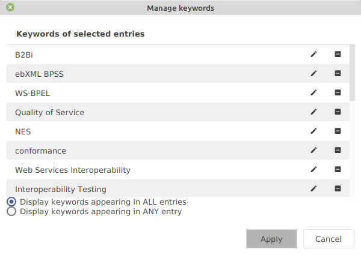
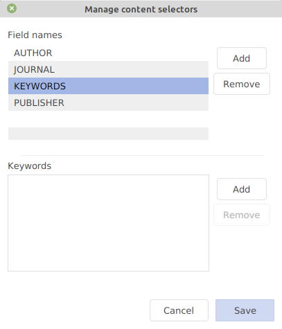

# Keywords

## The field "keywords"

Keywords can be added to your entries in a specific field. In the entry editor, the keywords field is displayed in the Main tab. There, you can add new keywords to an entry by typing it in. If auto-completion is activated for the field keywords (**File → Preferences → Entry editor**), suggestions are given based on existing keywords.

By default, the keyword separator is a comma. It can be redefined globally in the preferences (**File → Preferences → Entry**) and per library in the [library properties](../setup/databaseproperties.md#keyword-separator) (**Library → Library properties → General**). A separator set in the library properties takes precedence over the global preference. To use the separator character within a keyword itself, you can escape it with a backslash (`\`).


When opening a library that does not declare a separator, JabRef keeps the separator its keyword fields already use (for example `;`) instead of rewriting them to the global preference. Keyword fields that use a different delimiter than the library's separator are normalized on import.



If entries already in your library have a keyword separator differing from the prescribed one, use the cleanup "Normalize keyword delimiters" (**Quality → Cleanup entries**, section "Field formatters"). It rewrites the keywords of the selected entries to the library's keyword separator. The cleanup is also part of the default save actions (**Library → Library properties → Saving**), so entries you edit are normalized when the library is saved.


Additionally, the [special field](specialfields.md) values (relevance, priority, etc.) can be added to the keywords field automatically. This will allow you to group, sort, and search your library based on the special field values. See in **File → Preferences → Entry table** the item "Special fields" and select "Synchronize with keywords".

## Management of keywords

### Managing the keywords of specified entries

Select at least one entry and go to **Edit → Manage keywords**.

The keyword list is displayed in two modes:

* the keywords shared by ALL of the selected entries.
* the keywords appearing in ANY of the selected entries.

You can edit a keyword by double-clicking on it, or by clicking on the pencil icon. A keyword can be deleted by clicking on the minus icon.

### List of often-used keywords

To fasten the addition of often-used keywords, JabRef can store the list of your preferred keywords.

Go to **File → Manage content selectors**.

First, click on the field name "Keywords". Then, enter the list of your preferred keywords. Now, when you start to type one of your preferred keywords, JabRef will display a list of the matching ones (independently of the auto-completion). For more details, see the help section about [Managing content selectors](../advanced/contentselector.md).

## Searching for entries based on keywords

You can search for entries having specific keywords. For this, use a regular expression search, such as `anykeyword matches apple` or `keywords = modell?ing`. For more details, see the help section about [Searching within the library](search.md).

## Grouping entries based on keywords

Different types of groups can be created based on the values of the field keywords. See the help section about [Groups](groups.md).
