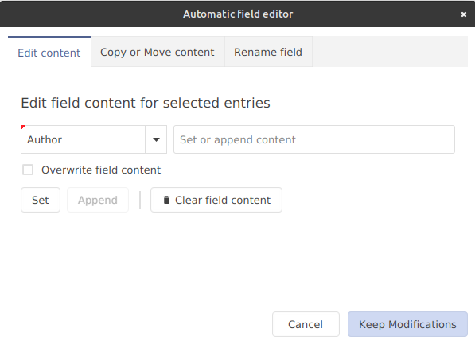
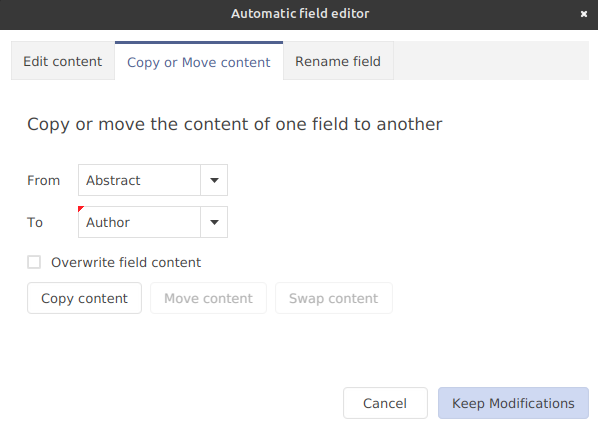
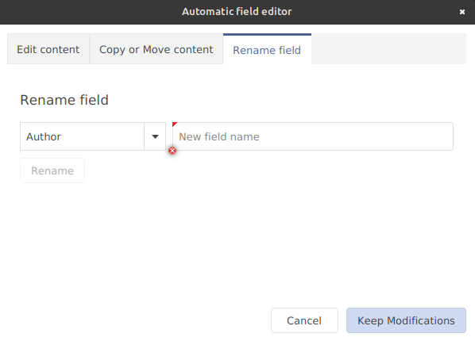

# Manage field names and their content

After selecting a set of entries, go to **Edit → Automatic field editor**, to edit (set, append and clear field content), copy and move field content and rename a field.


​To select all the entries of the current library, press`CTRL + A`.


A dialog window will be displayed with multiple tabs. Within are shown the actions that can be carried out on _all selected entries_. Down below, the actions are described in detail.

#### Reverting and Retaining Modifications&#x20;

* _Cancel._ Pressing the "Cancel" button reverts any changes that have been made so far.
* _Keep Modifications._ Pressing the "Keep Modifications" button will result in retaining all the changes permanently.

#### Edit content

<figure><figcaption>
Dialog window of the Automatic field editor in "Edit content" tab.
</figcaption></figure>

* _Set content._ Choose the field to add or edit (by typing it in or using the drop-down menu; If the field does not exist, it will be created). Then enter the field content to be used (by typing in the text box). then press the button "Set". For example, "Field name = owner" and "Set content = Smith" adds the line "owner = {Smith}," to the entries. If the field "owner" is already present in an entry, it is not modified, except if the "Overwrite field content" checkbox is checked.
* _Append content._ Enable the "Overwrite field content" checkbox. Choose the field to edit (by using the drop-down menu; If the field does not exist, it will be created). Then enter the string (by typing in in the text box) to be appended at the end of the field content. Then press the button "Append". For example, "Field name = keywords" and "Append content = , programming" adds the keyword "programming" to the existing list of keywords. If there is no field content yet, the appended content will be at the beginning of the field content and the keyword separator (in this case the comma) and empty space are not required.
* _Clear field content._ This removes the field from the entries. For example, type into the field "comments". If the "Clear field content" button is pressed, all the fields "comments" (and their content) are removed.

#### Copy or Move content

<figure><figcaption>
Dialog window of the Automatic field editor in "Copy or Move content" tab.
</figcaption></figure>

*   _Copy content._ This copies content from one field to another. Choose both a "from" and a "to" field (by typing it in or using the drop-down menus). Then press the "copy content" button. For example, enter the string "year" in the "From" text box. Also enter the string "date" in the "To" text box. If the copy content button is pressed, field content from the "year" field will be copied to the "date" field, but only, if the date field's content is empty (if the date field does not yet exist, it will be created). Field content in the "date" field will only be overwritten, if the "Overwrite field content" checkbox is checked. It is not possible to append content with this particular action.

    
    Known issue: Copying content while the "Overwrite field content" checkbox is checked cannot be reverted, even if the "cancel" button is pressed
    

* _Move content._ This moves content from one field to another. Choose both a "from" and a "to" field (by typing it in or using the drop-down menus). Enable the "Overwrite field content" checkbox. Then press the "Move content" button. For example, enter the string "year" in the "From" text box. Also enter the string "date" in the "To" text box. As soon as the "Move content" button is pressed, field content from the "year" field will be moved to the "date" field. If the date field does not yet exist, it will be created. It is not possible to append content with this particular action and content within the "to" field will always be overwritten. The "from" field will be empty after the movement operation.
* _Swap content._ This swaps content of two fields with each other. Choose both a "from" and a "to" field (by typing it in or using the drop-down menus). Enable the "Overwrite field content" checkbox. Then press the "Swap content" button. For example, enter the string "year" in the "From" text box. Also enter the string "date" in the "To" text box. As soon as the "Swap content" button is pressed, field content from the "year" field will be moved to the "date" field and vice versa. If any of the fields do not yet exist, this action will not succeed.

#### Rename field

<figure><figcaption>
Dialog window of the Automatic field editor in "Rename field" tab.
</figcaption></figure>

* _Rename field._ Choose a field (by typing it in or using the drop-down menu). Enter the new name for this field into the text box. Press the "Rename" button. For example, "Field name = institution" and "Rename fields = school" renames the field "institution" into "school". The field content is not altered.​


External resource: [A concrete example of using this feature to prune a library.​](http://tex.my/pruning-bib-files-with-jabref/)

