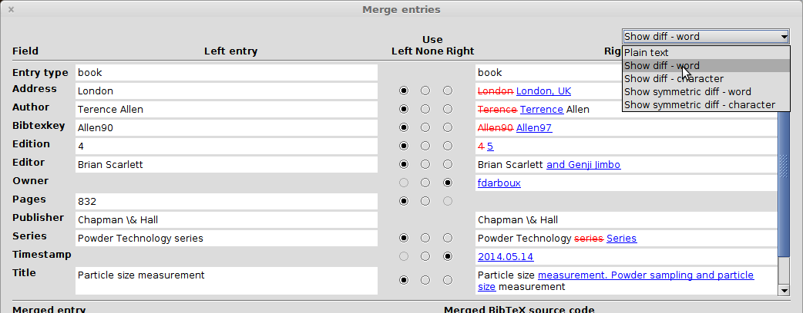
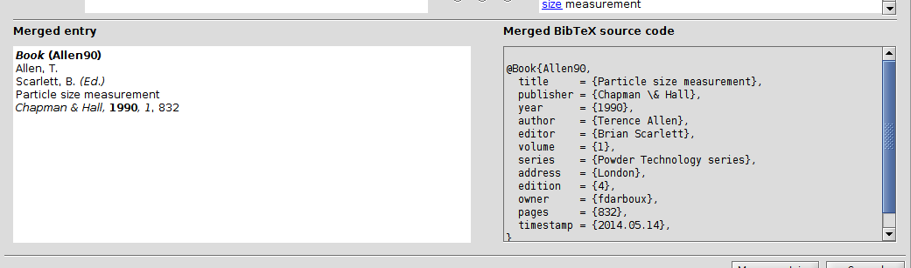

# Merge entries

JabRef can help you merging entries of your database.

First, select the two entries to be merged. Then select the menu **Quality → Merge entries...**. The **Merge entries** window will pop-up.

## Parallel display of the entries' fields

The fields of the two entries are displayed side-by-side on the upper part of the window.

The differences between the two entries can be emphasized through the drop-down menu located at the upper right-hand corner of the window. Five ways of displaying the differences are offered:

* **plain text**: as is, no emphasis
* **show diff** - word: differences are shown in the right entry. Full words are struck out in red if they are removed from the left entry or underlined in blue if they are added to the right entry.
* **show diff** - character: differences are shown in the right entry. Individual characters are struck out in red or underlined in blue as above.
* **show symmetric diff** - word: differences are shown on both sides. Words are underlined and displayed in color.
* **show symmetric diff** - character: differences are shown on both sides.  Characters are underlined and displayed in color.

In the central column, a radio button allows you to select which side to keep for each field: the **left side**, the **right side**, or **none**. By default, the left entry is kept, and any fields not present in the left entry are obtained from the right entry.

## Merged entry: preview and source code

Based upon your selection, the merged entry is shown, both as a preview \(on the left\) and as source code \(on the right\).

If you right-click on the preview, you can **Print entry preview** or **Copy preview**.

## Final merging

Finally, after selecting which fields to keep, you can decide to **Merge entries**. Alternatively, you can press **Cancel**.

**See also:** [Find duplicates](FindDuplicates.md)

