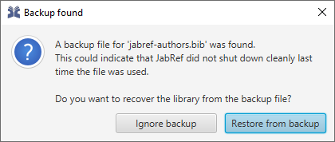

# Autosave and Backup - `.bib.sav` and `.bib.bak`


Autosave and backup feature is available sind JabRef 3.7.

To reduce the amount of configuration options, the possibility to disable them was removed in JabRef 5.1.


JabRef generates `.sav` and `.bak` files while working.
`.sav` is the autosave feature: Each 15 seconds, the current state of the library is saved.
`.bak` preserves the last state of the library after saving.
Thus, one can go back one save command in the history.

By using the [gitignore.io](https://www.gitignore.io/) service, you can generate an appropriate `.gitignore` file by opening [https://www.gitignore.io/api/jabref](https://www.gitignore.io/api/jabref).

## `.sav` - autosave files

This functionality runs in the background while you are working on a _BibTeX database_. It makes a _backup copy_ and keeps that up-to-date on every user interaction. For instance, when you change a field the new value would get saved into the backup copy.
Assuming that _JabRef_ crashes while you are working on a _BibTeX database_. When you try again to open the file _JabRef_ crashed with you will get the following dialog:

Now you have the possibility to restore your changes which would normally get lost.

When _JabRef_ gets closed normally the `.sav` file will be removed. Otherwise, this file is going to be used for database restoration next time.

## `.bak` - backup files

`.bak` preserves the last state of the library after saving.
Thus, one can go back one save command in the history.
For more advanced history, we recommend to use [git as version control system](https://git-scm.com/book).
