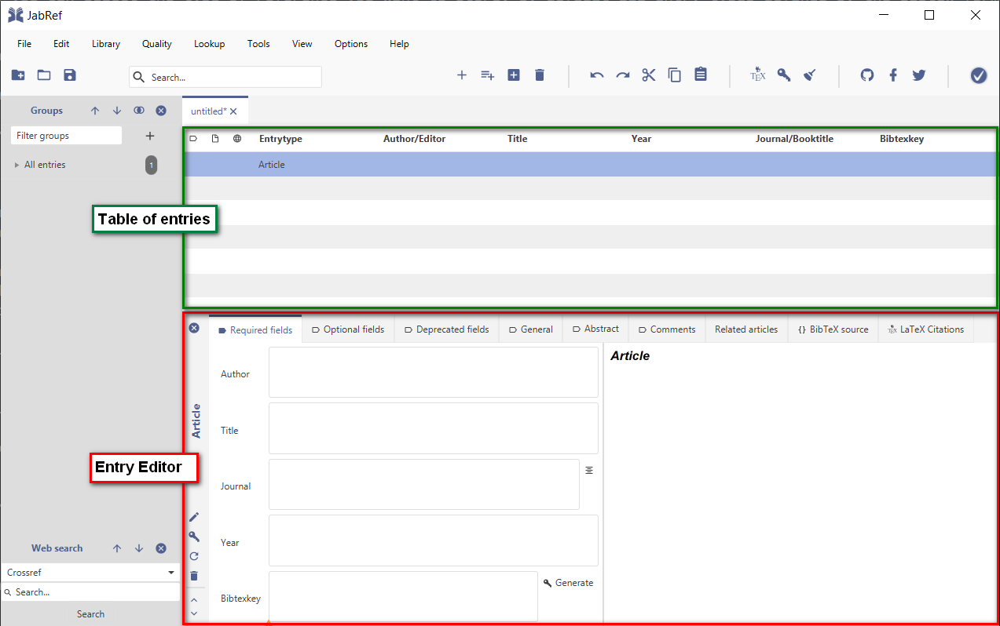

# Getting started

## Main Window of JabRef

Upon the first start of JabRef the main user interface is showing up the main elements are:

* Menu bar
* Icon bar \(shortcuts for most frequently used features\)
* Side bar \(for groups and web search\)

## Creation of a new library

A "library" is the main file that saves all the information about your collection of references. The storage format of the file is text-based in the BibTeX standard \(by default\).


The usage of a text-based file format has some advantages:

* The file is "human readable" and editable with every text editor
* the text format allows for an easy tracking of changes with every common version control protocol \(e.g., git\)
* and finally: the format is dedicated for the usage with LaTeX; so you do not need to convert it to any other format but you can just directly link to your JabRef library


To create a new library, just select the "New library" menu item in the "File" menu:

The main screen is now showing an empty "entry table" we will now start to fill with some entries.

## Adding of a new entry manually

To add a new entry select the menu bar entry "Library" -&gt; "New entry", click on the icon in the icon bar, or just hit CTRL-N.

This opens a dialog where you can select the type of reference you want to store. By default all entry types defined by the BibTeX format are available:

For our running example we will select "Article".

After clicking on the "Article" button, the dialog closes and the so called "Entry Editor" is opened for the newly created entry:

The most important information about the references to be added can now be entered in the "Required Fields" tab. "Author", "Title", "Journal", and "Year" should be self-explanatory - however, a "citationkey", might not be familiar to you. Basically, the idea of the "citationkey" is coming from working with BibTeX, where it is necessary to have an unique identifier for each entry. This allows for referencing within a document you might be creating using the stored information in your library. Moreover, also within JabRef this "key" is used for example for cross-references to other related entries or to determine file names for full-text references.

The key usually follows a global pattern and can be easily created automatically by clicking on the "generate" button next to the field.


The default key pattern is `[auth][year]`, which means that Author information is followed by the year of the publication, resulting in the example in `Turing1950`. However, the key pattern is customizable to your needs. See [Configuration](https://docs.jabref.org/setup) &gt; ["Customize the citation key generator"](https://docs.jabref.org/setup/citationkeypatterns) for more details.


After entering some information, you can see on the right side of the entry editor a preview of the bibliographic data:

There are further possibilities to add entries to your library which are described in the section "Collect" of this documentation:



## Enhancing the information

After creating the basic information the addition of all other bibliographical details is often cumbersome and error-prone. To ease this task, JabRef allows for an automatic completion of the bibliographic information by looking up the data in public databases. To use this feature just click on the "Update with bibliographic information from the web" button in the editor:


The found information is most accurate if an identifier like a "DOI" or "ISBN" is maintained. If you already know such an unique identifier, this can also be already the starting point to create a new entry without manual entering any information by using the "create from ID" feature in the Create entry dialog. For more information see: [Collect](https://docs.jabref.org/collect) &gt; ["Add entry using an ID"](https://docs.jabref.org/collect/add-entry-using-an-id)


If additional information is found you will be asked in a dialog which information should be taken over:

## Adding a full text document

Usually, you also want to attach a reference to the full-text of a reference. For this, you can use the "file" field in the "General" tab. Here you can either attach a file manually, search for an already existing local file matching the citationkey pattern, or trying to automatically download a matching full text from the web.


In order to use the automated feature, it is necessary to set-up a file directory first. To do so, please go to "Options" &gt; "Preferences", go to "Linked files" section, and select there an existing folder as the "Main file directory":


To test the automatic download of full texts you can click on the "Get full-text" icon next to the file field, or choose "Lookup" -&gt; "Search full text documents online" from the menu. As soon as a full-text is found, the file will be stored in the local file directory and linked to the entry:

To open the downloaded full text you can click on the "file" icon before the file name - or use the same icon in the entry table: 

## Finding more references in the web

If you want to search for other references, it is also possible to directly trigger a search in many of the most common bibliographic databases. To start a search just use the "Web Search" feature of JabRef: First select one of the existing data sources, enter a search term and click on "search":

The search results will be shown in an window where you can select all the search hits to be added to your library.

## Next steps

After adding more and more entries, your library might be a bit too unstructured. In order to keep all you references organized JabRef is offering a lot of helpful features like grouping, consistency checks, etc.

You can find more information on this topics in the "Organize" section of the documentation:



If you want to start writing your own papers, articles or thesis, you might find some helpful information on how to use JabRef for citing your collected references from your library:



