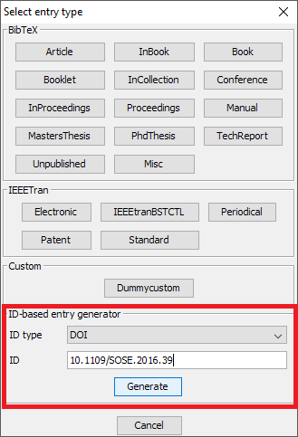

# Creating entries using the Digital Object Identifier \(DOI\)


Since: 3.7

To use this feature, choose **BibTeX → New entry...**. In the lower part, there is the box "ID-based entry generator". In the field "ID type", "DOI" should be already selected. The field "ID" is focused. Enter the DOI here and press Enter to generate an entry based on the Id. You can also click on "Generate". Then, [http://dx.doi.org/](http://dx.doi.org/) \(provided by [http://crossref.org/](http://crossref.org/)\) is used to convert the given DOI to a BibTeX entry. The found entry is opened in an entry editor. In case an error occurs, a popup is shown.

