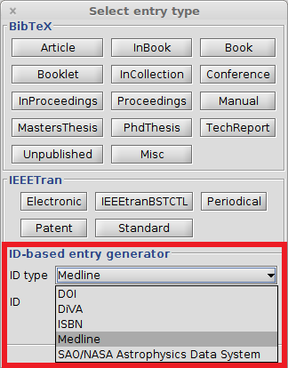


Since: 3.7


# Creating entries from Medline

[Medline](https://www.nlm.nih.gov/pubs/factsheets/medline.html) is a bibliographic database of life sciences and biomedical information. It includes bibliographic information for articles from academic journals covering medicine, nursing, pharmacy, dentistry, veterinary medicine, and health care. Medline also covers much of the literature in biology and biochemistry, as well as fields such as molecular evolution \([Wikipedia](https://en.wikipedia.org/wiki/MEDLINE)\).

To use this feature, choose **BibTeX → New entry...**. In the lower part, there is the box "ID-based entry generator". In the field "ID type", "Medline" can be selected \(see screenshot below\). Select the field "ID" and enter the Medline ID here \(e.g., `27934767`\) and press Enter to generate an entry based on the Id. You can also click on "Generate". The found entry is opened in an entry editor. In case an error occurs, a popup is shown.

